学机器人技术,  请访问  http://robot.czxy.com/ 

大家好

欢迎大家来到Python快速入门训练营

我们的课程有传智专修学院人工智能与机器人实验室，目的是给大家提供一个平台来给大家学习Python这门编程语言。

Python在人工智能与机器人学习与机器人开发方面有着非常重要的使用场景。

比如：工业机器人、无人驾驶和自动驾驶等，都需要使用Python语言。

那么，学好Python基础课程需要多久？

如果我告诉你只需要20个小时，你就可以使用Python语言写出一个飞机大战或者贪吃蛇的游戏，你信吗？

只需每天能抽出两个小时的时间，只要你会一些基本的电脑操作，比如开机，打字，移动鼠标，只要你真的有想学Python的意愿，那本次的训练营就非常的适合你。

让我们开始吧！

对于很多没有任何编程基础的同学们来说，我们必须要先来了解以下计算机的一些基本知识，因为任何的编程语言功能最终都是要用计算机来实现的。

# 1.关于计算机的一些知识

计算机就是我们通常说的电脑,像笔记本电脑和台式电脑，都是计算机。计算机的特点就是可以进行高速计算,既可以进行数值计算,又可以进行逻辑计算,还具有存储记忆功能。我们平时安装的软件都存储在我们的硬盘上面

计算机组由两部分组成，计算机硬件和计算机软件

我们先来看一下计算机的硬件组成

## 计算机硬件组成

**计算机的硬件**组成遵循的是经典的**冯·诺依曼**结构

就是下面这个结构图

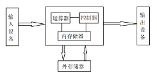

简单的了解一下计算机主要的硬件结构及其功能，给大家总结了一下：

**输入设备**:将信息输入到计算机中，比如键盘

**输出设备**:将计算机处理的结果输出来，比如电脑屏幕

**运算器**:负责数据运算,即数据的加工处理

**控制器**:整个计算机的中枢神经,控制程序的执行顺序,协调计算机各部分组件工作

**运算器和控制器**是计算机最核心的东西，也就是我们通常所说的中央处理器(CPU)

**存储器**包括内存储器和外存储器，主要的作用存储程序、数据和各种信号、命令等信息。平时我们安装一个程序，其实就是被一个程序的指令和信息保存在我们的存储器内

通过图片我们来更直观的了解以下各个硬件：


## 计算机软件组成

如果只有硬件，那我们的计算机也是不能工作的，必须要有软件的支持。所以我们还需要来了解以下软件的知识

**软件**指的是是一系列按照特定顺序组织的计算机数据和指令的集合。任何软件都数据和指令，比如我们使用微信，其实就是在运行各种指令，然后计算机会对指令做一个处理。

软件又分为**系统软件**和**应用软件**两种.

### 系统软件

人和计算机交流的时候，一个交流平台，系统软件充当的就是这个交流平台的功能，通过系统软件，人就可以控制计算机工作。

其实系统软件我们平时经常会接触到，常见的系统软件有这些：

我们最常的就是**windows**系统，相信大家都对最开始接触电脑开机时的Windows界面和音乐记忆深刻。

后面我们学习机器人开发或者进行其他一些开发的时候会用到一个**linux**系统，这个系统我们最常用的就是Ubuntu,后面我们学习机器人的时候，会帮大家安装这个系统。

另外如果有同学使用的是苹果电脑，评估电脑用系统软件叫做**macos**，它是基于unix的系统。linux系统也是类unix系统，**unix**系统是先出来的。

以上所说的都是电脑的操作系统。我们总结一下：

windows

linux(Ubuntu)类unix

macos

unix

除了电脑的操作系统呢，还有我们的手机操作系统

手机中最火的是安卓（Android)系统，它的内核也是linux系统，只不过我们可以用Java来写它的应用程序。然后还有苹果的iOS系统，它的内核是Unix，再早一点我们应该还有人听过诺基亚手机，它用的是塞班系统。还有一些我们的国产山寨机，它有一个内嵌的系统在手机里，我们不能随意的更改或者刷机。手机系统给大家简单的介绍一下。

那有了系统软件这个大平台之后呢，我们可以在电脑里溜达了，但是你想要聊天，听音乐，玩游戏可以吗？都不行！

所以，我们还需要一些应用软件来帮助我们实现一些特地的功能。

### 应用软件

什么是应用软件呢？

你们可以打开你们电脑里装的电脑管家之类软甲的，里面有一个软件管理，在软件管理里面就要各种五花八门的软件，影音类，办公类，游戏类，图片编辑类，等等，这些都是属于应用软件。有了他们，你就可以开始愉快的玩耍了。

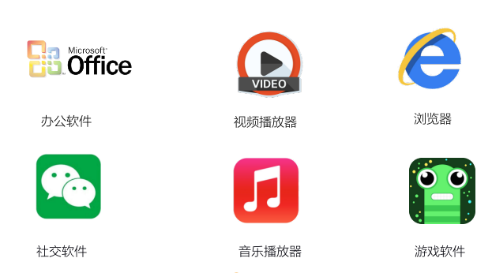


那简单的了解了一些关于计算机的基础知识之后呢，我们就要开始编程知识的学习了。

首先，来了解以下，编程语言。

# 2.编程语言

任何计算机软件都需要使用编程语言来编写

那什么是编程语言呢？

人类使用日常交流最常用的就是语言，计算机交流也需要语言，我们叫编程语言。

**编程语言**是用来定义计算机程序的语言,用来**向计算机发出指令**.

比如java,c++，C语言等都是编程语言，python属于编程语言的一种.

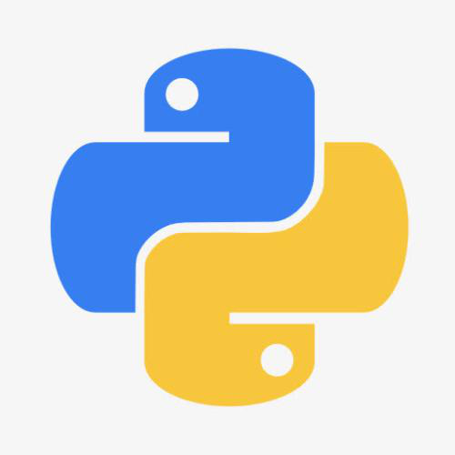

Python语言对于人工智能和机器人开发学科来说非常的重要，因为我们进行人工智能和深度学习的时候，我们可以使用Python语言，操作机器人也可以使用Python语言来进行操作。

为什么在这么多编程语言中，我们要选中Python语言呢？

且看：

这是地产大佬潘石屹去年发布的一篇微博：

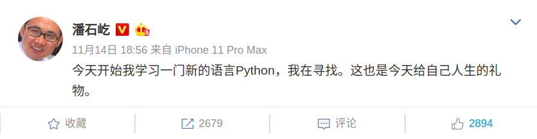

表示他要开始学习Python了

那为什么要学Python呢？第二天他又发了一篇长微博：
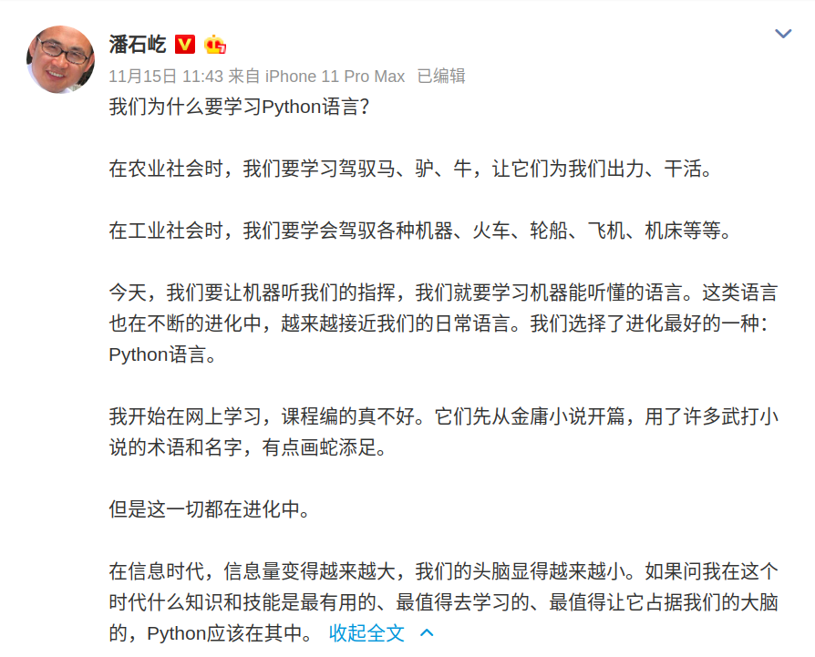

总得就是一句话：Python语言是最棒哒！

看来，现在不仅仅只是比你优秀的人比还你努力了，比你有钱的人比你还爱学习。

Python语言最大的优势就是：简单易学

非常适合零基础的人做为编程入门的学习语言，它的语法就像在阅读文章一样。

那我们来简单的了解以下Python。

# 3.python简介

### 创始人——“龟叔”

Python是著名的“龟叔”Guido van Rossum"在1989年圣诞节期间，为了打发无聊的圣诞节而编写的一个编程语言

以下就是“龟叔”本尊


之前中国程序员在GitHub上发布996ICU的时候，他也针对这个情况力挺中国程序员，认为996是非常不人道的。大家感兴趣也可以去搜一下。


###  编程语言排行榜

目前上在使用的编程的语言大概有600多种，比较常见的有20多种，我们经常会看到“Java第一””PHP最牛逼“之类的比较，那评判一种语言的地位或者使用率的标准是什么呢？

就像富豪排行榜一样，编程语言也有一个排行榜，叫做TLOBEB编程语言排行榜，排名越靠前的语言，说明使用的范围越广，那相对应的工作机会也会越多。那我们来看一下这个排行榜：

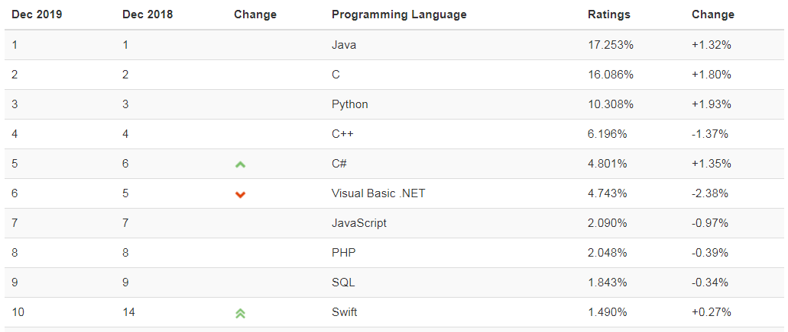

Java、 c语言、Python和c++是牢牢的占据了前四名，这个排行榜每个月都更新一次，网上可以直接搜索的到。

虽然Java目前还是稳居第一 ，但是我们来看另外一个图：

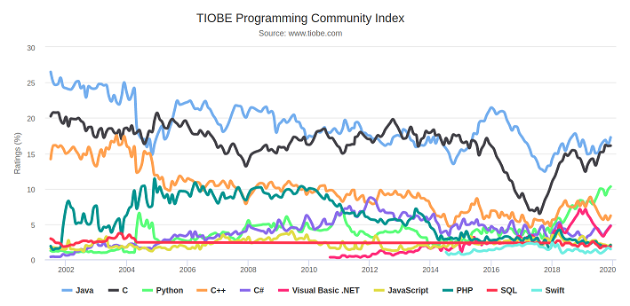

从这个趋势图中大家可以看到近几年Python一直呈上升趋势，而且上升的速度很快，说明它非常有潜力，就业形势自然也是很乐观的。

## Python的特点

Python是一种**解释型、面向对象、动态数据类型**的高级程序设计语。

解释型、面向对象和动态数据类型就是Python最大的三个特点。这里我们着重讲一下解释型，其他两个特点我们后面再详细讲解。

### 解释型

**解释型**是Python区别于其他编程语言的最大特点java和c语言等其他的是编译型语言。

那我们来看一下解释型和编译型的具体的区别在哪里吧。

我们之前说过人要和电脑进行交流，就需要用到各种软件，那我们对着电脑说“你好”，或者“hello"等等，电脑都是听不懂的，电脑只能听懂一种语言，那就是你们经常会看到，但是具体说不出个所以然来的一串由”0“和”1“组成的数字，这个就叫做**二进制的机器码**，这是计算机唯一能认识的语言。

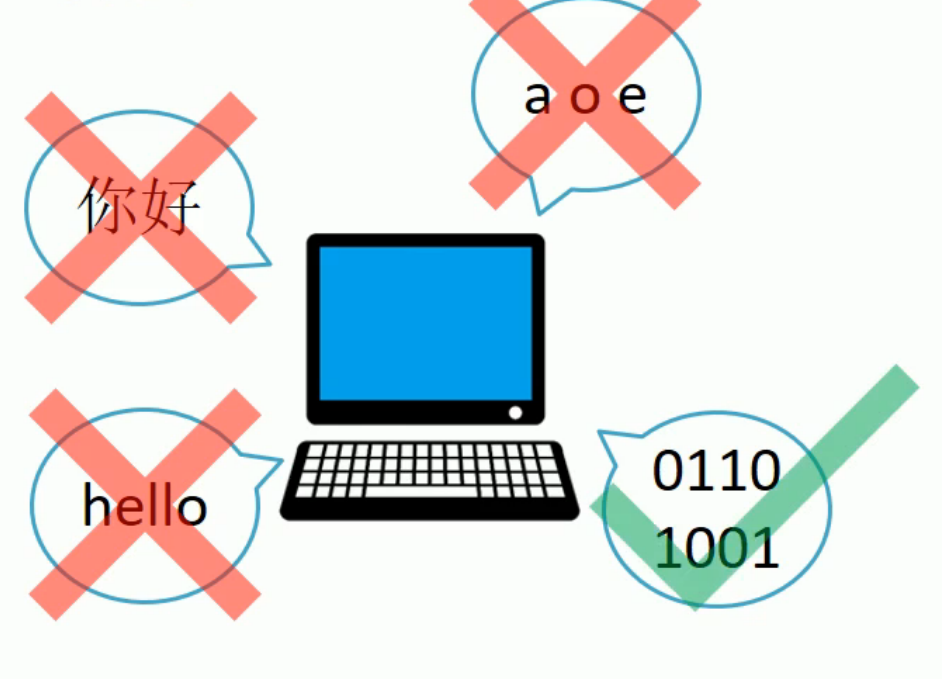

我们写的任何程序，代码，输入的内容都需要转换成二进制的机器码，才能够在机器上运行，所以解释型和编译型的区别就在于转换二进制的过程不同。

### 编译和解释型的区别

**编译型语言**首先是将源代码编译生成机器指令，再由机器运行机器码 。如下图，直接转换

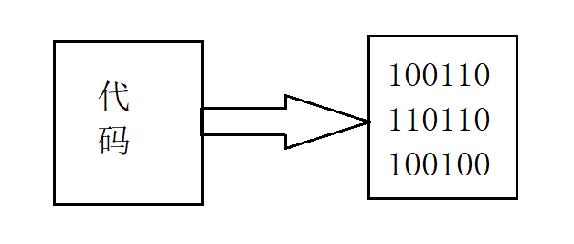

**解释型语言**的源代码不是直接翻译成机器指令，而是先翻译成中间代码，再由解释器对中间代码进行解释运行。如上图，中间多了一个步骤.

我们来举个例子

把大象放进冰箱要几步？

三步。

1. 把冰箱门打开
2. 把大象放进冰箱
3. 把冰箱门关上

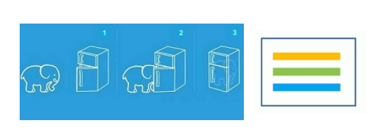

所以我们就写好了三行代码。

如果把这三行代码输入计算机。那解释型和编译型的过程有什么区别呢？

首先来看一下编译型


编译型直接将代码转换成二进制机器码，计算机识别二进制就可以运行处结果了。

就好像我们读一本英文书，直接将英文翻译成中文进入我们的脑子，我们就读懂英文书了。

但是解释型它中间多了一个解释的步骤。

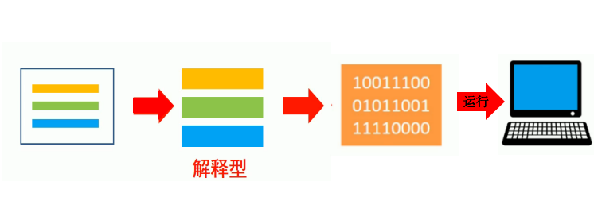

还是读英文书的例子，就是我们不是直接翻译成英文，还是需要借助一个字典或者旁边有个懂英文的人解释成中文给我们听，然后我们能理解的中文才输入到我们的脑中。

总结一下，起始的代码都是一样的，最终输入给计算机的也是二进制机器码。但是过程不一样，编译型直接翻译，解释型需要一个解释器。

### 编译型和解释型总结

编程言语的类型就只有这两种，要么编译型要么解释型

编译型就是直接生成二进制机器码执行

例如：c++ go kotlin)

解释型是读取一段解释执行一段

例如：python javascript

## Python的缺点

### 缺点一：运行速度慢

运行速度慢，是Python最大的缺点。

来看个例子：

运行C语言和Python语言同时爬取一段网络上的数据，我们对比的是爬取100个段子所需要的代码行数和所耗费的时间。

我们可以看到，C语言的代码数是400多行，Python只需要144行，是C语言的3分之一，这也是Python的一个优点，就是开发效率高，非常简洁。但是时间上，可以明显看到，C语言只需要0.5秒，而Python需要2.3秒，是C语言的几倍。

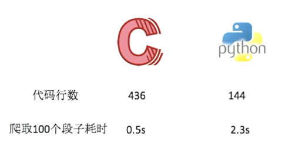

所以每一种语言都有它的特点，我们在后面进行项目开发的时候，就要根据项目开发的不同需求，选择合适的开发语言。

###  缺点二：代码不能加密

不能加密是Python的第二个缺点。也就是说你写完程序再发布，发布的也是源代码，前端开发中的JS发布的也是云代码。解释性语言的源码都是以名文形式存的。这个大家需要了解以下即可

### 缺点三：版本不兼容

每一种语言或者软件都会有更新迭代，从1.0版本往上到2.0或者3.0等。比如安卓系统，从1到10，从低到高，一般来说，高版本都可以向下兼容低版本。但是Python的版本不会向下兼容，目前是Python3版本它是不兼容Python2中一些过时的内容的。

## Python应用场景

Python有一个外号，叫做”万能语言“。也就是说有很多场景都可以用Python进行开发。

### 场景一：Web应用开发

比如说做一些网站和服务器的后台，但是注意一点，目前很多大公司腾讯百度阿里他们的后台都不是用Python，腾讯用的是C++，阿里巴巴用的是Java,不使用Python也是因为之前上说的Python的效率比较低，所以一些大型的后台还是需要一些高效率的语言，当然，Python可以做一些小的后台或服务器。

* 过mod_wsgi模块，Apache可以运⾏⽤Python编写的Web程序

* Python定义了WSGI标准应⽤接⼝来协调Http服务器与基于Python的Web程序之间的通信

  场景二:操作系统管理、服务器运维自动化脚本


### 场景二:操作系统管理、服务器运维自动化脚本

* 很多操作系统⾥，Python是标准的系统组件

* Python标准库包含了多个调⽤操作系统功能的库

* Python编写的系统管理脚本在可读性、性能、代码重⽤度、扩展性⼏⽅⾯都优于普通的shell脚本


### 场景三:科学计算

科学计算是Python一个非常重要的应用场景。Python里面有非常多的科学计算库。比如说NumPy、Matplotlib可以进行一下数据展示，所以进行科学计算时，用Python就非常方便

* NumPy,SciPy,Matplotlib可以让Python程序员编写科学计算程序

### 场景四:桌面软件

Python里面有一些框架支持它做桌面开发

* PyQt、PySide、wxPython、PyGTK是Python快速开发桌⾯应⽤程序的利器。

### 场景五:服务器软件(网络软件)

* Python对于各种⽹络协议的⽀持很完善，因此经常被⽤于编写服务器软件、⽹络爬⾍(机器学习  训练数据集  爬  百度)

### 场景六:游戏

很多人可能会有疑惑，Python的效率这么低，为什么还可以开发游戏？其实对于游戏来说，一般分为两大部分，第一部分是游戏引擎，另一个是游戏的逻辑框架。那游戏引擎它对于开发的效率要求比较高，一般都是用C语言来写，但是业务逻辑可以通过Python语言来实现，因为Python是一个面向对象的语言，写业务逻辑是非常方便的，所以说游戏的开发底层可以用C++,业务逻辑就可以用Python来写。

* 很多游戏使⽤C++编写图形显示等⾼性能模块，⽽使⽤Python或者Lua编写游戏的逻辑、服务器

相较于Python，Lua的功能更简单、体积更⼩；⽽Python则⽀持更多的特性和数据类型

以上就是Python最常的使用场景，其实最重要的是就是科学计算和人工智能方面的应用。

# 4.python环境安装

## Python环境安装过程

### Windows系统

1. 进入Python官网:https://www.python.org/

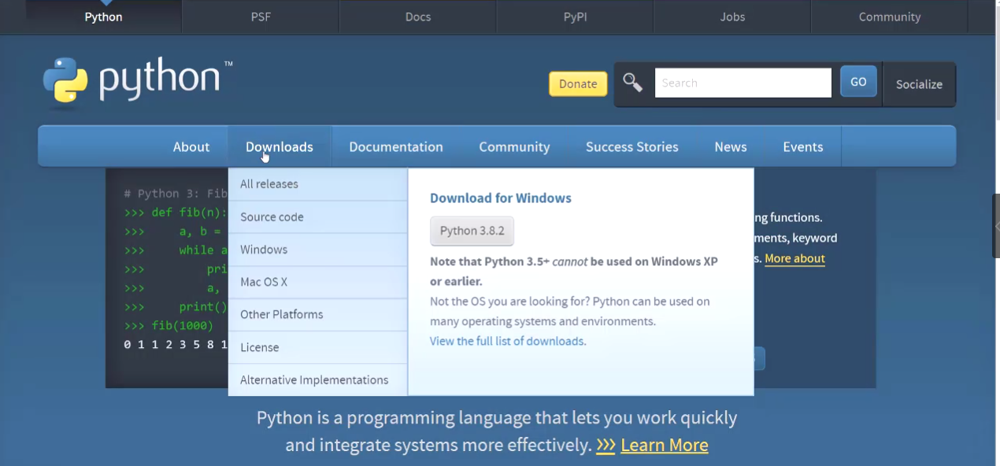

2. 点击Downloads,选择Downloads目录下的All releases的选项

   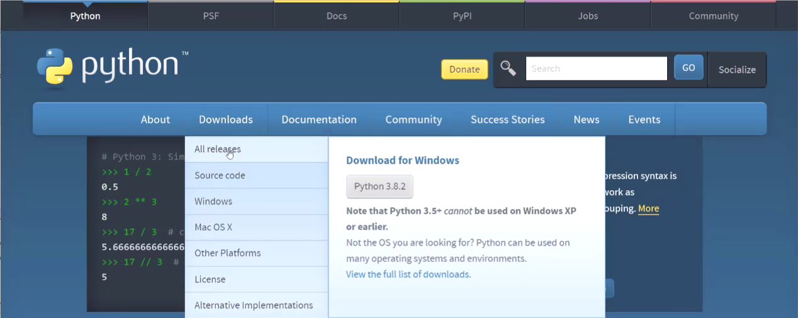

3. 安装最新版本Python3.8

   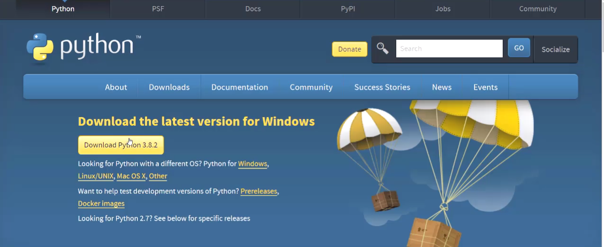

4. 按步骤进行安装，注意下问题：

   * 主要勾选Add Python 3.7 to PATH

     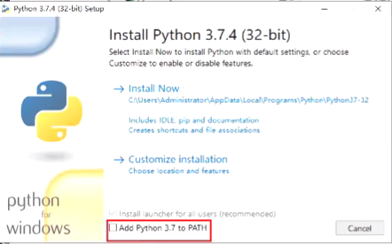

   * 选择默认安装或者自定义安装

     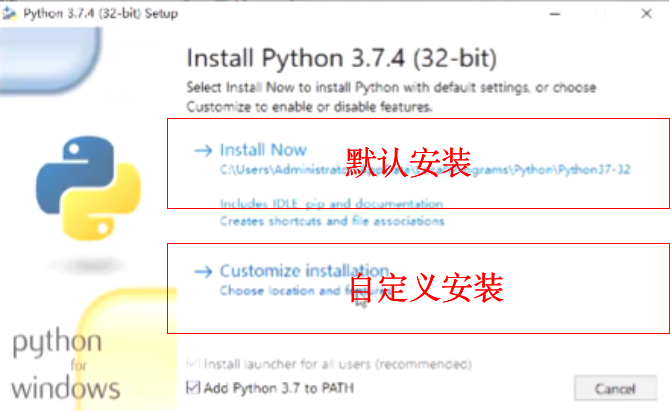

   * 安装成功

     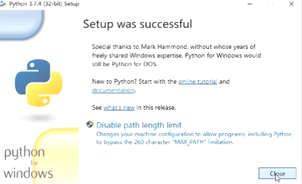

     

5. 检验安装是否成功

* 在命令行输入或者直接Windows+R ,输入cmd

  出现如下窗口：

  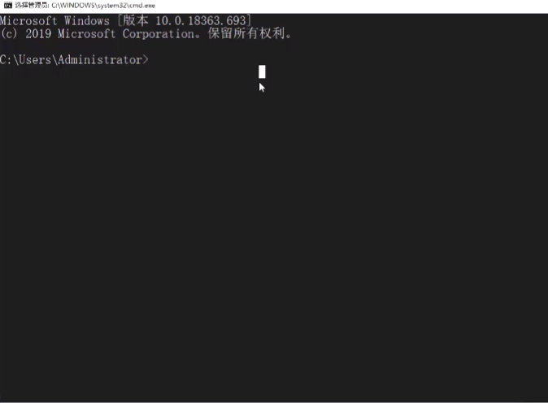

* 输入`python -V`

* 或者 `python —version`

  就会出现当前安装的版本号（此截图电脑装修的是3.7版本）

  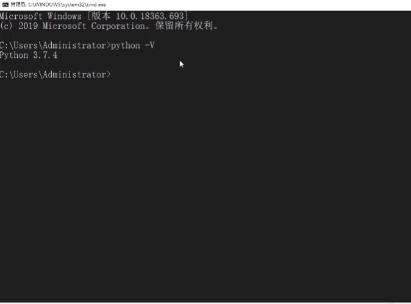

* 出现版本号，则表示安装成功

### MAC

1. 系统是OS X>=10.9，那么系统自带的Python版本是2.7
2. 要安装最新的Python 3.7，有两个方法：
   方法一：从Python官网下载Python 3.7的安装程序，双击运行并安装；
   方法二：如果安装了Homebrew，直接通过命令brew install python3安装即可。

安装成功后，我们将得到Python环境的解释器

### Python环境解释器

#### **CPython解释器**

* 这是官方版本的解释器，安装完Python 3.x之后，可直接获得。

* C代表的是C语言，也就是说这个解释器的底层是C语言来实现的。

#### IPython解释器

* IPython是基于CPython之上的一个交互式解释器.
* IPython只是在交互方式上有所增强，但是执行Python代码的功能和CPython是完全一样的。
* 好比很多国产浏览器虽然外观不同，但内核其实都是调用了IE

#### PyPy解释器

* 最大特点：JIT(just in time）（及时编译）技术
* Python代码进行动态编译（注意不是解释），所以可以显著提高Python代码的执行速度

#### Jython解释器

* Jython是运行在Java平台上的Python解释器，
* 可以直接把Python代码编译成Java字节码执行，相当于把一种语言翻译成另外一种语言

#### IronPython

IronPython和Jython类似，IronPython是运行在微软.Net平台上的Python解释器，可以直接把Python代码编译成.Net的字节码

# 5.pycharm集成开发工具

### **集成开发环境**

（Integrated Development Environment ）,通常称为IDE，也就是我们通常所说的开发工具。一般包括代码编辑器、编译器、调试器和图形用户界面等工具

### pycharm安装

Python使用的是开发环境是pycharm

下载地址:https://www.jetbrains.com/pycharm/download/#section=windows

pycharm是jetbrains公司的开发的一款非常智能的开发工具，这家公司是专门做集成开发工具的，根据不同的编程语言，可以安装选择不同的开发工具

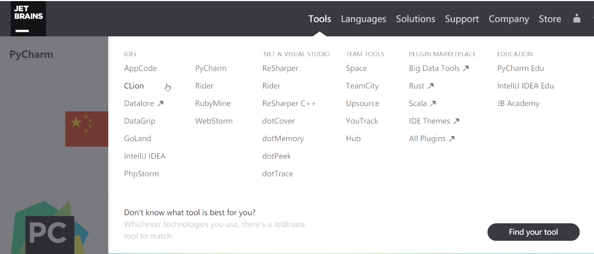

当然，除了pycharm之外也有其他的开发环境，我们在这里选择比较简单的pycharm

选择需要安装的版本，professional是专业版，功能多，需要收费，但是 有30天的体验期，我们可以先下载这个。

1. 下载pycharm

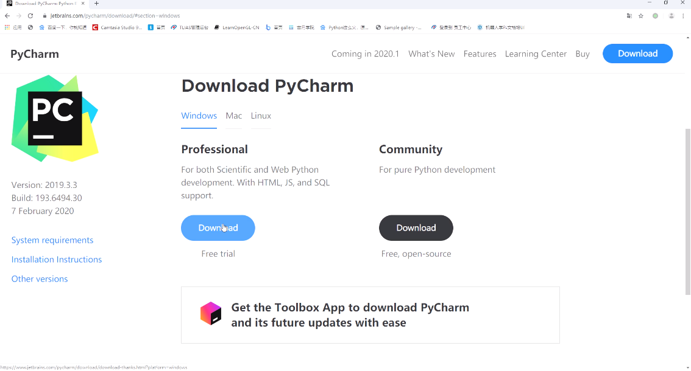

2. 下载完之后，开始进行安装，选择好合适的存储目录后，注意一下几个选项

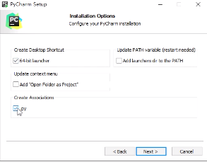

3. pycharm的一些基础设置

   * 第一次使用的话，这里不需要更改

     

   * 选择喜欢的主题

     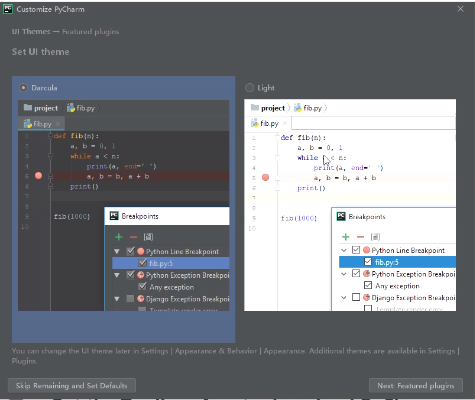

   * 选择免费试用

   


# 6.第一个python程序

### 创建一个工程

1. 在开发中，每一个项目都是一个功能，所以在写程序前，我们需要创建一个工程

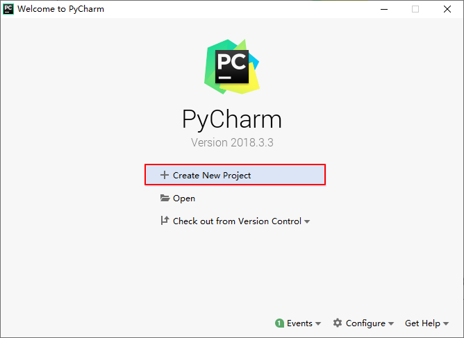

2. 创建一个纯净的Python文件，选择合适的存储路径，给文件命名，在配置好环境

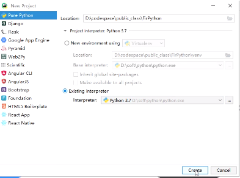

3. 第一次进去界面，会出现一个弹窗，询问你是否需要展示一些使用的技巧，可以选择浏览也可以跳过

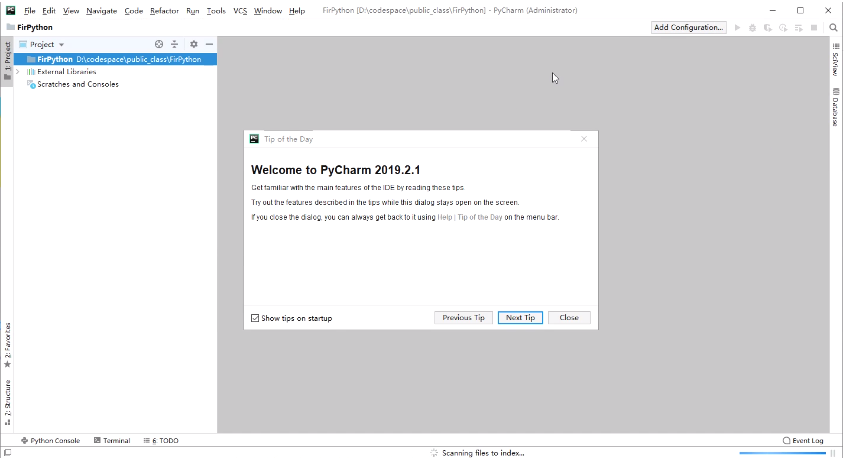

4. 创建一个新的文件Python file

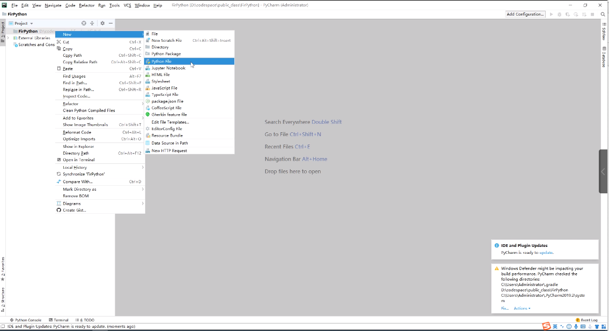

5. 文件命名为hello，不需要加后缀名

   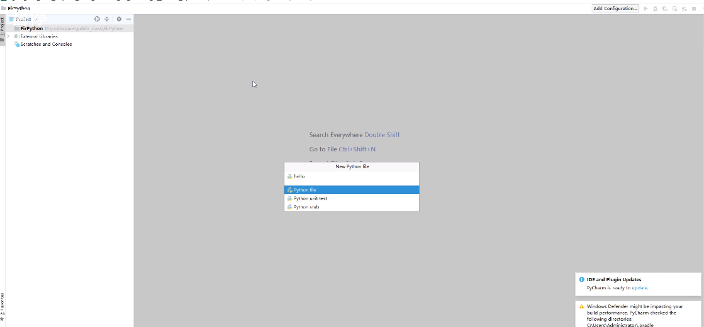

6. 创建完文件，打开文件，就可以编写代码了

   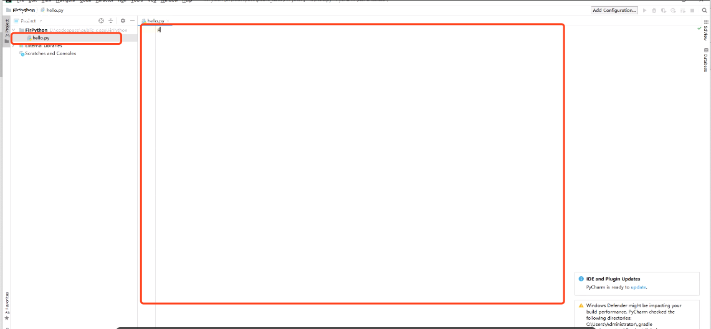


### 编写第一个程序

创建python文件,输入如下内容:

```python
print('hello')
```

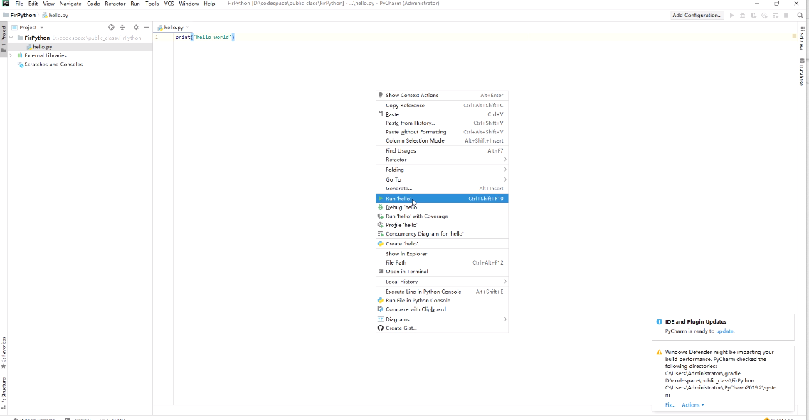

运行代码，输出如下内容，红框的地方地方显示运行的结果

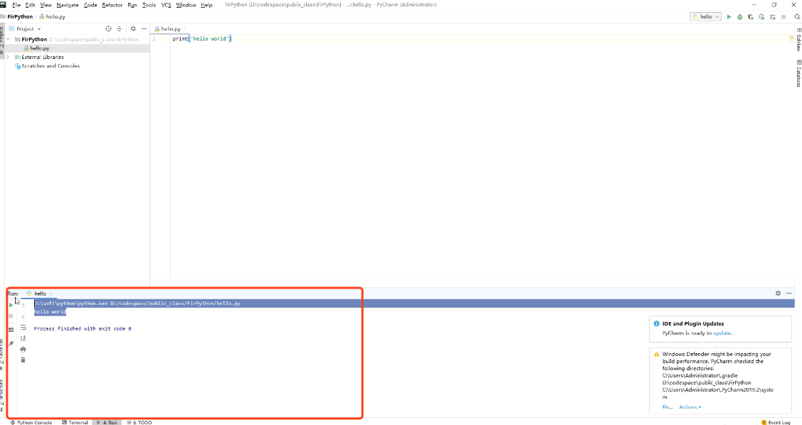

### pycharm界面设置

如果想要pycharm使用起来更加顺手，我们可以在设置里面调整一些设置

比如，修改一下字体的大小

* 修改工具栏字体

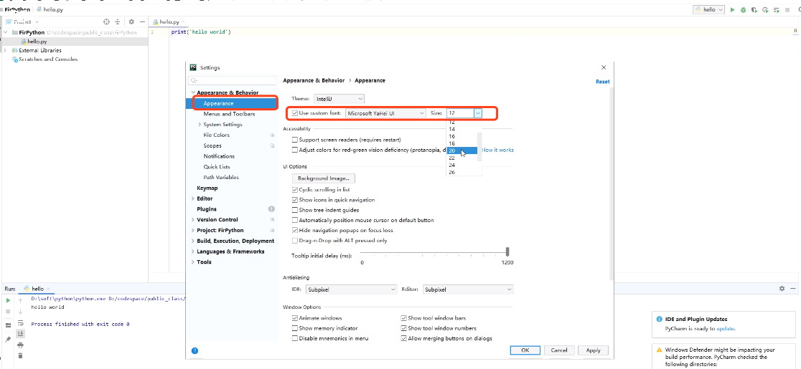

* 修改代码字体

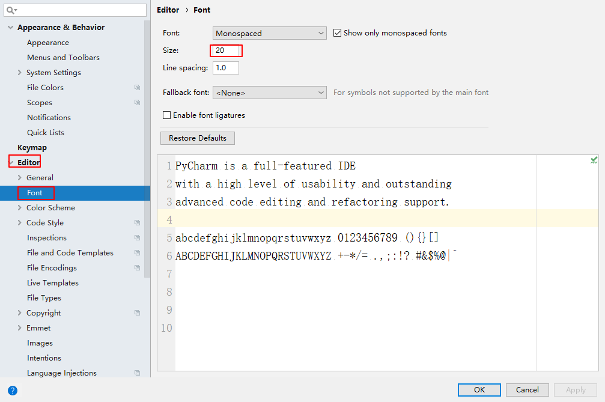

* 工程目录可以点击红框处隐藏或者显示或者使用快捷键**alt+1**

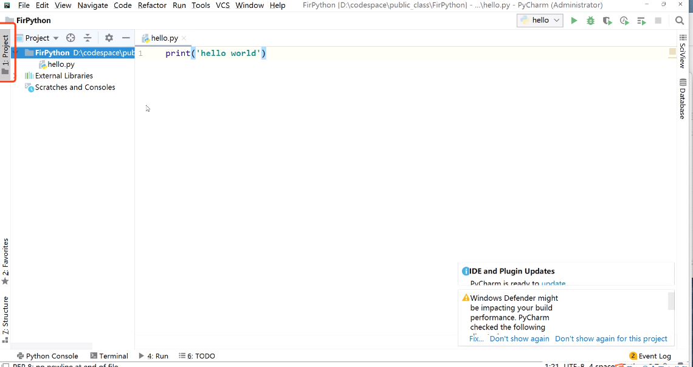

* 控制台，显示运行的结果

  Ter'minal是一个普通的Windows命令行

  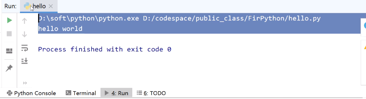


# 7.程序注释

程序注释在以后的开发过程中是非常重要的，如果要写非常标准规范的代码，程序注释是必不可少的

那什么是注释呢？

注释在我们的生活中非常的常见，比如我们看一些电子书，有些词语的意思我们不是特别的清楚，那它就有一个注释解释

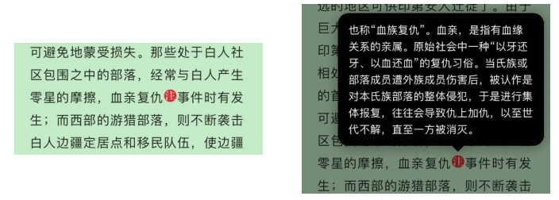

程序注释主要是对代码进行解释说明,并不参与程序的运行

注释可以分为:**单行注释**和**多行注释**

## 单行注释

我们新建一个文件，输入以下代码

```python
# 下面代码是给女神打招呼
print('hello 林青霞')
```

单行注释以**#**开头,**#**后空一格后跟上注释的内容

运行程序，出来的结果是

```hello 林青霞
hello 林青霞
```

注释的内容，并不会执行，所以说他只是一个解释说明的部分

## 多行注释

除了单行注释之外呢，还有一种是多行注释

如果注释内容比较多的话,一行写不下来，可以使用多行注释

多行注释以**'''**开头,**'''**结尾,或者**"""**开头,**"""**结尾

```python
'''
第一行代码是给女神打招呼
第二行代码是给男神打招呼
'''
print('hello 林青霞')
print('hello 郑少秋')
```

运行结果

```
hello 林青霞
hello 郑少秋
```

我们在开发过程中号使用的最多是单行注释，单行注释还有一个快捷键ctrl+/，可以进行注释或者取消注释。

## 注释的作用

注释在编程中非常重要，具体的作用有以下一些

* 单行代码添加说明

* 整段代码添加说明

* 调试程序

  当程序报错时，可以通过注释代码，检查错误

* 记录工作日志(TODO)

  当我们编写一个复杂的项目时，就需要写一些工作日志，比如我们需要写一个登录模块，因为网络请求还没有写好，所以暂时还没办法写，我们就可以用TODO记录，在下面TODO里面就会显示所有的TODO工作日志。


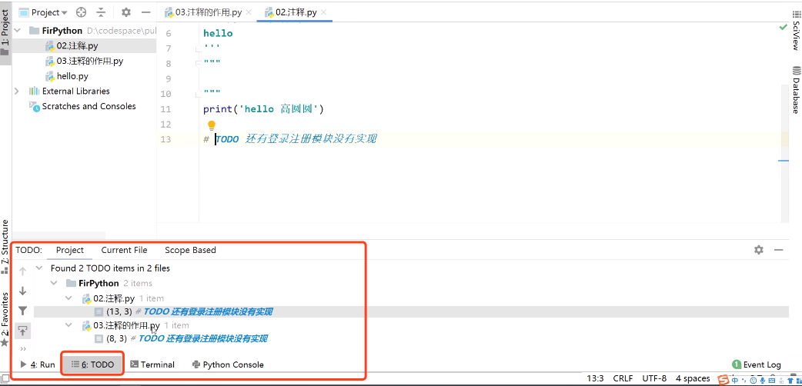

# 8.pycharm的提示信息

在编程的过程中，pycharm之类的开发工具会将各种各样的隐藏信息和错误提示出来 。有以下几种情况

### 代码规范提示

输入以下内容

```
#输出hello
print“hello”
```

注释地方出现会灰色的波浪线，见下图，但是程序可以正常运行。

这个就是属于代码规范提示。

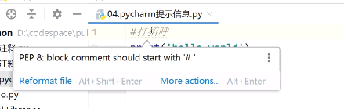

在写注释的时候，规范的写法是#和内容有一个空格，如果没有的话，就会出现类似的提示。不写也不影响代码执行，只是不规范，所以大家还是尽量按照规范的写法来写。

### 单词提示

我们再输入一个

```
print('itcast')
```

你会发现，itcast下面也出现了灰色的波浪线，见下图这个提示信息是告诉我们单词可能不存在，但是也不影响程序的正常运行，这个也可以不用管它


### 错误提示

但是还有一种情况，就必须得注意，例如：在print前面空一格

```
 print('hello')
```

你会发现，出现了以下的情况

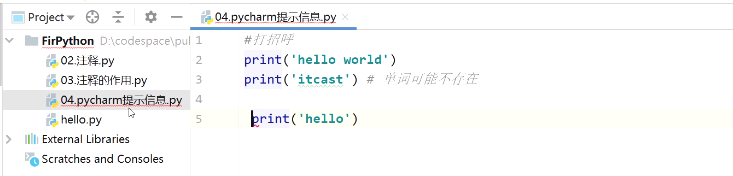

在代码、文件名和文件夹名的下方都出现了红色的波浪线，程序也不能正常运行，会报错，这个就是代码出现错误，这是格式错误，如果print拼写错误，也会报错，因为在Python中找不到这个单词。

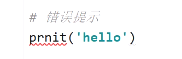

这种错误提示我们就需要去处理好，将错误修改正确，保证程序的正常运行。

我们来总结一下，代码规范和单词提示，我们可以不做处理，但是错误提示就要解决。

# 9.变量

变量**是用来描述计算机中的**数据存储空间的

我们在程序中要保存一个人的姓名，一个人的年纪，都是通过变量来实现的。

变量其实跟我们去买房子是一样的，我们去买房的时候并不是买一整栋，买的是其中的一间，那买完时候，有几个问题要注意

1. 你是怎么样正确找到子家的房子呢？

   对，我们可以通过小区的名字，楼栋号，门牌号来定位自己的房子。

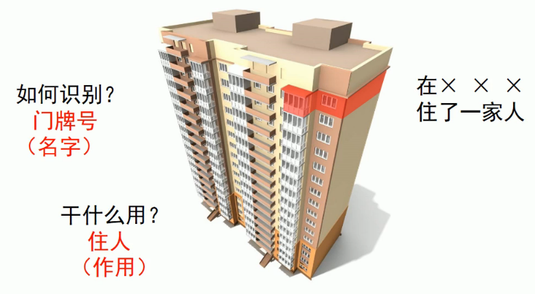

2. 买了房子我们是用来干嘛的？

   有些人为了结婚生孩子自住，有些人会用来出租，有些人用来投资


变量跟这个也是一样的道理。

比如我们要在程序中要定义一个变量，保存一个信息，其实就可以看做是一整块内存被分成了多个空间，

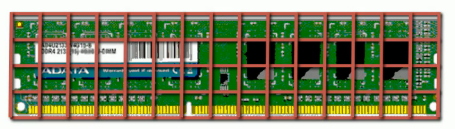

我们定义的变量就是将信息保存在其中的一个空间内

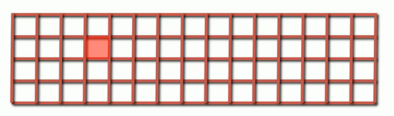

接下来就是确定这个内存要用来干什么事情？我们需要明确一下几点：

需要知道这块内存的识别方式以及用途

* 识别方式:可以给这块内存起个名字(比如:age）

* 用途:取决于放什么东西(放数字,放其它都行)

总结一下变量

* **变量概念**:描述计算机中的数据存储空间
* **变量作用**:在计算机内存中保存数据

所以说以后我们要在程序中定义数据和保存数据都是通过变量来实现的

## 变量定义

### 定义变量格式

**格式**：**变量名 = 变量值**

可以一次定义一个变量，修改变量


也可以一次定义多个变量


定义变量有一个特别重要的方面，就是变量的命名，有一些规则我们需要遵守

## 变量的命名规则

变量名的定义需要遵守下面的规则:

1. 只能由数字,字母,_(下划线)组成
2. 不能以数字开头。比如1、0等都不能开头
3. 不能是关键字
4. 区分大小写。name和NAME是两个不同的变量

考一考，看看下面哪些命名是合法的？

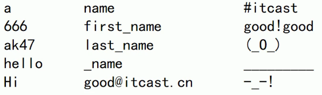

这个应该很简单，大家以后在给变量命名的时候一定要注意。

为了让代码更加的清晰，除了必须遵守的命名规则外，还有命名规范

## 变量的命名规范

为了让我们代码更加简洁易懂,还需要遵守下面的命名规范

1. 下划线命名法

   ```python
   zhang_name = '张三'
   ```

2. 驼峰命名法

   ```python
   # 大驼峰命名法
   ZhangName = '张三'
   # 小驼峰命名法
   zhangName = '李四'
   ```

大小驼峰的区别就是首字母是否大写。

##  变量练习

需求：求圆的面积

分析：面积=π*半径的平方

代码：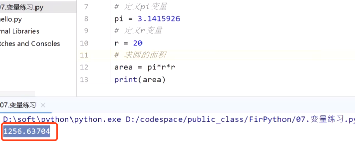

这个程序有三个变量，一个是pi,r,area。其实大家都知道pi在数学中是个不会改变的，在其他的编程语言中，不可修改的变量我们称之为“常量”，但是在Python中没有常量这个概念，所以如果你想要让别人知道你的某一个变量不想被修改，就可以将它全部大写。

## 获取Python中的关键字

主要是通过**keyword**包查找，输入一下代码，就可以获取到关键字，以后的学习中我们也会学到，先了解以下

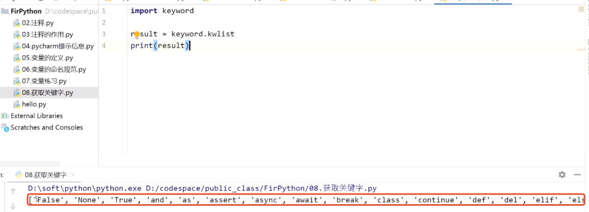

## 数据类型

定义一个变量就是通过变量名=变量值的方法来进行定义，主要是考虑两个方面，一个是如何识别变量，就是变量名，另一个就是变量的用途，就是变量值。另外变量还有一个重要的方面就是变量的类型。

不同的数据对应不同的数据类型。

### 变量类型分类

变量类型主要分类两大类：**数字型**和**非数字型**

我们分别来看下它们的区别

**数字型类型:**

| **数据类型**         | **描述**     |
| -------------------- | ------------ |
| int                  | 整型         |
| float                | 浮点型(小数) |
| bool(True 1 False 0) | 布尔型       |
| complex              | 复数型       |

**非数字数据类型**

| **数据类型** | **描述** |
| ------------ | -------- |
| str          | 字符串   |
| list         | 列表     |
| tuple        | 元组     |
| set          | 集合     |
| dict         | 字典     |

我们首先需要掌握的是数字型。

### 变量类型获取

格式：type(变量名/数值)

如：定义单个不同类型的变量，通过type可以获取它们的变量类型，分别是int类型，浮点类型，和bool类型

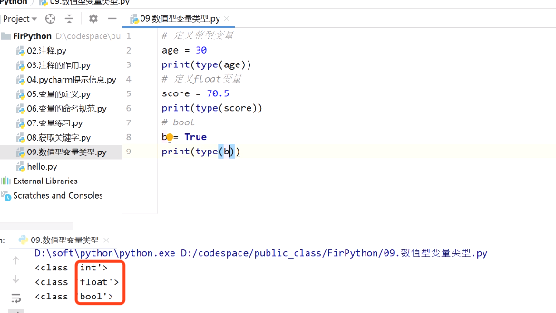

### 变量类型的特征

在Python中定义变量，我们不需要指定它的类型，这个跟其他的编程语言又有所不同了，比如在Java中，就需要指定变量的类型，指定之后，就不能修改了。如果不指定的话，就可以进行修改。比如：

```
age = 30  #age是数字类型
age = "张三"#age是字符串类型
```

在同一个程序中可以修改变量的类型，以最后一次出现的类型为准

所以称Python语言是一个动态的编程语言。

# 10.算术运算符

跟变量类型紧密相连的是运算符。

数值之间的操作用到的运算如如下:

| **运算符** | **描述** |
| ---------- | -------- |
| +          | 加       |
| -          | 减       |
| *          | 乘       |
| /          | 除       |
| //         | 取整除   |
| %          | 取余数   |
| **         | 幂       |

来看一下不同变量类型之间的运算

1. 数值型变量之间可以直接计算

   ```
   a = 10
   b = 3
   # 除 结果是浮点类型
   c = a/b
   print(c)
   # 整除 结果是整数类型
   c = a//b
   print(c)
   # % 取余数
   d = a%b
   print(d)
   # 求幂
   e = a**3
   print(e)
   ```

   运行结果：

   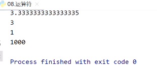

2. 字符串之间使用+拼接字符串

   ```python
   str1 = 'hello'
   str2 = 'world'
   str3 = str1 + str2
   print(str3)
   ```

   输出结果:

   ```
   helloworld
   ```

3. 字符串变量和整型使用*重复拼接相同的字符串

   ```python
   str = 'hello'
   s = str*5
   print(s)
   ```

   输出结果:

   ```
   hellohellohellohellohello
   ```

4. 不同数据类型之间不能进行运算

   ```python
   str = 'hello'
   a = 10
   # 错误,字符串和数字不能直接相加
   result = str+a
   print(result)
   ```

# 11. 输入和输出函数

## 人机交互

人机交互是一门非常高深的学问，我们有很多的方式可以实现人机交互，大家有兴趣也可以去百度上搜索一下。我们先来看一下市面上常用的人机交互方式

1. 意念交互

   这是最高级的一种，大家可以去搜一下Facebook意念打字，就是有一端接收人的脑电波，然后将人的想法用文字展示在电脑屏幕上。

   

2. 语音交互

   我们打开微信或者其他软件，都会用的语音交互，这个已经比较普遍了。最有名的就是科大讯飞的语音输入法。

   

3. 眼动交互

   暴风影音和谷歌眼镜很火，就是用眼球的滚动来控制画面的切换，其实它的内部原理，就是通过内部的传感器来接受眼球的滚动。

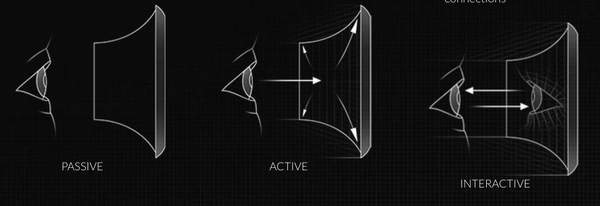

1. 体感互动

   体感游戏大家肯定也不陌生，也是利用传感器定位人的位置，实现人机互动


这些都是我们生活中常见的交互方式，但是我们现在演示不了。但是我们可以进行最简单的打字交互，就是我们的输入和输出函数

## 输出函数

程序可以通过**输出函数**将程序执行的数据输出到控制台

输出的方式有两种：普通输出和格式化输出

python中的输出函数是:`print()

#### 普通输出

1. 一次输出一个变量

   下图是定义了三个变量，分别打印了出来，打印了三次

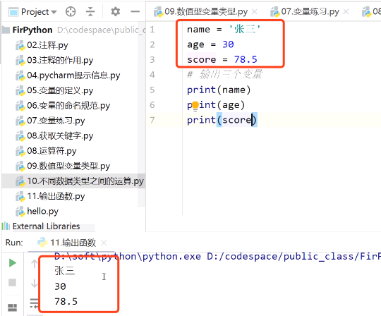

2. 也可以一次输出多个变量


#### 格式化输出

如果想要输出一些提示，比如想对这三个变量做一些提示，在姓名，年纪，分数之前都加上提示。如果是其他的语言，那么就是：

```
print('姓名'+name+' 年纪:'+age+' 分数'+score)
```

但是在Python当中这样是运行不了的，因为前面说了Python中不同的变量类型不能相加，那要怎么做呢？所以就要用到格式化输出。

首先不用的类型占位符不同：

| **格式化字符** | **含义**                                  |
| -------------- | ----------------------------------------- |
| %s             | 字符串                                    |
| %d             | 有符号的十进制整数,%06d表示不足6位以0补齐 |
| %f             | 浮点数,%.2f表示小数后只显示两位           |
| %%             | 输出%                                     |

所以如果实现以上功能，代码格式如下：

```
# 格式化输出
print('姓名:%s,年纪:%d,分数:%f'%(name,age,score))
```

占位符和括号内的变量是一一对应的，用%连接

还可以输出一些特殊的格式

```
# 特定长度的整型类型
# print('年纪:%06d'%age)

# 浮点类型
# print('分数:%.2f'%score)

print('姓名:{},年纪:{},分数:{}'.format(name,age,score))
```

##### 练习

需求1. 定义字符串变量 name，输出 我的名字叫 小明，请多多关照！

分析：只需要定义一个变量 name

代码：

```
name = '小明'
print('我的名字叫 %s,请多多关照'%name)
```

需求2. 定义整数变量 student_no，输出 我的学号是 000001

分析：定义变量 student_no，需要设置他的输出学号位数，格式化输出

代码：

```
student_no = 1
print('学号:%06d'%student_no)
```

需求3. 定义小数 price、weight、money，输出 苹果单价 9.00 元／斤，购买了 5.00 斤，需要支付 45.00 元

分析：定义三个float类型变量price、weight、money，需要运算和格式化输出

代码：

```
rice = 9.00
weight = 5.00
money = price*weight
print('苹果单价 %.2f 元／斤，购买了 %.2f 斤，需要支付 %.2f 元'%(price,weight,money))
```

需求4. 定义一个小数 scale，输出 数据比例是 10.00%

分析：使用%%的运算符

代码：

```
scale = 10.00
print("数据的比例是 %.2f%%"%scale)
```

## 输入函数

程序不单需要输出信息，还需要输入信息，比如我们去银行的ATM机上取钱的时候呢，它就会要我们输密码。

输入函数用来接收用户从控制台输入的数据

python中的输入函数是:input()

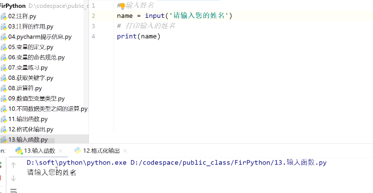

大家可以看到，计算机输出的不是我们之前看到的整个变量，而是input里面的信息，我们输入张三，张三就是我们的输入信息

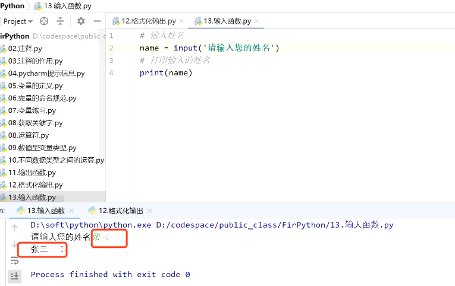

输入年纪，也是同理

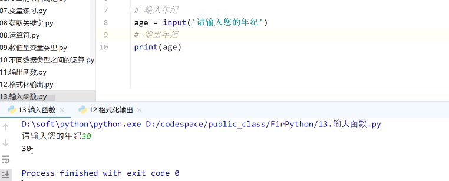

**注意**：input输入的数据都为str字符串类型

可以用type获取类型

```python
# 输入年纪
age = input('请输入年纪')
# 获取age类型
t = type(age)
print(t)
```

输出结果:

```
<class 'str'>
```

### 转换输入数据

* float()函数将输入的数据转换为浮点类型
* int()函数将输入的数据转换为整型

```
# 输入年纪
age = input('请输入您的年纪')
# print(type(age))
# # 将age的字符串类型转换成int类型
age = int(age)
# # 增加1岁
age = age + 1
# # 输出年纪
# print(age)
```

运行结果：

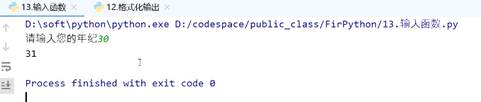

转换为变量类型后就可以进行运算

我们还可以输入分数：


那score后面可以直接加上数字吗？

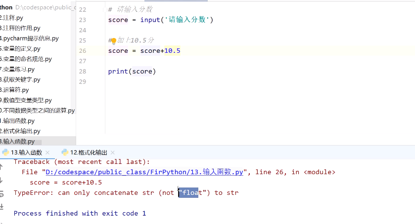

我们看到程序报错了。因为score和10.5不是同一种类型，不能直接相加

另外必须要注意的是，int这些数据类型在转换的时候，里面只能是数字

```
int('10')
```

如果不是数字，就会报错

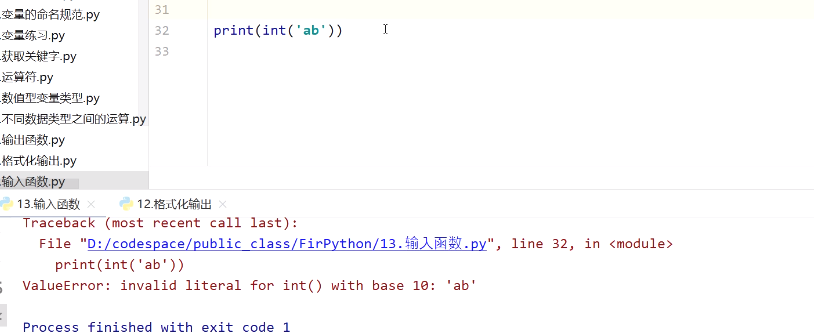


# 12.输入输入练习

下面，我们来做一些练习巩固一下输入和输出的知识，大家也要动手联系起来

## 练习1.计算器

```
需求:
用户输入a
用户输入b
计算输出a+b=?
```

分析：

```
a和b应该是整型类型的变量，需要使用int转换数据类型
否则打印出来是字符串拼接
```

代码如下:

```python
# 用户输入a
 a = input('请输入a')
# 用户输入b
b = input('请输入b')
# 将a和b转换成int类型
a = int(a)
b = int(b)
# 计算输出a+b=?
result = a+b
print(result)
```

运行结果：

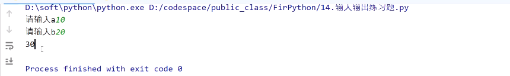

## 练习2.超市打票

```
需求:
 收银员输入苹果的价格,单位:元/斤
 收银员输入用户购买苹果的重量,单位:斤
 计算并输出付款金额
```

分析：

```
定义两个变量price和weight
需要将变量类型转换为float类型
```

代码如下:

```python
# 收银员输入苹果的价格,单位:元/斤
price = input('请输入苹果的单价:元/斤')
# 收银员输入用户购买苹果的重量,单位:斤
weight = input('请输入购买苹果的重量:斤')

# price和weight转换成float类型
price = float(price)
weight = float(weight)

# 计算并输出付款金额
money = price * weight
print(money)
```

输出结果：

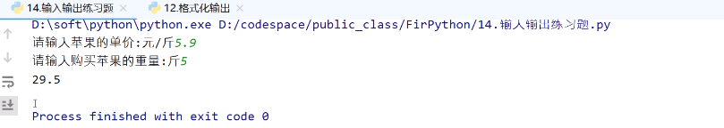

## 练习3.打印名片

```
需求:
在控制台依次提示用户输入：姓名、公司、职位、电话、邮箱
按照以下格式输出：
```

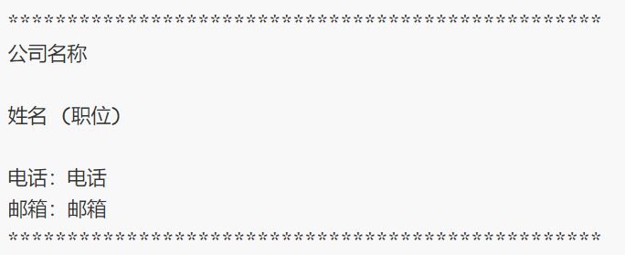

分析：

```
1.输入信息定义5个变量
2.输出名片格式
```

代码如下:

```python
# 姓名
name = input('请输入姓名')
# 公司
com = input('请输入公司名')
# 职位
title = input('请输入职位名')
# 电话
phone = input('请输入电话')
# 邮箱
email = input('请输入邮箱')

# 输出名片
print('*'*50)
print('公司名称 %s'%com)
print()
print('%s(%s)'%(name,title))
print()

print('电话:%s'%phone)
print('邮箱:%s'%email)
print('*'*50)
```

输出结果：

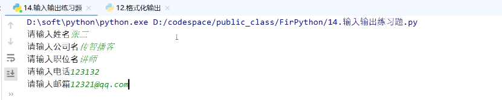

# 12.其它运算符

操作各种数据，就要用到各种各样的运算符，接下来我们就来学习几种常见的运算符。

## 赋值运算符

赋值运算符主要用来对变量进行赋值,最简单的就是 = ，我们在定义变量的时候其实就是在赋值，把后面的值赋值给前面的变量名。除了 = 之外，还有一些赋值运算符，给大家整理在一下的表格。

| **运算符** | **描述** |
| ---------- | -------- |
| =          | 赋值     |
| +=         | 加等于   |
| -=         | 减等于   |
| *=         | 乘等于   |
| /=         | 除等于   |
| //=        | 整除等于 |
| %=         | 模等于   |
| **=        | 幂等于   |

实例如下:

```python
a = 10
a += 5 # 等价于  a = a+5
-= 同理
a *=2 # 等价于 a  = a*2
```

## 比较运算符

比较运算符主要用来比较两个数据的大小,它返回的类型是True和False包括如下这些:

| **运算符** | **描述** |
| ---------- | -------- |
| ==         | 等于     |
| !=         | 不等于   |
| >          | 大于     |
| <          | 小于     |
| >=         | 大于等于 |
| <=         | 小于等于 |

实例如下 ：

```python
a = 10
b = 20

# ==
result = a == b
print(result)
```

输出结果：

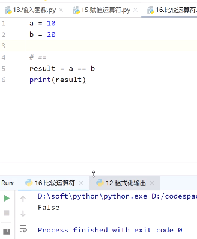

因为a不等于b，所以返回的结果是false

如果将 == 换成 =！ 则返回True

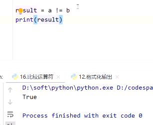

## 逻辑运算符

逻辑运算符在其他的编程语言中也都有广泛运用。

逻辑运算符主要用在布尔类型的数据,返回结果是布尔型数据,包括如下:

| **运算符** | **描述** |
| ---------- | -------- |
| and        | 逻辑与   |
| or         | 逻辑或   |
| not        | 逻辑非   |

1. **and  逻辑与**: 必须两个数据都为True,才返回True

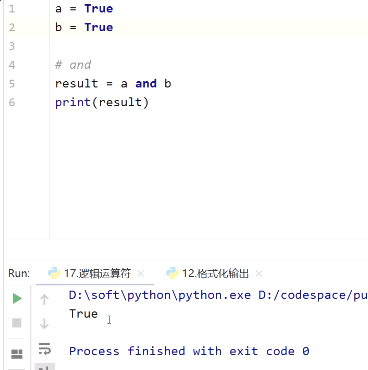

2. **or**  **逻辑或**:只要两个有一个为True,结果就为True

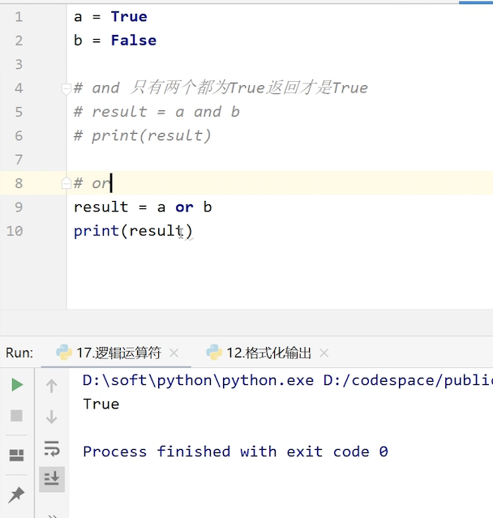

当两个都为false的时候则返回False


3.**not  逻辑非**:取反操作

原来如果是True则为False ,原来是False则为True

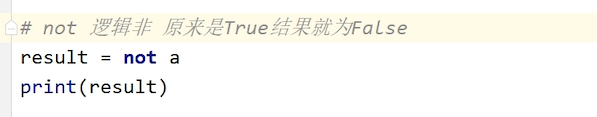

在后面的流程控制语句，在条件判断时候就需要用到逻辑运算符。


## 运算符的优先级

在学习了多种运算符之后，如果几种运算符同时出现，谁的优先级高呢，就算我们数学中先乘除后加减一样，它们也有优先级。

算术运算符的规则就数学的差不多。

* 单目运算符:只需要一个数据运算的运算符,比如:not 后面只要跟一个数据

* 双目运算符:需要两个数据运算的运算符,比如:+ -…or and  前后都需要跟数据

* 总体来说:单目运算符的优先级高于双目运算符

另外如果你想要优先运算的数据可以将他们用（）起来，就会优先运算（）里的数据,也跟数学有些类似

  例如：

```python
a = (10+20)*30
print(a)
```

# 13.条件控制语句if

在学习完变量和基础的运算符之后呢，我们就要学习一个非常重要的知识点，叫流程控制语句。基本上我们学习任何的编程语言都是这样的一个过程，先学习一些基础的变量和运算相关的知识，接下来就是流程控制语句。

那什么是流程控制语句呢？

顾名思义，就是控制流程的意思。我们来通过具体的代码了解一下。

先看一段代码:

```python
print('hello1')
print('hello2')
print('hello3')
print('hello4')
print('hello5')
```

这段程序无论怎么执行,无论你什么时候执行，结果都是一样的。因为我们没有控制流程的东西，所以每一次输出的结果都一样。但是作为一个程序，我们需要再不同的条件下执行不同的代码或者说返回不同的结果，这个时候，我们就需要用到流程控制语句。

流程控制语句的类型也比较多，我们先来学习的是if语句

## if语句

* 程序满足特定的条件才能执行特定的代码
* 条件控制语句使用**if**关键字

#### 流程结构图：

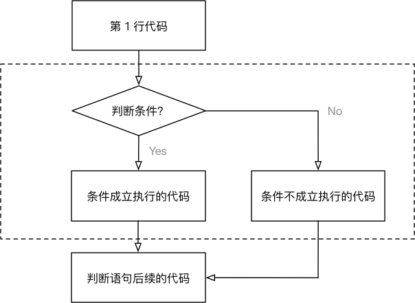

#### if语句的格式:

```
if 条件:
    条件成立时，要做的事情
    ……
```

#### 练习：进网吧打游戏

```
需求
1. 定义一个整数变量记录年龄
2. 判断是否满 18 岁 （>=）
3. 如果满 18 岁，允许进网吧嗨皮
```

分析：

```
1.定义一个age变量
2.转换int类型
3.运用>=运算符
4.使用if语句判断
```

代码如下:

```python
# 1. 定义一个整数变量记录年龄
age = input('请输入年纪')
# 将age转换成整型类型
age = int(age)
# 2. 判断是否满 18 岁 （>=）
if age>=18:
    print('允许进网吧嗨皮')
```

> 注意:python中没有{},通过缩进代表作用域，用tab键缩进

## if...else...语句

有些情况我们希望满足条件执行相应的代码,不满足条件执行其他的代码,这就需要用到if …else...语句

#### if ... else...语句格式

```python
if 要判断的条件:
    条件成立时，要做的事情
    ……
else:
    条件不成立时，要做的事情
    ……
```

#### 练习：进网吧打游戏

```
需求：
1. 输入用户年龄
2. 判断是否满 18 岁 （>=）
3. 如果满 18 岁，允许进网吧嗨皮
4. 如果未满 18 岁，提示回家写作业
```

分析：

```
使用if...else...语句
```

代码如下:

```python
# 1. 定义一个整数变量记录年龄
age = input('请输入年纪')
# 将age转换成整型类型
age = int(age)
# 2. 判断是否满 18 岁 （>=）
if age>=18:
    print('允许进网吧嗨皮')
else:
    print('回家写作业')
```

## if ...elif... else语句

当然现实生活中很多东西不是非黑即白，只有两种情况，一般都是有很多种可能，在开发中，可能希望 并列的执行出多种结果，这时就可以使用**elif**

#### if ...elif... else格式

```python
if 条件1:
    条件1满足执行的代码
    ……
elif 条件2:
    条件2满足时，执行的代码
    ……
elif 条件3:
    条件3满足时，执行的代码
    ……
else:
    以上条件都不满足时，执行的代码
    ……
```

#### 练习：女友的生日

```
需求
1. 定义 holiday_name 字符串变量记录节日名称
2. 如果是 情人节 应该 买玫瑰／看电影
3. 如果是 平安夜 应该 买苹果／吃大餐
4. 如果是 生日 应该 买蛋糕
5. 其他的日子每天都是节日啊……
```

分析：

```
1.定义一个变量holiday_name
2.节日的情况有很多种
3.使用==逻辑运算符
4.使用elif
注意哦，这里用到的都是字符串，所以不用转换数字类型
```

代码:

```python
holiday_name = input('请输入节日名称')
if holiday_name=='情人节':
    print('买玫瑰/看电影')
elif holiday_name=='平安夜':
    print('买苹果/吃大餐')
elif holiday_name=='生日':
    print('买蛋糕')
else:
    print('每天都是节日,每天一个红包')
```

根据不同的节日输入情况，出现的结果就不一样，大家可以去练习一下，节日的个数没有限制。

## if语句使用逻辑运算

* 在程序开发中，执行结果 可能和 多个条件有关
* 比如 多个条件都成立才能执行，或者有一个条件成立就可以执行，这时就需要使用 逻辑运算符
* 逻辑运算符 可以把 多个条件 按照 逻辑 进行 连接，变成 更复杂的条件

### 练习

```
练习1: 定义一个整数变量age，编写代码判断年龄是否正确
      要求人的年龄在 0-120 之间
练习2: 定义两个整数变量python_score、c_score，编写代码判断成绩
     要求只要有一门成绩 > 60 分就算合格
练习3: 定义一个布尔型变量is_employee，编写代码判断是否是本公司员工,如果不是提示不允许入   内
```

代码：

```python
# 练习1: 定义一个整数变量age，编写代码判断年龄是否正确
 age = int(input('请输入年纪'))
# 要求人的年龄在 0-120 之间
if age>=0 and age<=120:
    print('年纪满足')
else:
     print('年纪不满足')
    
# 练习2: 定义两个整数变量python_score、c_score，编写代码判断成绩
 要求只要有一门成绩 > 60 分就算合格
  
python_score = float(input('请输入python成绩'))
c_score = float(input('请输入c语言成绩'))
if python_score>=60 or c_score>=60:
    print('成绩合格')
else:
    print('成绩不合格')
    
# 练习3: 定义一个布尔型变量is_employee，编写代码判断是否是本公司员工
     如果不是提示不允许入内
# True 1  False 0 输入1或者0就可以了
is_employee = int(input('请输入值'))
if is_employee:
    print('是公司员工')
else:
    print('不是公司员工')
```

## if嵌套

在开发中，使用 if 进行条件判断，如果希望 在条件成立的执行语句中 再 增加条件判断，就可以使用 if 的嵌套

**if 的嵌套 的应用场景**

在之前条件满足的前提下，再增加额外的判断

### if 的嵌套 的语法格式

除了缩进之外 和之前的没有区别

```python
if 条件 1:
    条件 1 满足执行的代码
    ……

    if 条件 1 基础上的条件 2:
        条件 2 满足时，执行的代码
        ……    

    # 条件 2 不满足的处理
    else:
        条件 2 不满足时，执行的代码

# 条件 1 不满足的处理
else:
    条件1 不满足时，执行的代码
    ……

```

### 练习：火车站安检

```
需求
1. 定义布尔型变量 has_ticket 表示是否有车票
2. 定义整型变量 knife_length 表示刀的长度，单位：厘米
3. 首先检查是否有车票，如果有，才允许进行 安检
4. 安检时，需要检查刀的长度，判断是否超过 20 厘米
     果超过 20 厘米，提示刀的长度，不允许上车
     如果不超过 20 厘米，安检通过
5. 如果没有车票，不允许进门
```

分析：

```
1.定义两个变量 布尔型变量 has_ticket 
             整型变量 knife_lengt
2.使用if嵌套，第一层检查是否有车票，第二层 刀的长度
```

代码如下:

```python
# 1. 定义布尔型变量 has_ticket 表示是否有车票
has_ticket = int(input('请输入是否有车票'))
# 2. 定义整型变量 knife_length 表示刀的长度，单位：厘米
knife_length = int(input('请输入刀的长度'))
# 3. 首先检查是否有车票，如果有，才允许进行 安检
if has_ticket:
    # 有车票
    # 4. 安检时，需要检查刀的长度，判断是否超过 20 厘米
    if knife_length>20:
        print('不允许进站')
    else:
        print('允许进站')
    pass # 语法补齐  并没有实际意义
else:
    print('不允许进站')
```

# 14.综合应用-石头剪刀布

最后，我们再做一个简单的案例，把今天学的知识再回顾巩固一下，今天的内容不多，主要是变量，运算符和流程控制语句，

需求

```
1. 从控制台输入要出的拳 —— 石头（1）／剪刀（2）／布（3）
2. 电脑 随机 出拳 
3. 比较胜负
```

**规则分析**

| **序号** | **规则**   |
| -------- | ---------- |
| 1        | 石头胜剪刀 |
| 2        | 剪刀胜布   |
| 3        | 布胜石头   |

**分析**

电脑随机出拳比较复杂，为了让流程先跑通，可以先将问题简化，让电脑固定出拳，我们以后碰到复杂的问题的时候，也是这样，先让流程跑通，

```
1. 玩家出拳
2. 电脑出拳  电脑出的石头 
```

**假定电脑出石头**

```python

"""--------------------------- 电脑固定出拳 ---------------------------"""
# 1.玩家输入出拳 石头:0 剪刀:1 布:2
player = int(input('请出拳(石头:0,剪刀:1,布:2)'))
# 2.电脑固定出拳 石头:0
com = 0
# 3.比较胜负
# 玩家赢有三种情况，用括号括起来，用or来运算，满足一种情况即可
if (player == 0 and com == 1) or (player==1 and com==2) or (player==2 and com==0):
     print('玩家赢,玩家出拳:%d,电脑出拳:%d'%(player,com))
 elif player==com:
     print('平局,玩家出拳:%d,电脑出拳:%d'%(player,com))
 else:
     print('电脑赢,玩家出拳:%d,电脑出拳:%d'%(player,com))

"""--------------------------- 电脑随机出拳 ---------------------------"""
# 导入功能模块 随机数
import random

# 1.玩家输入出拳 石头:0 剪刀:1 布:2
player = int(input('请出拳(石头:0,剪刀:1,布:2)'))
# 2.电脑随机出拳 
com = random.randint(0,2)# 1-10
# 3.比较胜负
# 玩家赢
if (player == 0 and com == 1) or (player==1 and com==2) or (player==2 and com==0):
    print('玩家赢,玩家出拳:%d,电脑出拳:%d'%(player,com))
elif player==com:
    print('平局,玩家出拳:%d,电脑出拳:%d'%(player,com))
else:
    print('电脑赢,玩家出拳:%d,电脑出拳:%d'%(player,com))
```

这里有一个新的知识点**导入功能模块**，Python中有很多写好了的功能模块，我们需要使用的时候，主要在代码开头使用**import**导入，具体格式：

inport **（导入的模块名）

例如

```python
import random
```

最后，要跟大家说一下的就是，大家在写比较大的项目的时候，一定要先将流程跑通，要不然很容易忘记具体的步骤或者很容易写着写着就不知道写到哪里去了，这是一个非常重要的方法。