学机器人技术,  请访问  http://robot.czxy.com/ 

欢迎大家来到我们的第二天的课程

今天我们要学习的主要内容有两个

* 循环控制语句
* 高级变量类型列表

循环控制语句是流程控制语句的一种，后面也还会学到其他的

高级变量类型是我们后面开发中经常碰到的东西，我们今天主要讲一些列表的定义操作和嵌套，最后还会有一些练习题巩固。

学习while循环之前，我们先来了解以下程序的三种执行。

# 1.程序的三种执行流程

程序的执行流程有三种,分别是:**顺序执行**、**分支执行**、**循环执行**


- 顺序 —— 从上向下，顺序执行代码
- 分支 —— 根据条件判断，决定执行代码的分支
- 循环 —— 让 特定代码 重复 执行

我们之前学的if语句就是分支执行，这里我们就不再了。

顺序执行就是简单的按照代码的顺序，全部执行一遍

我们今天要讲的就是循环执行。

# 2.while循环

循环的作用是**让指定的代码重复的执行**

while 循环最常用的**应用场景**

就是 让执行的代码 按照 **指定的次数** 重复 执行

## while循环的基本语法

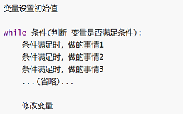

用一个非常简答的案例来演示一下while循环

```
需求:
打印 0 ~ 100 之间所有数字
```

分析：

```
1.定义一个变量index来保存0~100的数字
2.数字从0开始是不断往上增加的1 使用 +=
3.使用while循环100次 <=100 或者<101
```

代码：

```python
# 定义循环变量
index = 0
# 循环
while index < 101:
    # 打印语句
    print(index)
    # 修改循环变量
    # index += 1
print('程序结束')
```

另外我们还可以用debug的方式来查看程序的每一步的执行流程，怎么debug呢？在你关心的代码前点一个断点，然后选择debug运行，

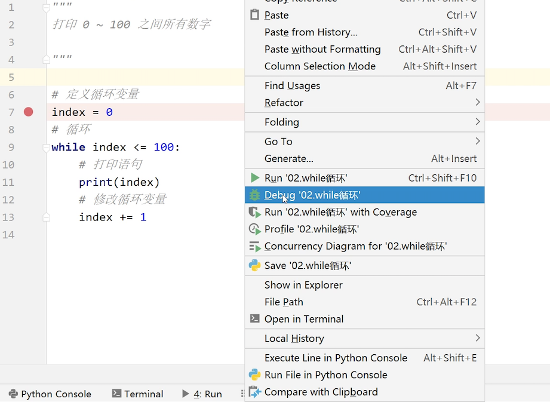


## 循环变量和死循环

代码中的修改循环变量是非常重要的，主要作用是控制循环什么时候停止下来，如果忘记修改循环变量，那循环就会变成死循环。
**死循环**指的是程序持续执行,无法终止,原因通常是忘记在循环内部修改循环变量的值。

例如：

```python
# 定义循环变量
index = 0
# 循环
while index < 101:
    # 打印语句
    print(index)
```

和正常代码相比,在循环内部忘记修改循环变量,那么循环条件一直满足,循环就会一直执行。

接下来，我们就要用while循环来解决一些循环中遇到的问题，

## 练习

需求1

```
计算 0 ~ 100 之间所有数字的累计求和结果
```

分析：

```
1. 0+1+2+3....+100
2.定义变量index 从0开始 += 1
3.先将0~100的数据先打印出来
4.定义求和结果变量sum 从0开始 +=index
```

代码：

```python
# 保存求和的结果变量
sum = 0
index = 0
while index < 101:
     sum += index
     # 修改循环变量
  print(sum)
```

运行结果：

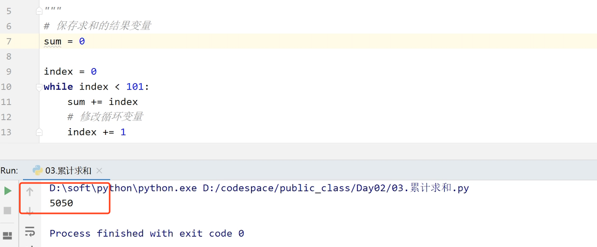


需求2

```
计算 0 ~ 100 之间 所有 偶数 的累计求和结果
```

分析

```
1.判断偶数，如果能整除2，余数为0就是偶数
2.使用运算符%
```

代码

```python
# 保存求和的结果变量
sum = 0
index = 0
while index < 101:# 3%2  1 4%2 0
    if index%2==0:
        sum += index
    # 修改循环变量
    index += 1

print(sum)
```


需求3

```
打印所有3位回文数
```

分析

```
1.找到所有的3位数  100-999
2.回文数：百位和个位相同，例如：101 111 121等
```

代码

```Python
# 1.找到所有的3位数  100-999
index = 100
while index < 1000:
    # 2.百位和个位是否相同 343
    hun = index//100#整除100获取百位
    single = index%10
    #if语句判断
    if hun==single:
        print(index)
    # 修改循环变量
    index += 1
```

需求4：打印三角形**

```
*
**
***
****
*****
```

分析

```
1.每一行打印的个数和当前行号相同定义行数的变量index
2.循环从1开始，循环5次
3.*的个数为"*"*index
```

代码:

```python
index = 1
while index < 6:
    print('*'*index)
    index += 1
```

需求升级

```
*****
****
***
**
*
```

分析

```
index从5开始
```

代码

```python
 index = 5
 while index > 0:
     print('*'*index)
     index -= 1
```

需求升级

```
*****
 ****
  ***
   **
    *
```

分析

```
1.前面用空格补齐
2.空格和*用+做字符串拼接
```

代码

```python
index = 5
while index > 0:
    # 先打印空格
    blankCount =5-index
    str = ' '*blankCount+'*'*index
    # 再打印*
    print(str)
    index -= 1
```

技能升级

```
需求
按照以上规则打印无数行
```

代码

```python
index = int(input('请输入行数:'))
a = index
while a > 0:
    # 先打印空格
    blankCount = index-a
    str = ' '*blankCount+'*'*a
    # 再打印*
    print(str)
     index -= 1
```


#  3.break和continue

现在我们要学习的是循环里的两个特别重要的关键字

**break**和**continue**

**break**

某一条件满足时，不再执行循环体中后续重复的代码，并退出循环

```python 
例如:5后面的数据都不输出
i = 0
while i < 5:
    if i == 3:
        break # 到了3就会退出循环
    print(i)
    i += 1
```

**continue**

某一条件满足时，不再执行本次循环体中后续重复的代码，但进入下一次循环判断

```python
例如：如果数据是3就停止，进入后面的循环，所以除了3其余的数据都会输出
i = 0
while i < 5:
    i += 1
    if i-1 == 3:
        continue # 等于3的时候，跳出此次运行，3不执行，继续执行后面的结果
    print(i-1)
```

下面我们通过案例来具体了解一下它们各自的用法

### break

需求

```
找到第一个5位数回文数
```

分析

```python
1. 5位数 从1000  <10000
2.万位等个位  千位等于十位 例如：12321 14541  89898
3.找到第一个回文数之后不用再继续查找了
```

代码

```Python
# 1. 5位数 10000-99999
 index = 10000
 while index < 100000:
     # 2.万位等个位  千位等于十位 12321 14541  89898
     wan = index//10000 #  求万位  整除10000
     qian = index%10000//1000 #求千位  先去掉万位用%10000 再整除1000
     ten = index%100//10 #求十位 去掉前面万千百用%100 再整除10
     single = index%10 #求各位 %10
     # 3.找到第一个回文数之后不用再继续查找了
     if wan==single and qian==ten:
         print(index)
         # 找到回文数,不需要再继续查找了
         break # 如果没有break，那运行结果会出现10000到99999之间所有的回文数
     index += 1
```

结果

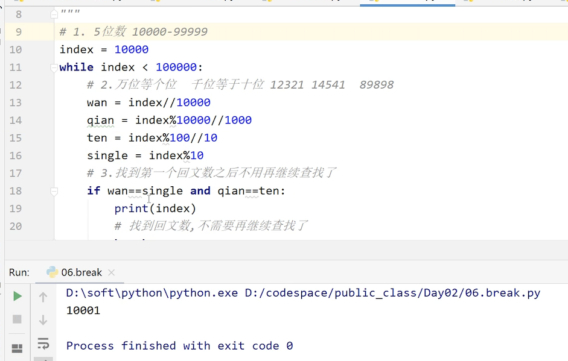

**需求升级**

```
需求
找到第10个5位数回文数
```

分析

```
1. 5位数 从1000  <10000
2.万位等个位  千位等于十位 例如：12321 14541  89898
3.定义一个变量记录回文数的个数 count
```

代码

```python
# 回文数的个数
count = 0
# 1. 5位数 10000-99999
index = 10000
while index < 100000:
    # 2.万位等个位  千位等于十位 12321 14541  89898
    wan = index // 10000
    qian = index % 10000 // 1000
    ten = index % 100 // 10
    single = index % 10
    # 3.找到第一个回文数之后不用再继续查找了
    if wan == single and qian == ten:
        count += 1
        if count==10:
            # 如果是第十个回文数才能输出
            print(index)
            # 找到回文数,不需要再继续查找了
            break
    index += 1
```

### continue

需求

```
把所有3位非回文数找出来
```

分析

```
1.范围100~1000
2.非回文数：当程序运行到回文数时，跳过，继续后面的循环，直到跳过所有的回文数，则所有的非回文数就都被打印出来了
3.修改循环变量要放在if语句前面
```

代码

```python
# 1.找到所有的3位数  100-999
index = 100
while index < 1000:
    # 2.百位和个位是否相同 343
    hun = index//100
    single = index%10
    # 修改循环变量
    index += 1
    if hun==single:
        # 调到下一次循环
        continue
    else:
        print(index-1)
```

# 4.嵌套循环

if语句可以嵌套，循环同样也可以嵌套。

while 嵌套就是：while 里面还有 while

### while循环嵌套的格式

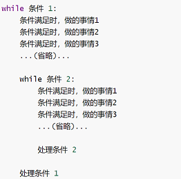

代码如下:

```python
需求：打印0、1、2 打印4次  
# 外层循环 打印4次
i = 0
while i < 5:
    # 内层循环 打印0、1、2
    j = 0
    while j<3:
        print(j)
        j+=1
    i += 1
```

### 嵌套练习：九九乘法表

我们先来看一下九九乘法表，很多同学一看到就蒙了，觉得很难。其实只要大家按照之前老师说的方法，一步一步分析，先把流程跑通，慢慢的就可以完成

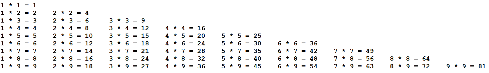

我们慢慢的要使自己拥有使负责的问题简单化的能力

我们来看一下。

虽然数据比较多，但是他们的结构是一样的，就是一个数据*一个数据=一个数据。所以我们将每一个等式看成是一个整体，将这个整体找一个东西，比如 * 代替。

然后将 * 替换成口诀

思路分析:

```
1.打印星星
2.使用嵌套循环打印星星
3.将星星替换成乘法口诀公式
```

**第一步：使用嵌套循环打印星星**

```python
#简单版
index = 1
while index<10:
   print('*'*index)
   index+=1
```

这种方法 *将参与运算，所以这种方法不行

需要换一种方法

分析

```
1.有行数和列数，所以循环需要嵌套
2.九九乘法表 前面表示的是行数，后面表示的是列数
3.打印的个数和行数号一样 
```

代码

```python
#定列数
row = 1
while row<10:
  #定义行数
    col = 1
    #行数比列数少一行
    while col<row+1:
        print('*',end='')
        col+=1
    # 一行打印完成 可以换行
    print()
    row+=1
```

输出结果:

```
*
**
***
****
*****
******
*******
********
*********
```

**将星星替换成乘法口诀**

```python
row = 1
while row<10:
    col = 1
    while col<row+1:
        print('%d * %d = %d'%(col,row,col*row),end='\t')#\t是制表符，更加美观
        col+=1
    # 一行打印完成 可以换行
    print()
```

输出结果:

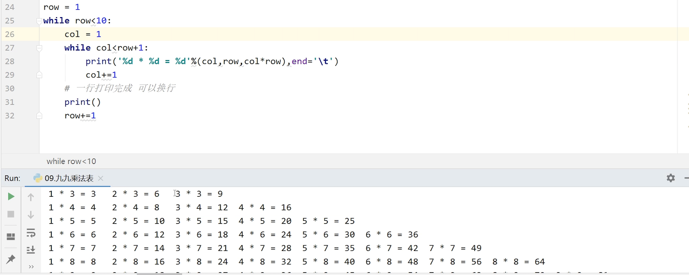

#### 制表符

| **转义字符** | **描述**   |
| ------------ | ---------- |
| \            | 反斜杠括号 |
| '            | 单引号     |
| “            | 双引号     |
| \n           | 换行       |
| \t           | 横向制表符 |
| \r           | 回车       |

#### 倒序九九乘法表

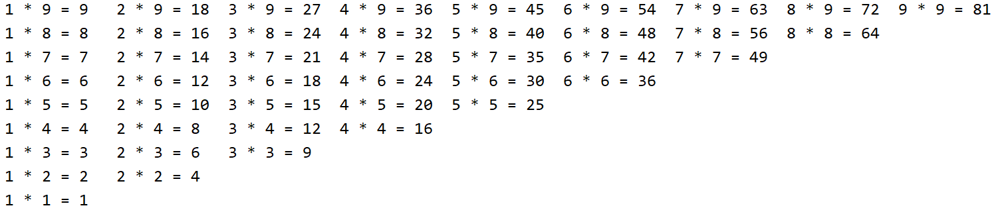

分析

```
1.row = 9  改变row的初始值
2.row > 0  改变row的条件判断
3.row -= 1 改变row的修改规则
```

代码:

```python
row = 9
while row > 0:
    # 这一行,需要操作n次 定义循环
    # 列循环:操作的次数
    col = 1
    while col <= row:
        # 不需要换行
        # 列*行=数据
        print('%d * %d = %d'%(col,row,col*row),end='\t') # 默认会有换行
        col += 1
    # 换行
    print()
    row -= 1
```

# 5.for循环

for循环跟while循环是有区别的

**作用**

for循环的主要作用是遍历数据(容器)中的元素，并不是所有的数据都能遍历

**字符串、列表等高级数据类型**都属于容器,都可以通过for循环遍历

任何可**迭代**的数据都能通过for循环遍历('hello' )

**遍历**

把容器中的每一个元素都找到，就是遍历

**迭代**

任何的容器都有迭代的功能

####  for循环的语法格式:

```python
for 临时变量(变量的名字自己取) in 列表或者字符串等可迭代对象:
	执行的代码
```

来看看具体的例子：

**使用for循环遍历字符串中的所有字符**

```
需求:
打印字符串'hello world'中每一个字符
```

分析

```
1.定义一个变量
2.定义一个临时变量ele，程序会将每一个元素赋值给ele,直到程序结束
3.使用for循环
```

代码如下:

```python
str = 'hello world'
# ele普通变量  接收容器中的元素
for ele in str:
    print(ele)
```

运行结果：（这里没有显示完全，实际所有的字母都被打印出来了，包括空格）

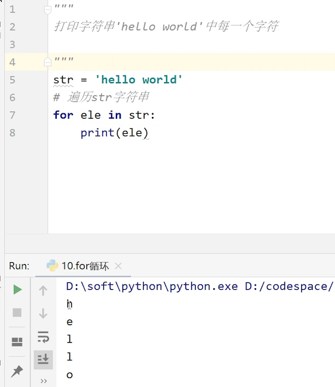

## in和not in

in和not in 都是关键字

 **in** 操作符用于判断元素是否存在于容器中，如果在容器中,返回 true，否则返回 false

例如：

```
需求
判断h是否在容器中
```

代码：

```python
str = 'hello'
result = 'h' in str
print(result)
```

结果:

```
True
```

##  continue和break

在for循环中也可以使用continue和break跳出循环
使用的方式和while循环一致

来看看怎么区别使用两者

```
需求1:
1.打印字符串'hello world'中除了'w'之外的每一个元素
```

分析：

```
1.先打印所有元素
2.for循环遍历
3.不需要打印w,使用一个判断if语句  使用运算符==
4.打印到w的时候，循环终止，进行下一轮循环，知道其他的都打印出来，使用continue
```

代码:

```python
str = 'hello world'
for ele in str:
    if ele=='w':
        continue
    print(ele)
```

```
需求2：
打印字符串'hello world'中第一个'o'出现之前(不包含第一个'o')的所有元素
```

分析

```
当第一个o出现时，程序终止，使用braek
```

代码

```python
str = 'hello world'
for ele in str:
    if ele =='o':
        break
```

```
需求3：
打印字符串'hello world'中第三个'l'出现之前(不包含第三个'l')的所有元素
```

分析

```
for循环没有计数功能，需要定义一个变量count来记录数量
```

代码

```python
str = 'hello world'
count = 0
for ele in str:
    if ele == 'l':
        count += 1
        if count==3:
            break
    print(ele)

```

在后面只要是碰到需要再容器中遍历元素，都可以用到for循环

## range

在python中，很多时候，我们不止需要一个整型数据，有时候是一段整型数据，比如1~100。

那如何在python中保存一段数据呢？我们可以使用range

range的中文意思就是**区间**

区间我们并不陌生，它是一个数学的概念

python range() 可创建一个整数列表

**range()**相当于数学中的**左闭右开**区间(包含左,不包含右)

我们先看看数学中的区间:

```
开区间:(1,10)  不包含1和10
闭区间:[1,10]  包含1和10

半开半闭区间

左开右闭区间:(1,10]  包含10不包含1
左闭右开区间:[1,10)  包含1不包含10
```

range的定义

```python
# 定义0到10的区间(包含0,不包含10)
 r = range(0,11)# 包含0 不包含11
# 如果区间从0开始,可以省略开始数据
 r = range(11)
```

负数的区间定义

```python
 r = range(-10,-5)
```

 倒序区间，10到0区间,默认都是正序，从小到大。使用逆序，需要加上步长-1

```python
r = range(10,-1,-1)
```

判断是否在容器中，使用关键字in

```python
result = 5 in r
print(result)
```

区间遍历:可以通过for循环

```python
# 定义0到10的区间(包含0,不包含10)
r = range(0,10)
# 遍历区间
for ele in r:
    print(ele)
```

求长度**:len()**

```python
str = 'hello'
length = len(r)
print(length)
```

注意点的是，在其他编程语言中，会有小数区间，或者字符区间，在python中只有整型区间。

### 练习：水仙花数

```
题目：
打印出所有的"水仙花数"，所谓"水仙花数"是指一个三位数，其各位数字立方和等于该数本身。
例如：153是一个"水仙花数"，因为153=1的三次方＋5的三次方＋3的三次方。
```

**分析:**

```
1.获取所有的三位数100-999
2.判断是否是水仙花数
    百位
    十位
    个位
```

**代码**

```python
# 1.获取所有的三位数100-999
for ele in range(100, 1000):
    # 2.判断是否是水仙花数
    # 百位
    hun = ele // 100
    # 十位 153
    ten = ele%100//10
    # 个位
    single = ele%10
    # 三个数据的立方和
    sum = hun**3+ten**3+single**3
    if ele==sum:
        print(ele)
```

运行结果：

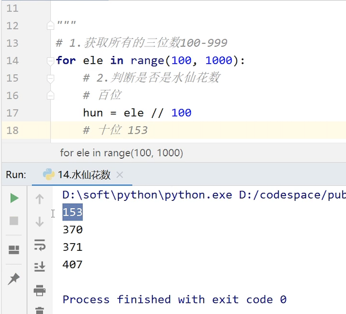

### 练习：数字组合

```
需求：
有四个数字：1、2、3、4，能组成多少个互不相同且无重复数字的三位数？各是多少？
```

分析：

```
1.三个位中每一个数据都是从1 2 3 4中获取
2.不能相同  不能重复
```

代码:

```python
#百位，从1~5遍历
for hun in range(1,5):
  # 十位 从1~5遍历
    for ten in range(1,5):
      # 个位 从1~5遍历
        for single in range(1,5):
          #判断百位！=十位且十位！=个位且百位！=百位，找出满足这三个条件的数字
            if (hun!=ten) and (ten!=single) and (single!=hun):
                num = hun*100+ten*10+single
                print(num)

```

## 循环结合else

循环也可以像if语句一样结合else

else 中的语句会在循环正常执行完（即 不是通过 break 跳出而中断的）的情况下执行,while循环也一样

**for…else**格式:

```python
for 变量 in 容器:
	循环体代码
else:
    没有通过break退出循环,循环结束后,会执行的代码
```

**示例代码**

**for循环正常**

会执行else中的代码

```python
str = 'hello world'

for ele in str:
    print(ele)
else:
    print('执行了else语句')
```

**for else中执行了continue**

continue不会影响else的执行

```python
for ele in str:
    if ele == 'o':
        continue
    print(ele)
else:
    print('执行了else语句')
```

**for else中执行了break**

如果执行了break,则else中代码就不会再执行了

```python
for ele in str:
    if ele == 'l':
        break
    print(ele)
else:
    print('执行了else语句')
```

 只是定义了break并没有执行,那else语句还会在循环结束之后执行

```python
for ele in str:
    if ele=='z':
        break# 不会执行
   print(ele)
else:
```

循环加else会让我们的开发变得非常的简介，后面我们会跟大家说明。

##  密码合法判断练习

我们学习任何语言都是一样的，先学习语法，然后知道这个语法在实际开发中有什么作用，只有在理解了作用之后呢，我们才真正的掌握。

```
需求:
判断登录密码'hhew2383dW_fkf&E@^'是否合法
要求:
1. 密码必须是数字、字母(大小写都可以)、和下划线,否则不合法
2. 如果密码合法,就输出'密码合法,可以登录'
```

分析

```
1. 定义容器:保存所有满足条件的字母(大写和小写）数字（0~9）和下划线
2. 遍历密码字符串
3. 判断所有元素是否在容器中
4.所有的元素都满足条件,说明整个密码合法
```

代码:

```python
pwd = 'hhew2383dW_fkfE'
# 1. 定义容器保存所有满足条件的字母数字和下划线
container = '0123456789abcdefghijklmnopqrstuvwxyzABCDEFGHIJKLMNOPQRSTUVWXYZ_'
# 2. 遍历密码字符串
for ele in pwd:
    # 3. 判断元素是否在容器中
    if ele in container:
        # 一个字符合法
        pass
    else:
        print('密码不合法')
        # 结束循环
        break
else:
    # 4.所有的元素都满足条件,说明整个密码合法
    print('密码合法')
```

如果执行了break,就不会再执行else,密码合法就不会执行，只要没有执行break说明都是合法的，就执行else。

# 5.高级变量

前面我们已经学过python的一些类型，比如说：

数字型包含:整型、浮点型、布尔型、复数型，还有字符串类型，他们都有不同的作用，

如果要保存一个人的年龄，要用到整型

如果要保存一个人的姓名，要用到字符串

如果要保存一个人的成绩，要用到浮点型

但是，仅仅只有这些类型是不够的，如果我们要用一个变量保存三个人的姓名，那这些变量类型就没办法实现了。

所有我们就要一些高级变量类型，也就是非数字型

### 高级变量类型

列表
元组
集合
字符串
字典

### 高级变量的特点

* 都是一个 序列 sequence，也可以理解为 容器

* 获取某一个元素 \[0\](集合例外,无序的，不能够取第几个)

* 通过for循环遍历 

* 都可以计算长度、最大/最小值、比较、删除

* 连接 + 和 重复 * 

* 切片(容器一部分)

下面我们就开始分别来学习一下这些高级变量

今天我们要学习的是其中非常重的一个——列表

##  列表

列表是Python中使用最频繁的数据类型

专门用于存储一串数据，存储的数据 称为**元素**，比如我们前面说的，我们要保存多个人的姓名，就要用到列表这个容器。每个姓名，就是列表中的元素。

列表的类型是:**list**

### 列表的定义

列表用**[  ]**定义,元素之间用 **,**分隔

```
需求：
保存几个女生的姓名，年龄
```

代码：

```python
#字符串
l = ['林青霞','高圆圆','张曼玉']
#数字
l = [60,40,50]
#混合数字类型
l = ['张三',60,40,50,True,78.5]
```

### 访问列表的元素

查找列表中元素是按照列表索引进行查找的

**索引** 就是元素在 列表 中的位置编号，又可以被称为 下标

索引是从**0**开始的

例如:第一个元素,索引就为0

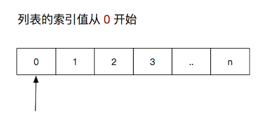

```
需求：
获取列表中的第二个元素
```

代码：

```python
l = ['林青霞','高圆圆','张曼玉']
# 第二个元素 根据索引访问元素
ele = l[1]
print(ele)
```

### 遍历列表

如果想要获取列表中所有的元素就要用到遍历

可以通过for遍历列表中的元素

```
需求：
获取列表中所有的元素
```

代码：

```python
l = ['林青霞','高圆圆','张曼玉']
for ele in l:
    print(ele)
```

## 列表的操作

既然列表是一个容器，那大家可以想一下，如果这个列表是一个箱子，那我们是不是可以从箱子拿东西，也可以从箱子里加东西，也可以换东西。

所有对于容易来说，都可以进行一些增删改查的操作

列表可以增加新的元素,可以删除元素,元素也可以修改,还可以对列表进行排序等操作

#### 增加元素

| **方法**          | **说明**                                 |
| ----------------- | ---------------------------------------- |
| append(数据)      | 在末尾追加数据                           |
| insert(索引,数据) | 在指定位置插入数据(位置前有空元素会补位) |

1. 通过append增加新元素

```
需求：
在末尾增加 凤姐
```

代码：

```python
l = ['林青霞','高圆圆','张曼玉']
l.append('凤姐')
print(l)
```

结果:

```python
['林青霞','高圆圆','张曼玉','凤姐']
```

```
需求：
# 在第二个位置 增加 范冰冰

```

代码:

```python
l = ['林青霞','高圆圆','张曼玉']
l.insert(1,'范冰冰')
print(l)
```

结果：

```python
['林青霞','范冰冰','高圆圆' ,'张曼玉' ]
```

#### 删除元素

| **方法**       | **说明**                      |
| -------------- | ----------------------------- |
| del 列表[索引] | 删除指定索引的数据            |
| remove(数据)   | 删除第一个出现的指定数据      |
| pop()          | 删除末尾数据,返回被删除的元素 |
| pop(索引)      | 删除指定索引数据,返回元素     |
| clear()        | 清空列表                      |

1. **del** 

   删除指定索引数据

```
需求：
删除凤姐
```

代码：

```python
l = ['林青霞','凤姐','高圆圆','张曼玉']
#del 删除凤姐
del l[1]
print(l)
```

结果：

```python
['林青霞''高圆圆','张曼玉']
```

2. **remove**

   删除指定数据，如果知道名字，不知道索引，就使用这种方式删除数据

```
需求：
删除凤姐
```

代码：

```python
 l = ['林青霞','凤姐','高圆圆','张曼玉']
 remove
 l.remove('凤姐')
 print(l)
```

结果:

```python
['林青霞''高圆圆','张曼玉']
```

3. **pop**

   删除末尾元素，并且会返回删除的元素

```
需求：
删除最后一个元素
```

代码：

```python
# pop 删除末尾 并返回删除的元素
# 定义一个变量接受删除的结果
l = ['林青霞','凤姐','高圆圆','张曼玉']
ele = l.pop()
print(l)
print(ele)
```

结果：

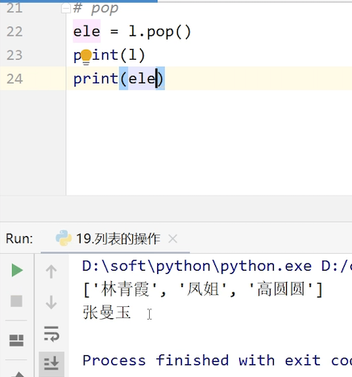

​    

pop(索引) 如果在括号里增加索引，那就是删除索引处的数据了，并且也会返回删除的元素值

  ```python
# pop(索引) 删除索引对应的数据 并返回删除的数据
 l = ['林青霞','凤姐','高圆圆','张曼玉']
 ele = l.pop(1)
 print(ele)
 print(l)
  ```

如果这个列表的元素都不需要了，不需要一个个的删除，可以直接清空整个列表

4. **clear**

   清空列表

代码：

```python
# 清空列表
 l = ['林青霞','凤姐','高圆圆','张曼玉']
 l.clear()
```

#### 修改元素

方法: 列表[索引]=新数据 

```
需求：
将列表中的凤姐修改成李冰冰
```

代码：

```python
 l = ['林青霞','凤姐','高圆圆','张曼玉']
# 凤姐修改成李冰冰
 l[1] = '李冰冰'
 print(l)
```

结果:

```python
['林青霞','李冰冰','高圆圆','张曼玉']
```

#### 查询元素

| **方法**    | **说明**                                             |
| ----------- | ---------------------------------------------------- |
| 列表[索引]  | 根据索引取值，索引不存在会报错                       |
| index(数据) | 根据值查询索引，返回首次出现时的索引，没有查到会报错 |
| len(列表)   | 列表长度                                             |

1. **列表[索引]**  

   根据索引值查找元素，索引不存在会报错

```
需求
获取第二个元素
```

代码

```python
 l = ['林青霞','凤姐','高圆圆','张曼玉']
# 获取第二个元素
 ele = l[1]
 print(ele)
```

结果:

```
凤姐
```

2. **列表.index(元素)** 

   查找元素的索引

有些时候我们需要修改元素，但是不知道它的索引，就可以先查询它的索引，然后再进行修改

```
需求
获取凤姐的位置
```

代码

```python
# 获取某一个元素在列表中的位置(索引)
 index = l.index('凤姐')
 print(index)
```

结果:

```
1
```

3. **len(列表)**

   获取列表的长度

这些列表的基本操作，就是这些，增删改查是所有容器都可以进行的操作，我们要知道什么时候用什么方法。后面要用的时候，如果实在没记住，可以回来查文档

## 列表的排序

除了增删改查，列表还有一个功能，是排序。

| **方法**           | **说明**       |
| ------------------ | -------------- |
| sort()             | 升序(从小到大) |
| sort(reverse=True) | 降序(从大到小) |
| reverse()          | 逆序、反转     |

1. **列表.sort()**

   对列表进行**升序**排序，从小到大

```python
l = [10,50,20,30,90]
l.sort()
print(l)
```

结果:

```
 [10,20,30,50,90]
```

2. **列表.sort(reverse=True)**

   reverse 是反转的意思

   对列表进行**降序**排序

```python
l = [10,50,20,30,90]
l.sort(reverse=True)
print(l)
```

结果:

```
[90,  50, 30, 20, 10]
```

3. **列表.reverse()**

   对列表进行反转

   反转的意思就是不论大小，把列表里的数据反过来

```python
l = [10,50,20,30,90]
l.reverse()
print(l)
```

结果:

```
[90, 30, 20, 50, 10]
```

### 练习：登录系统

需求

```
输入用户名和密码，判断账号和密码是否正确，是否能成功登录
```

分析

```
1.建立后台，保存系统里面有多个用户，用户的信息目前保存在列表里面
    users = ['root','westos']
    passwd = ['123','456']
2.用户登陆(判断用户登陆是否成功）
    1).判断用户是否存在
    2).如果存在
        1).判断用户密码是否正确
        如果正确，登陆成功，推出循环
        如果密码不正确，登录失败
    3).如果用户不存在
    登录失败
```

代码

```python
# 1.保存所有已经注册的用户
users = ['root','westos']
passwd = ['123','456']
# 2.接收用户输入用户名或密码
name = input('请输入用户名')
pwd = input('请输入密码')
# 1).判断用户是否存在
if name in users:
    # 2).如果存在
    # 根据用户输入的用户名找到正确的密码
    # 找到用户名在列表中的索引
    index = users.index(name)
    # 获取正确的密码
    rightPwd = passwd[index]
    # 1).判断用户密码是否正确
    if rightPwd==pwd:
        # 如果正确，登陆成功
        print('登录成功')
    else:
        # 如果密码不正确，登录失败
        print('登录失败,用户名或密码错误')
else:
    # 3).如果用户不存在
    # 登录失败
    print('登录失败,用户不存在')
```

运行结果：只有当账号和密码等正确时，才能登录成功

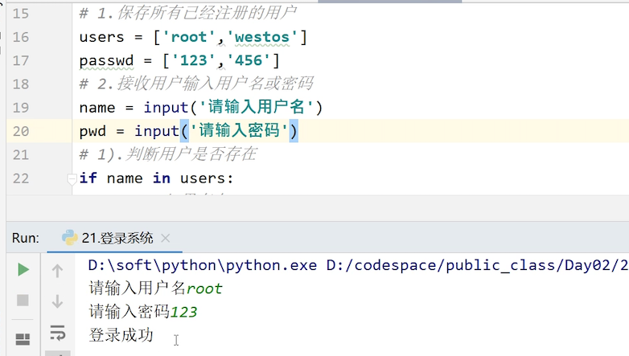

否则，会有错误提示

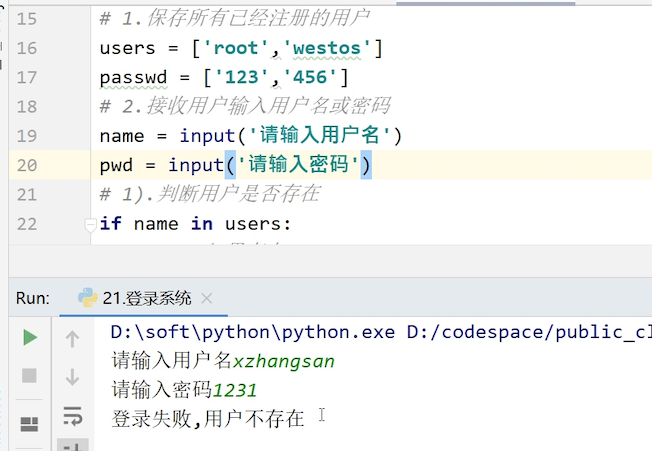

其实我们后台的逻辑也是差不多的，要加上网络请求，要有一个端口来等待浏览器请求，把数据传过来，在数据库里找到用户名和密码比对，流程也是差不多的

## 列表的嵌套

前面也是讲过嵌套，列表中的元素可以是列表类型的数据,就称为列表的嵌套。

那列表的嵌套有什么用呢？

我们来看一下。

```
思考:
1班有三位同学:林青霞 狄龙 郑少秋
2班有2位同学:张曼玉  梁朝伟
请问:怎么将1班和2班同学保存在一个列表?
```

代码：

```python
# 定义1班同学
 class1 = ['林青霞','狄龙','郑少秋']
# 定义2班同学
 class2 = ['张曼玉','梁朝伟']
# 保存两个班级的同学
students = [class1,class2]
 print(students)
```

结果：两个列表组成了一个新的列表

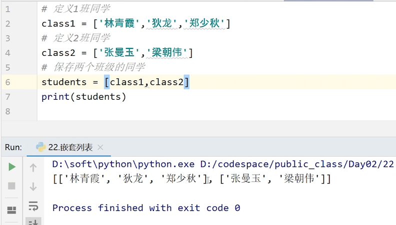

对于新的列表来说，有两个元素，第一个元素就是class的整个列表，第二个元素是class2的整个列表。所以这里有三个列表。那我们如果查询students这个列表中的某一个元素呢？

比如我们要查找郑少秋。

代码：

```python
# students这个列表当中的第一元素class1中的第二个元素
print(students[0][2])
```

结果：

修改元素也是跟之前学的修改列表元素是一样的。

比如把张曼玉修改成王菲

代码：

```python
 #将students这个列表当中的第一元素class1中的第0个元素修改为王菲
 students[1][0] = '王菲'
 print(students)
```

结果：

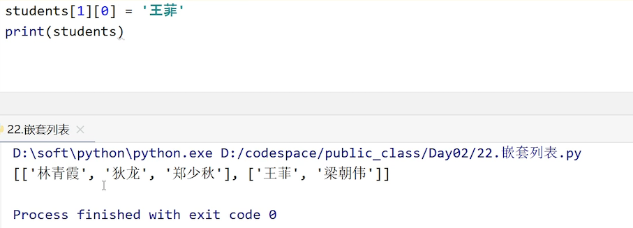

### 练习：办公室分配

需求

```python
一个学校，有3个办公室，现在有8位老师等待工位的分配，
请编写程序:
1. 完成随机的分配 
2. 获取办公室信息 (每个办公室中的人数，及分别是谁)
```

分析：

```
1.定义数据类型保存3个办公室 列表:嵌套
  三个办公室里分别有老师，分成三个列表
  三个办公室又组成一个列表
2.8位老师用列表保存
3.随机分配
    遍历老师列表
    随机找一个办公室添加进去
4.输出办公室信息
```

代码：

```python
# 随机分配 
 
 import random
 # 1.定义数据类型保存3个办公室 列表:嵌套
 classrooms = [[],[],[]]
 # 2.8位老师用列表保存
 teachers = ['袁腾飞','罗永浩','李永乐','吴恩达','俞敏洪','张雪峰','李笑来','徐小平']
 # 3.随机分配
 #     遍历老师列表
 for teacher in teachers:
    
     # 随机角标
     index = random.randint(0,2)
     # 随机找一个办公室添加进去
     classroom = classrooms[index]
     # 添加到教室中
     classroom.append(teacher)


 # 4.输出办公室信息
 print(classrooms)

# 分配办公室:每个办公室必须至少有一名老师 

# 1.定义数据类型保存3个办公室 列表:嵌套
classrooms = [[],[],[]]
# 2.8位老师用列表保存
teachers = ['袁腾飞','罗永浩','李永乐','吴恩达','俞敏洪','张雪峰','李笑来','徐小平']
# 先把每一个办公室先分配一名老师
for classroom in classrooms:
    # 优化:执行效率 代码简洁
    # # 随机角标
     index = random.randint(0,len(teachers)-1)
    # # 获取老师
     teacher = teachers[index]
    # # 添加到办公室中
     classroom.append(teacher)
    # # 删除这名老师
     teachers.remove(teacher)

    # 添加到办公室中
    classroom.append(teachers.pop(random.randint(0, len(teachers) - 1)))


# 3.剩下的老师再进行随机分配
#     遍历老师列表
for teacher in teachers:
    # 随机角标
    index = random.randint(0,2)
    # 随机找一个办公室添加进去
    classroom = classrooms[index]
    # 添加到教室中
    classroom.append(teacher)


# 4.输出办公室信息
print(classrooms)
```


