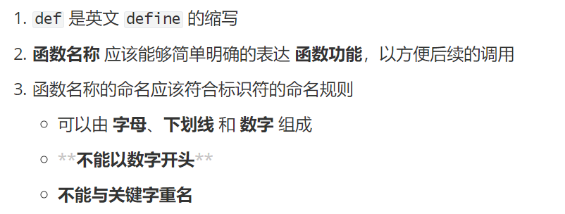
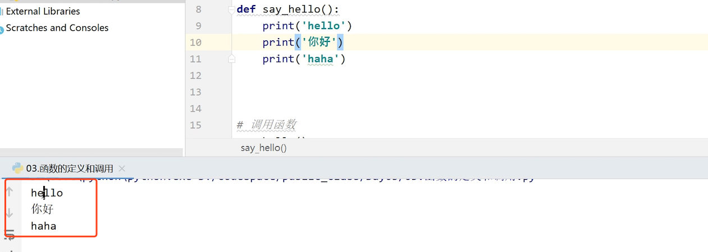
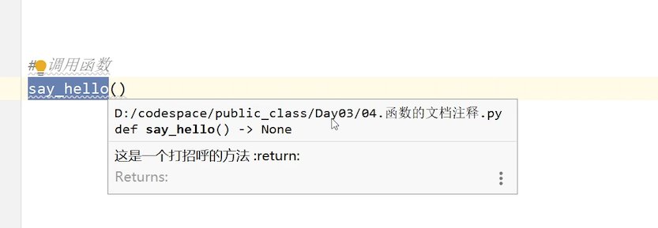
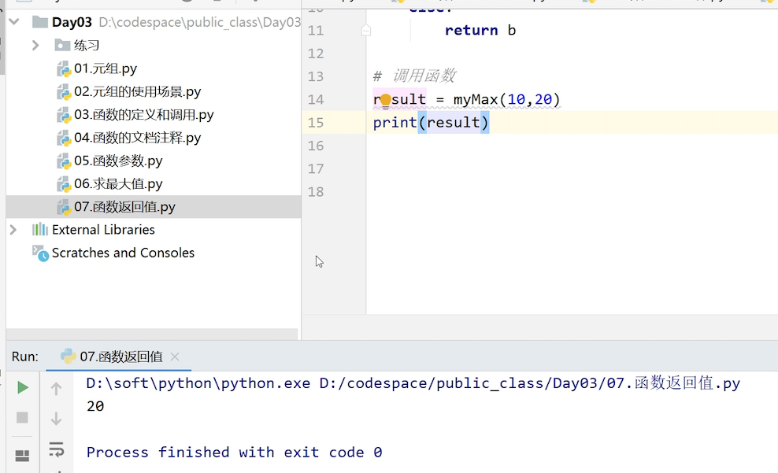
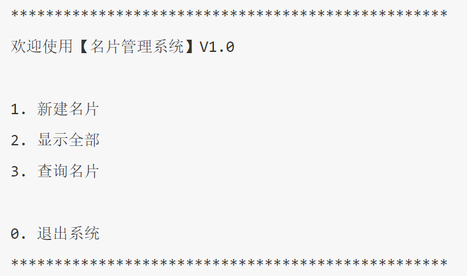

学机器人技术,  请访问  http://robot.czxy.com/ 

### 练习题讲解 

**练习1.区间练习**

```
列出1~1000内的所有素数(只能被1和自身整除的数)
```

分析：

```
1.列举出1到1000数据(for循环)
2.判断是否素数
```

代码：

```python
# 1.列举出1到1000数据(for)
for ele in range(2,1001):
    # 2.判断是否素数
    # 让当前数据除以 2到当前数据-1  是否能够整除
    # for a in range(2,ele):
    for a in range(2,ele//2+1):
        if ele%a==0:
            # 不是素数
            break # 跳出内层循环
    # 都没有执行ele%a==0
    else:
        print(ele)
```

**练习2.综合练习**

```
需求：
判断登录用户名是否合法(不能用正则表达式)
用户名是数字字母或者_,需要在3到20位,必须有2个或以上大写字母,2个或以上小写字母,3个或以上数字
hhew2383dW_fkf&E@^
```

分析

```
1.用户名必须是数字字母或_(三个容器:数字 小写字母  大写字母)
2.必须要在3到20位(len)
3.2个或以上的大写字母
4.2个或以上的小写字母
5.3个或以上的数字
```

代码：

```python
# 1.定义三个容器保存合法字符
numberContainer = '0123456789'
upperContainer = 'ABCDEFGHIJKLMNOPQRSTUVWXYZ'
lowerContainer = 'abcdefghijklmnopqrstuvwxyz'
# 2.定义三个变量保存大写字母  小写字母  数字个数
numberCount = 0
upperCount = 0
lowerCount = 0
# 3.判断长度是否满足条件
if len(name)>=3 and len(name)<=20:
    for ele in name:
        # 用户名必须是数字字母或_(三个容器: 数字 小写字母 大写字母)
        if ele in numberContainer:
            numberCount+=1
        elif ele in upperContainer:
            upperCount+=1
        elif ele in lowerContainer:
            lowerCount+=1
        elif ele=='_':
            pass
        else:
            print('用户名不合法,非法字符')
            break
    else:
        # 排除了用户名包含其它非法字符
        if numberCount>=3 and upperCount>=2 and lowerCount>=2:
            print('用户名合法')
        else:
            print('用户名不合法,元素个数有问题')
else:
    print('用户名不合法,长度有问题')
```


今天的学习内容主要有以下一些哦

* 元组
* 函数
* 模块
* 黑马名片管理系统

# 1.元组

Python的元组与列表类似，也是容器的一种,都是属于高级变量类型，

不同之处在于列表是可以变化的，可以对它进行增加和删除数据

元组的**元素不能修改**

- 元组用 () 定义
- 用于存储 一串 数据，元素之间使用 , 分隔
- 元组的 索引 从 0 开始
- 元组的类型:tuple

## 元组的定义

我们用代码的方式来看下元组的定义

1. 元组用**(  )** 定义

```python
 t = ('张曼玉','林青霞','高圆圆')
```

元组的元素可以是任意类型,整型，字符串，浮点，布尔

```python
t = ('张曼玉','林青霞','高圆圆',10,True,87.5)
```

 注意:一个元素的元组定义需要在元素后加上,

```python
 t = (10)
 t = (10,)
 print(t)
```

## 元组的特点

元组作为一种高级数据类型,具备如下的特点

**不可修改**

有时我们传递列表数据给别人使用,希望别人不要修改列表

可以把列表转换成元组,这样就变成了不可变的数据

```python
l = [10,20,30]
# 将列表转换成元组
t = tuple(l)
```

## 元组的操作

**1.获取元素**

需求：

```
获取列表的第2个元素
```

代码：

```python
 t = ('张曼玉','林青霞','高圆圆')
# 获取第二个元素
 name = t[1]
 print(name)
```

需求

```
获取所有的元素
```

代码

```python
t = ('张曼玉','林青霞','高圆圆')
 for ele in t:
     print(ele)
```

**2.元组的遍历**

使用for循环遍历

```python
t = ('张曼玉','林青霞','高圆圆')
 for ele in t:
     print(ele)
```

计算元组的长度len()

```
t = ('张曼玉','林青霞','高圆圆')
 for ele in t:
     print(ele)

print(len(t))
```

因为元组不能被修改，所以它的操作不多，就只有获取和遍历。

## 元组的应用场景

元组在应用场景主要由以下5种

* 自动组包
* 自动解包
* 交换数据
* 格式化输出
* 让列表不可被修改,保护数据安全

###  自动组包

自动组包是一个python的语法，比如我们一般定义元组的格式为：

```python
t = (10,20,30)
```

但是我们也可以这样定义

```python
t = 10,20,30
```

后面的几个数都会自动打包给元组，赋值给t

**t的类型是元组类型,这就是元组的自动组包特征**

###  自动解包

```python
# 解包需要左右两边数量相同
t = (10,20,30)
a,b,c = t
print(a,b,c)
```

元组t会自动解包分别赋值，把10赋值给a,20赋值给b，30赋值给c

**注意**:左边变量的个数一定要和元组的元素个数保持一致,是一一对应的。

### 交换数据

有了组包和解包之后呢，就可以进行交换数据了

交换数据在其它语言中的实现如下:

```python
a = 10
b = 20
# 交换a和b
tmp = a
a = b
b = tmp
```

结果：

```
a=20
b=10
```

这样的操作，任何语言都是可以这样操作的，设置中间变量是比较麻烦的。需要定义临时变量。

可以利用python元组的组包和解包特点,快速交换两个数据，就非常的方便

```python
a = 10
b = 20
# 交换a和b  先组包，再解包
 a,b = b,a # (20,10)
```

结果：

```python
a=20
b=10
```

首先右边会进行自动组包,组成新的元组(20,10)

左边会把元组解包,元素分别赋值给a和b,最终实现交换的功能

### 格式化输出

代码

```python
 t = ('张三',30)
 print('姓名:%s,年纪:%d'%(t[0],t[1]))
#或者更加单点写，直接用t
 print('姓名:%s,年纪:%d'%t)
```

如果元组的每一个元素都需要打印的话，可以直接将元组放到后面去。因为(t[0],t[1])代表的就是t 这个元组。

**注意**：打印的条目数量和元组里的数量是一一对应的

### 让列表不可修改

有时我们传递列表数据给别人使用,希望别人不要修改列表

可以把列表转换成元组,这样就变成了不可变的数据

```python
l = [10,20,30]
# 将列表转换成元组
t = tuple(l)
```

# 2.函数

函数是程序非常重要的组成部分,是计算机执行命令的单元

拿生活中常见的乐高玩具来举一个例子


每个积木都有插槽，把这些积木按照一定的规则搭好，就可以搭成各式各样的东西


对于这所房子来说，就像我们一个完整的程序。

这个积木就可以理解为函数，函数就是一个个模块，把这些模块组合在一起，就是一个完成的程序了。

## 函数的定义和调用

所谓**函数**，就是把 具有独立功能的代码块组织为一个整体，在需要的时候调用。

函数的使用包含两个步骤:

   	1. 定义函数 —— 在函数中编写代码，实现功能
      	2. 调用函数 —— 执行编写的代码

函数的作用，在开发程序时，使用函数可以提高编写的效率以及代码的 重用

**函数的定义格式**

```python
def 函数名():
    函数封装的代码
    ......
```

def:是英文define的缩写

函数的定义各种编程语言是有区别的，比如java会有一些关键字和符号。

**函数的命名规范**

函数名的命名规则和变量的命名规则要保持一致



**函数的调用格式**

```python
函数名()
```

## 第一个函数

需求:

```
1. 编写一个打招呼 say_hello 的函数，封装三行打招呼的代码
2. 在函数下方调用打招呼的代码
```

代码如下:

```python
#定义函数 
def say_hello():
    print('hello')# 换行自动缩进
    print('你好')
    print('haha')

# 调用函数 注意格式，调用函数不能在被函数内
sayHello()
```

运行结果：



注意：如果不调用函数，运行程序，并不会打印代码，函数只是做了一个功能的定义。

## 函数的文档注释

函数名并不能完全的表示出函数的含义,定义函数的时候就需要给函数加上注释。因为以后开发的过程中，函数的数量会非常的多，我们单独根据函数名会分别不出来，注释也会让函数更加的清晰

函数的注释就是文档注释

注释的规则和格式如下:

- 注释应该定义在**函数的下方**
- 使用三对引号注释
- 调用函数时,可以通过快捷键`Ctrl+Q`查看函数的说明信息

```python
def say_hello():
    """
    这是一个打招呼的方法
    :return:
    """
    print('hello')
    print('你好')
    print('haha')

# 调用函数
say_hello()   
```

当我们在后面调用函数需要看注释的时候，不需要回到注释的地方，只需要Ctrl+Q,按住函数名，就可以看到这个函数的注释了

## 函数的参数

先来看一段代码

```python
def say_hello()：
		print("你好，林青霞")
sayHello()
```

当我们定义好一个函数，再打印出来：你好，林青霞

任何时候打印的结果都是不变的。但是显然不符合我们的实际需求，我们希望，我们传一个高圆圆，就给高圆圆打招呼，传一个张曼玉，就给张曼玉打招呼。

这样，就需要用到参数。

函数的参数，可以传递数据给函数内部，根据不同的参数就会有不同的结果。
参数的作用是增加函数的 通用性，否则，你给不同的人打招呼，就要定义不同的函数

所以我们把前面的函数改一下。给不同的女神打招呼

```python
# 定义和任意女神打招呼的方法,name就是一个参数，可以自己命名
def sayHello(name):
    '''
    给任意女神打招呼方法
    :param name: 女神姓名 是str类型数据
    :return:
    '''
    print('hello %s'%name)

# 调用
# sayHello('高圆圆')
```

**参数的定义和调用格式**

```python
# 定义函数
def 函数名(参数1,参数2):
    函数代码
    
# 调用函数
函数名(参数1,参数2)
```

函数也可以有多个参数，要注意上传的参数数量要和定义的参数数量相同

**函数参数的使用**

需求:

```
需求:
定义函数,传递a和b,求a+b的和
```

代码如下:

```python
def sum(a,b):
    '''
    这个函数是求两个数据的和
    :param a: 第一个数据
    :param b: 第二个数据
    :return:
    '''
    result = a+b
    print(result)

# 调用
sum(10,20)
```

**练习**

```
需求:
任意给出两个数字,可以打印最大的数字值.
```

代码：

```python
# 定义函数myMax
def myMax(a,b):
    '''
    求两个数最大值
    :param a: 第一个数 int类型
    :param b: 第二个数 int类型
    :return:
    '''
    if a>b:
        print('最大值:%d'%a)
    else:
        print('最大值:%d'%b)

# 调用
result = myMax(40,20)
print(result)
```

## 函数的返回值

前面我们定义函数和打印函数，都只是在函数内部做了处理，但是有些情况下，我们可能希望，把数据传给函数之后，它能把结果返回过来，拿到结果之后我们可以进行下一步的操作，这样的话，我们就需要用到函数的返回。

**1.概念**

- 开发中,有时会希望一个**函数执行结束后,告诉调用者一个结果**,以便调用者针对具体的结果做后续的处理
- **返回值**是函数给调用方提供的结果
- 函数中使用`return`关键字返回结果
- 调用函数一方,可以通过**变量**来接收函数的返回结果

需求:

```
定义函数返回两个数最大值
```

代码如下:

```python
#定义函数
def myMax(a,b):
    '''
    求两个数最大值
    :param a: 第一个数 int类型
    :param b: 第二个数 int类型
    :return:
    '''
    if a>b:
        return a
    else:
        return b

# 调用函数
result = myMax(10,20)
print(result)
```

结果：



函数也可以有多个返回值

需求

```
定义函数接收参数a和参数b,并返回a和b的和以及a和b的差
```

代码

```python
def cacl(a,b):
    '''
    求两个数的和以及差
    :param a: 第一个数 int类型
    :param b: 第二个数 int类型
    :return:
    '''
    # # 返回和
    # return a+b
    # # 返回差
    # return a-b
    return a+b,a-b

# 调用函数
result = cacl(10,20)
print(result)

# sum,result = cacl(10,20)
# print(sum)
# print(result)
```


## 函数的四种类型

函数按照是否有参数以及返回值可以将函数分成四种类型

### 无参无返回值函数

没有参数也没有返回值，就是我们最开始定义的那种，主要是做一些输出，是最简单的函数

```python
def sayHello():
    print('hello')
```

### 无参有返回值函数

没有参数有返回值。用于数据的收集

```python
import random
def getTem():
    '''
    返回当前温度
    :return:
    '''
    return random.randint(0,100)
# 调用
tem = getTem()
print(tem)
```

### 有参无返回值函数

```python
 def sayHello(name):
    print('hello %s'%name)

 sayHello('林青霞')
```

### 有参有返回值函数

也是我们开发过程中最常见的鹅。

```python
def sum(a,b):
    return a+b

result = sum(10,20)
print(result)
```

这就是函数的四种类型，我们要根据实际的开发需求来选择合适的类型。

下面再不惨跟函数有关的几组名词

## 形参和实参


例如1.

```python
def sum(a,b):#实参
  return a+b

#实参
sum(10,20)
```

例如2

```python
def get():#实参
  return 30

#实参
sum(get(),20)
```

总结：

1. 在调用函数时，实参将赋值给形参。因而，必须注意实参的个数，类型应与形参一一对应，并且实参必须要有确定的值。
2. 实参可以是常量、变量、表达式、函数等. 无论实参是何种类型的量,在进行函数调用时，它们都必须具有确定的值。

**形参的作用域**

什么叫作用域呢？


* 形参的作用域只在定义函数的代码块 中，一旦超出该范围就不能再使用了
* 不同的函数中,可以有同名的形参,不会相互影响
* 作用域的使用提高了程序逻辑的局部性，增强程序的可靠性，减少名字冲突。
* 函数间的形参是不能相互使用的

## 局部变量和全局变量

**局部变量**

- **局部变量**,指的是在**函数内部**定义的变量
- 局部变量的目的是**存储需要临时保存的数据**
- 局部变量的作用域只在函数内部
- 不同的函数,可以定义相同名字的局部变量

```python
def sum(a,b):# 形参
    # 局部变量
    result = a+b
    return result
# 实参
print(sum(10, 20))
```

函数执行完之后，变量就不存在了

**全局变量**

全局变量是在整个py文件中声明，全局范围内都可以访问

```python
# 全局变量 可以在整个文件中使用 或者被其它模块导入使用
m = 10

def sum(a,b):# 形参
   在函数内使用
    print(m)

# 在函数外使用
print(m)
```

**函数内修改全局变量**

如果要在函数内部修改全局变量  需要首先使用`global`关键字将声明全局变量

```python
# 全局变量
m = 10
def modify():
    global m
    # 修改m
    # 定义了一个新的局部变量
    m = 20
    print(m)

modify()
print(m)
```

# 3.模块

在我们的过程中，会使用到很多的功能，这些功能并不需要我们全部自己手动写，比如我们写一个软件，要用到网络框架，有很多第三方，已经把这个框架写出来，我们只需要把功能导出来，直接用就可以了。

* 模块是 Python 程序架构的一个核心概念

* 模块 就好比是 工具包，每一个以扩展名 **py** 结尾的 Python 源代码文件都是一个模块

* 在模块中定义的 **全局变量 、 函数** 都是模块能够提供给外界直接使用的工具，局部变量和参数是不可以用的。

我们来演示一下模块的定义个导入

我们定义一个utils模块

**utils.py模块**里面有两个功能，全局变量和函数

```python
# 定义全局变量
age = 30
name = '张三'

# 定义函数
def func():
    m = 40
    print('hello %d'%m)
```

**使用utils模块中的功能**

要想使用这个工具包中的工具，就需要 导入模块

使用关键字**import**

```python
# 导入utils模块
import utils

# 使用模块中的功能
print(utils.name)

result = utils.sum(10,20)
print(result)
```

模块的命名规则

* 可以由 字母、下划线 和 数字 组成
* 不能以数字开头
* 不能与关键字重名

# 4.综合练习：黑马名片管理系统

**需求**

```
1.程序启动，显示名片管理系统欢迎界面，并显示功能菜单
2.用户用数字选择不同的功能
3.根据功能选择，执行不同的功能
4.用户名片需要记录用户的 姓名、电话、QQ、邮件
5.如果查询到指定的名片，用户可以选择 修改 或者 删除 名片
```



## 菜单功能

菜单需要多次输出,所以可以放在死循环中,如果退出程序直接break循环即可。一下就是我们名片管理系统的大的框架

```python
def printMenu():
    """
    打印菜单
    :return:
    """
    print('*' * 50)
    print('欢迎使用[名片管理系统]V1.0')
    print()
    print('1.新建名片')
    print('2.显示名片')
    print('3.查询名片')
    print()
    print('0.退出系统')
    print('*' * 50)
 
while true：
		printMenu()
   	input('请输入执行的操作：'）
```

## 输入处理

输入不同的数字代表不同的操作

```python
while True:
    printMenu()
    type = int(input('请输入执行的操作:'))
    # 根据操作类型执行不同的操作
    if type == 0:#退出
       break#选择0的时候循环终止
    elif type == 1:# 新建名片
        
    elif type == 2:# 显示全部
        
    elif type == 3:# 搜索名片
       
```

## 新建名片

1. 定义列表保存所有的名片

   ```python
   l = [] # 名片数据列表  [姓名,电话,qq,email]
   ```

   名片包含四个属性,可以再通过列表按照姓名、电话、qq、email的顺序保存

2. 定义`createCard`创建名片函数

   ```python
   #定义一个列表来保存名片，
   l=[]
   def printMenu():
        ...
   def createCard():
       '''
       创建新名片
       :return:
       '''
       print('您选择的功能是: 1')
       print('功能: 新建名片')
       name = input('请输入姓名:')
       phone = input('请输入电话:')
       qq = input('请输入QQ:')
       email = input('请输入邮箱:')
       # 每一个名片是列表数据，存放在列表中
       # [姓名,电话,qq,email]
       card = [name,phone,qq,email]
       #存放在整体的列表中，列表嵌套
       l.append(card)
       
    # 循环调用  
   while True:
       printMenu()
       type = int(input('请输入执行的操作:'))
       # 根据操作类型执行不同的操作
       if type == 0:#退出
          break#选择0的时候循环终止
       elif type == 1:# 新建名片
            createCard()
       elif type == 2:# 显示全部
           
       elif type == 3:# 搜索名片
           
   ```


## 显示全部名片

定义显示所有名片的`showAll`函数

```python
l=[]
def printMenu():
     ...
def createCard():
     ...
def showAll():
    """
    显示所有的名片
    :return:
    """
    print('您选择的功能:2')
    print('功能提示:显示全部')
    print('姓名\t电话\tqq\t邮件')
    print('-'*50)
    # 显示所有的名片
    for card in l:
        name = card[0]
        phone = card[1]
        qq = card[2]
        email = card[3]      
        print('%s\t%s\t%s\t%s'%(name,phone,qq,email))
        print('%s\t%s\t%s\t%s'%tuple(card))
    print('-'*50)
 
# 调用
while True:
    ...
    type = int(input('请输入执行的操作:'))
    ...
    elif type == 2:
        showAll()
```

## 查询名片

定义queryCard函数

```python
l=[]
def printMenu():
     ...
def createCard():
     ...
def queryCard():
    """
    查询名片
    :return:
    """
    print('您选择的功能是:3')
    print('功能:查询名片')
    name = input('请输入查询的姓名:')
    # 查询是否有张三
    # 有 显示结果
    for card in l:
        if card[0]==name:
            # 有这个人
            print('姓名\t电话\tqq\t邮件')
            print('-' * 50)
            # 显示所有的名片
            print('%s\t%s\t%s\t%s' % tuple(card))
            print('-' * 50)
            handleCard(card)
            break
    else:
        # 没有
        print('没有找到对应的用户:%s'%name)
    
# 调用
while True:
    ...
    type = int(input('请输入执行的操作:'))
    ...
    elif type == 3:
         queryCard()
```

## 操作名片

handleCard函数是对搜索的名片操作

```python
def handleCard(card):
    """
    操作名片
    :return:
    """
    while True:
        id = int(input('请输入对名片的操作: 1.修改/ 2.删除/ 0.返回上一级:'))
        if id==0:
            # 退出
            break
        elif id ==1:
            # 修改
            modifyCard(card)
            # 退出循环
            break
        elif id==2:
            # 删除
            deleteCard(card)
            # 退出循环
            break
        else:
            # 输入错误
            print("输入错误")
```

> 输入1进行修改,对应`modifyCard`函数
>
> 输入2进行删除,对应`deleteCard`函数

**修改名片modifyCard**

```python
def modifyCard(card):
    """
    修改名片
    :param card:修改的名片
    :return:
    """
    name = input('请输入姓名:')
    phone = input('请输入电话:')
    qq = input('请输入QQ:')
    email = input('请输入邮箱:')
    # 修改名片
    card[0] = name
    card[1] = phone
    card[2] = qq
    card[3] = email
```

**删除名片deleteCard**

```python
def deleteCard(card):
    """
    删除名片
    :param card: 要删除的名片
    :return:
    """
    l.remove(card)
```

完整代码：

```python
l = []

def printMenu():
    """
    打印菜单
    :return:
    """
    print('*' * 50)
    print('欢迎使用[名片管理系统]V1.0')
    print()
    print('1.新建名片')
    print('2.显示名片')
    print('3.查询名片')
    print()
    print('0.退出系统')
    print('*' * 50)

def createCard():
    """
    创建名片
    :return:
    """
    print('您选择的功能是:1')
    print('功能:新建名片')
    name = input('请输入姓名:')
    phone = input('请输入电话:')
    qq = input('请输入QQ:')
    email = input('请输入email:')
    # 存放在列表中
    card = [name,phone,qq,email]
    # 存放到整体的列表中
    l.append(card)
    print(l)

def showAllCards():
    """
    显示所有的名片
    :return:
    """
    print('您选择的功能:2')
    print('功能提示:显示全部')
    print('姓名\t电话\tqq\t邮件')
    print('-'*50)
    # 显示所有的名片
    for card in l:
        # name = card[0]
        # phone = card[1]
        # qq = card[2]
        # email = card[3]
        # print('%s\t%s\t%s\t%s'%(name,phone,qq,email))
        print('%s\t%s\t%s\t%s'%tuple(card))
    print('-'*50)

def modifyCard(card):
    """
    修改名片
    :param card:修改的名片
    :return:
    """
    name = input('请输入姓名:')
    phone = input('请输入电话:')
    qq = input('请输入QQ:')
    email = input('请输入邮箱:')
    # 修改名片
    card[0] = name
    card[1] = phone
    card[2] = qq
    card[3] = email

def deleteCard(card):
    """
    删除名片
    :param card: 要删除的名片
    :return:
    """
    l.remove(card)

def handleCard(card):
    """
    操作名片
    :return:
    """
    while True:
        id = int(input('请输入对名片的操作: 1.修改/ 2.删除/ 0.返回上一级:'))
        if id==0:
            # 退出
            break
        elif id ==1:
            # 修改
            modifyCard(card)
            # 退出循环
            break
        elif id==2:
            # 删除
            deleteCard(card)
            # 退出循环
            break
        else:
            # 输入错误
            print("输入错误")


def queryCard():
    """
    查询名片
    :return:
    """
    print('您选择的功能是:3')
    print('功能:查询名片')
    name = input('请输入查询的姓名:')
    # 查询是否有张三
    # 有 显示结果
    for card in l:
        if card[0]==name:
            # 有这个人
            print('姓名\t电话\tqq\t邮件')
            print('-' * 50)
            # 显示所有的名片
            print('%s\t%s\t%s\t%s' % tuple(card))
            print('-' * 50)
            handleCard(card)
            break
    else:
        # 没有
        print('没有找到对应的用户:%s'%name)

while True:
    printMenu()
    type = int(input('请输入执行的操作:'))
    # 根据操作类型执行不同的操作
    if type==0:
        # 退出
        break
    elif type==1:
        # 创建
        createCard()
    elif type==2:
        # 显示所有名片
        showAllCards()
    elif type==3:
        # 查询名片
        queryCard()
```

