学机器人技术,  请访问  http://robot.czxy.com/ 

今天我们要学习的python一个全新的开发框架——PyQt。

PyQt是一套Python的GUI开发框架,即图形用户界面开发框架.

我们第一天的课程中讲过python的使用场景，除了深度学习和神经网络开发之外内，他也可以做一些图形界面开发，也就是桌面软件， PyQt就是这样图形开发工具。

除了 PyQt之外了，python还有一些其他的图形开发框架。例如

- Tkinter
- wxPython
- Kivy
- PyGUI
- Libavg

相比于其他的框架来说，PyQt更加简单，API也更加丰富，更加适合初学者，这就是我们学习PyQt的原因。


#  1.PyQt简介

PyQt将Python编程语言和Qt库成功融合在一起。

它的内部有c++包裹，内部有python进行封装，底层是c++，业务层是Python。

可以运行在所有主流的操作系统上.包括windows、unix以及macos

Python中经常使用的GUI控件集有PyQt、Tkinter、wxPython、Kivy、PyGUI和Libavg

其中PyQt是Qt(c++语言实现的)为Python专门提供的扩展

### **Qt简介**

1991年，Qt Company开发的跨平台C++图形用户界面开发框架。
2008年，Qt Company被诺基亚公司收购，Qt也因此成为诺基亚旗下的编程语言工具。
2012年，Qt被Digia收购。
2014年4月，跨平台集成开发环境Qt Creator 3.1.0正式发布

### **PyQt特点**

- 基础高性能的Qt的GUI控件集
- 能够跨平台运行在windows、linux和macos等系统上
- 使用信号/槽(signal/slot)机制进行通信(其它语言采用回调方式)
- 对Qt库的完全封装
- 可以使用Qt成熟的IDE(Qt Designer)进行图形界面设计,并自动生成可执行的Python代码
- 提供了一整套种类繁多的窗口控件，比如，按钮，文本框，图片控件等。

# 2.PyQt环境搭建

PyQt的安装方法有两种：

1. 到官网下载PyQt5的最新源码进行编译安装

2. 使用pip install进行在线安装

   

首先，我们来看一下第一种，官网下载源码安装

PyQt官网:https://riverbankcomputing.com/software/pyqt/intro

选择最新版本PyQt5

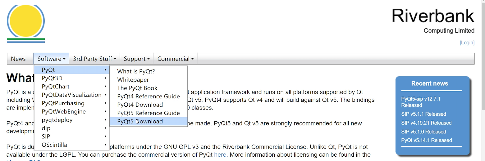

然后我们通过源代码，自己编译安装，需要用到c++的一些知识，对于初学者来说，就比较麻烦，所以我们就学习使用第二种方法——可以通过pip在线安装PyQt的依赖

我们先来了解一下，什么是pip.

**pip**

pip 是 Python **包管理工具**，该工具提供了对Python 包的查找、下载、安装、卸载的功能。

比如，别人写好一个功能，把这些功能都放在一个仓库里面，就比如PyQt已经在仓库里了，你需要使用，那你需要把PyQt放在本地，不能直接在仓库里使用。pip就是这个功能，能把仓库的东西安装在你的电脑本地。

目前如果你在 python.org 下载最新版本的安装包，则是已经自带了该工具。我们之前安装的是Python3.8的版本，已经有了。可以直接使用。

Python 2.7.9 + 或 Python 3.4+ 以上版本都自带 pip 工具。

开始PyQt环境搭建

**第一步：配置pip国内镜像**

pip安装的包都存在于外国的服务器上,速度会非常慢,可以给pip配置国内镜像,直接从国内服务器安装依赖

步骤：

1. 直接在c盘的user目录中创建一个pip目录

2. 在`pip`目录下新建文件pip.ini
3. 在pip.ini里面写入如下内容：

```python
[global]
index-url = https://pypi.tuna.tsinghua.edu.cn/simple
[install]
trusted-host=mirrors.aliyun.com
timeout = 150 
```

**第二步：通过pip install安装PyQt5**

1. 使用命令`pip install PyQt5`安装`PyQt5`

   

2. 使用命令`pip install PyQt5-tools`安装Qt工具

3. 把`PyQt5-tools`的安装目录添加到系统的环境变量

注意：安装完成之后可以在`python安装目录/Libs/site-packages`中找到

**第三步：测试PyQt环境**

1. 进入cmd命令

2. 进入python交互式命令行

3. 在交互式命令下执行下面代码

   ```python
   from PyQt import QtWidgets
   ```

如果执行成功就说明环境搭建完成

查看PyQt版本

```PYTHON
from PyQt5.QtCore import *
print(QT_version_STR)
```

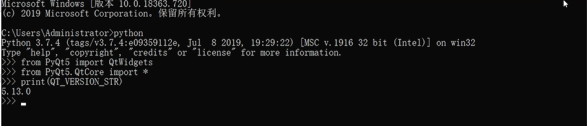

#  3.第一个PyQt窗口

1. 显示展示窗口

   代码：

```python
# 导入PyQt框架
from PyQt5.QtWidgets import QApplication,QWidget
# 导入系统库
import sys
# 1.创建Qt应用程序,参数是固定写法
app = QApplication(sys.argv)
# 2.创建窗口
w = QWidget()
# 3.展示窗口
w.show()
# 4.等待窗口停止，参数是固定写法
sys.exit(app.exec())
```

执行代码,就会显示PyQt窗口:

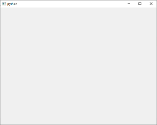

# 4.PyQt模块简介

PyQt中有非常多的功能模块,开发中最常用的功能模块主要有三个:

- **QtCore**:包含了核心的非GUI的功能.

  主要和时间、文件与文件夹、各种数据、流、URLs、mime类文件、进程与线程一起使用

- **QtGui**:包含了窗口系统、事件处理、2D图像、基本绘画、字体和文字类

- **QtWidgets**:包含了一些列创建桌面应用的UI元素

**PyQt的其它模块**

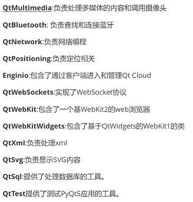

这些模块呢，我们用的时候再给大家说明。

# 5.模板创建

我们之前创建的窗口，大小，图标都是默认的，但是在实际开发过程中，肯定都是有要求的，所以就需要我们去进行设置。

我们现在要创建一个指定图标和标题的窗口，第一个是先把窗口创建出来。那代码就跟之前是一致的。

我们就可以把前面的代码做成一个模板，后面我们就可以快速的使用这些代码了。

来看一下模板创建的方法。

1. 拷贝需要创建的模板代码

2. 通过在setting里面设置，如下图

   

   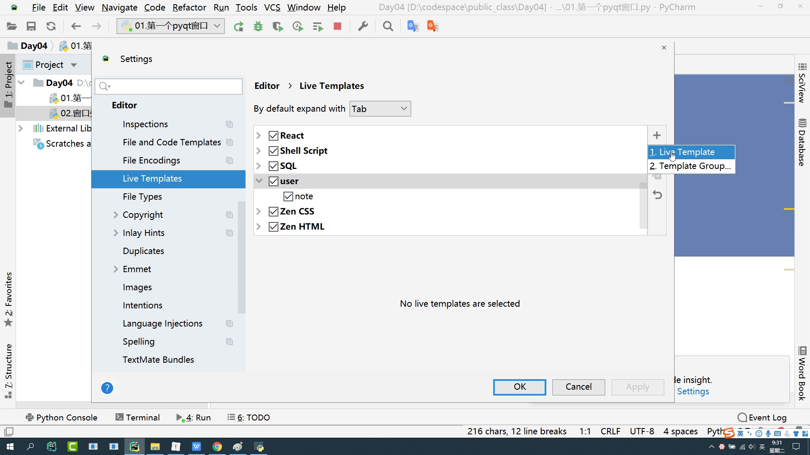

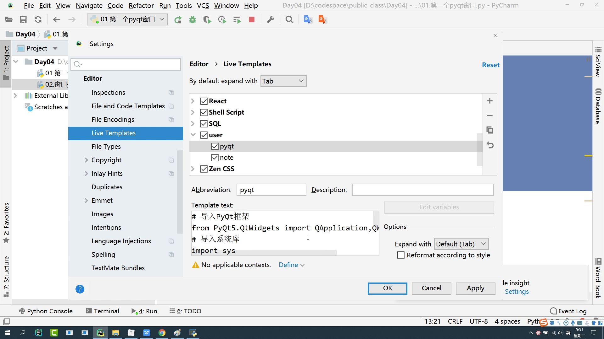

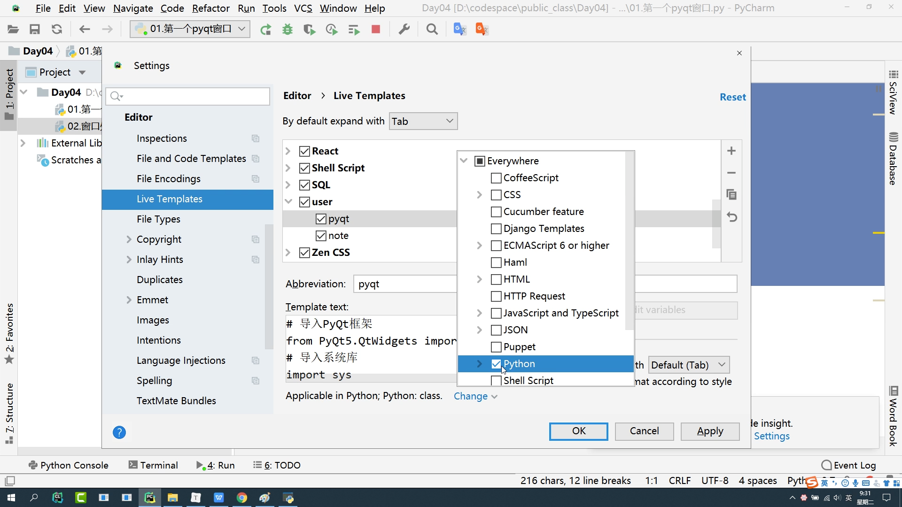

定义好模板之后，只要输入模板的名字，再点击回车键，模板的代码就出来了。

# 6.设置窗口标题和图标

应用程序图标是一个小的图像，通常在标题栏的左上角显示。

分析：

```
1.使用定义好的PyQt模板
2.修改窗口大小和图标都是在创建窗口之后进行，然后在展示窗口。
```

代码：

```python
# 导入PyQt框架
from PyQt5.QtWidgets import QApplication,QWidget
from PyQt5.QtGui import QIcon
# 导入系统库
import sys

# 1.创建Qt应用程序,参数是固定写法
app = QApplication(sys.argv)

# 2.创建窗口
window = QWidget()

# 修改标题
window.setWindowTitle('黑马窗口')

# 创建图标
icon = QIcon('qq.png')
# 修改窗口的图标
window.setWindowIcon(icon)

# 设置窗口大小
window.setFixedSize(600,800)# 固定大小

# 3.展示窗口
window.show()
# 4.等待窗口关闭(阻塞)
sys.exit(app.exec())
sys.exit(app.exec())
```

运行程序:

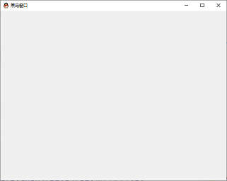

# 7.气泡提示

我们使用软件的时候，经常会使用到的一个功能，就是我们把鼠标放到一些文字上面，它会自动弹出一些解释性的文字，这个就是气泡提示。

在设计界面时应改尽可能人性化,对于关键的操作,给出相关信息的提示会非常有用,就可以使用气泡提示

代码：

```python
# 导入PyQt框架
from PyQt5.QtWidgets import QApplication,QWidget
from PyQt5.QtGui import QIcon
# 导入系统库
import sys

# 1.创建Qt应用程序,参数是固定写法
app = QApplication(sys.argv)
# 2.创建窗口
window = QWidget()
# 修改标题
window.setWindowTitle('黑马窗口')

# 创建图标
icon = QIcon('qq.png')
# 修改窗口的图标
window.setWindowIcon(icon)

# 设置窗口大小
window.setFixedSize(600,800)# 固定大小
# 设置窗口气泡提示
window.setToolTip('这是第一个窗口')

# 3.展示窗口
window.show()
# 4.等待窗口关闭(阻塞)
sys.exit(app.exec())
```

运行程序:

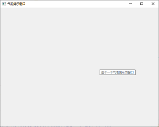


一个窗口就创建好了，后面我们创建其他的窗口，只需要修改标题，图标和大小就可以了。

所以我们将刚定义的PyQt模板的代码修改一下方便后面的使用。

方法还是一样的，我们只要讲可变的代码改一下就可以了。修改区域如下。

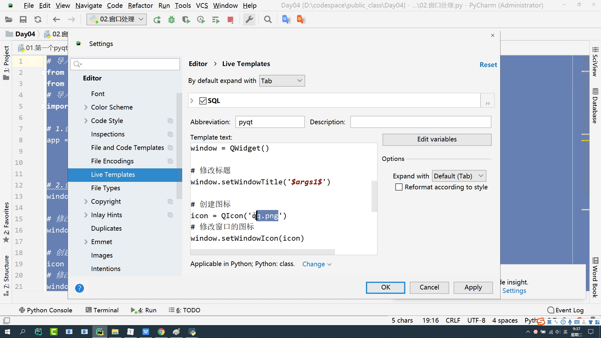

为了我们讲课的效率，后面我们只需要修改窗口名称，图标和大小，我们都不需要修改，所以就只保存窗口名称，修改代码如下：

```python
# 导入PyQt框架
from PyQt5.QtWidgets import QApplication,QWidget
from PyQt5.QtGui import QIcon
# 导入系统库
import sys

# 1.创建Qt应用程序,参数是固定写法
app = QApplication(sys.argv)


# 2.创建窗口
window = QWidget()

# 修改标题
window.setWindowTitle('$args$')

# 3.展示窗口
window.show()
# 4.等待窗口关闭(阻塞)
sys.exit(app.exec())
```

窗口创建好之后，我们就需要往窗口里添加一些控件来展示不同的内容，比如说一些文本，图片，按钮，单选框，复选框等等。我们一次来学习一下。

# 8.文本控件

文本控件是**QLabel**，不可编辑的文本

* 文本是通过QLabel实现的.
* QLabel可以显示不可编辑的文本或图片,也可以放置一个GIF动画
* QFont开设置字体样式和字体大小

分析：

```
1.创建一个文本控件QLabel
2.所有的控件在QtWidgets
3.文本展示在窗口上
```

代码

```python
# 导入PyQt框架
from PyQt5.QtWidgets import QApplication,QWidget,QLabel
from PyQt5.QtGui import QIcon
# 导入系统库
import sys

# 1.创建Qt应用程序,参数是固定写法
app = QApplication(sys.argv)

# 2.创建窗口
window = QWidget()

# 修改标题
window.setWindowTitle('文本展示')

##有三种方法，选一种即可，最好选择第三种
##第一种方法
# 创建QLable
label = QLabel()
label.setText('第一个文本')

##第二种方法
# 显示文本label
label.setParent(window)
label = QLabel('第一个文本',window)

##第三种方法
label = QLabel('第一个文本')
label.setParent(window)

# 3.展示窗口
window.show()
# 4.等待窗口关闭(阻塞)
sys.exit(app.exec())
```

运行程序:

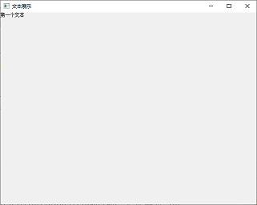

# 8.图片控件

**QLabel **控件既可以显示文本,也可以显示图片，还可以显示gif 的动图

这里需要导入**QPixmap 和 QMovie**

动图需要一个开始和停止的操作

```python
# 导入PyQt框架
from PyQt5.QtWidgets import QApplication,QWidget,QLabel
from PyQt5.QtGui import QIcon,QPixmap,QMovie
# 导入系统库
import sys

# 1.创建Qt应用程序,参数是固定写法
app = QApplication(sys.argv)


# 2.创建窗口
window = QWidget()

# 修改标题
window.setWindowTitle('图片展示')

"""--------------------------- 图片 ---------------------------"""
# 创建QLabel
label = QLabel()
# 创建QPixmap
pixmap = QPixmap('i.jpg')
# 设置图片进去
label.setPixmap(pixmap)
# 显示控件
label.setParent(window)

# 设置窗口大小(图片的宽度和高度)
window.setFixedSize(pixmap.width(),pixmap.height())

"""--------------------------- 展示gif动图 ---------------------------"""
# 创建QLabel
label = QLabel()
# 创建QMovie
movie = QMovie('b.gif')
# 设置动图
label.setMovie(movie)
# 展示控件
label.setParent(window)
# 开始播放动图
movie.start()

# 3.展示窗口
window.show()
# 4.等待窗口关闭(阻塞)
sys.exit(app.exec())
```

运行程序:

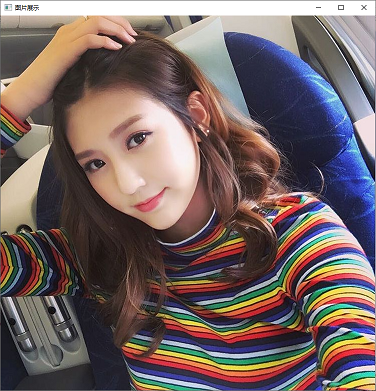

# 9.单行文本输入框

文本框指的就是输入框，我们平时聊天的就是输入框。

输入框又分为单行输入框和多行输入框。

**QLineEdit**控件可以输入单行文本

```python
# 导入PyQt框架
from PyQt5.QtWidgets import QApplication,QWidget,QLineEdit
from PyQt5.QtGui import QIcon
# 导入系统库
import sys

# 1.创建Qt应用程序,参数是固定写法
app = QApplication(sys.argv)

# 2.创建窗口
window = QWidget()

# 修改标题
window.setWindowTitle('单行输入框')

# 创建单行输入框
edit = QLineEdit()
"""--------------------------- 设置模式 ---------------------------"""
# 默认模式
edit.setEchoMode(QLineEdit.Normal)
# 没有任何输入反馈 安全级别比较高的时候用，实际开发中用的比较少
edit.setEchoMode(QLineEdit.NoEcho)
# 密码输入  只提示个数  不提示内容
edit.setEchoMode(QLineEdit.Password)
# 只要离开输入框 就显示密码状态
edit.setEchoMode(QLineEdit.PasswordEchoOnEdit)
"""--------------------------- 设置提示文字 ---------------------------"""
edit.setPlaceholderText('请输入用户名')
"""--------------------------- 设置文字 ---------------------------"""
edit.setText('张三')
"""--------------------------- 设置输入最大长度 ---------------------------"""
edit.setMaxLength(10)
"""--------------------------- 获取输入框内容 ---------------------------"""
print(edit.text())
# 展示
edit.setParent(window)

# 3.展示窗口
window.show()
# 4.等待窗口关闭(阻塞)
sys.exit(app.exec())
```

运行程序:

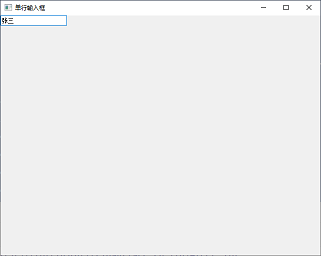


**QLineEdit的方法**

| setEchoMde()         | QLineEdit.Normal,正常显示所输入的字符,默认选项QLineEdit.NoEcho,不显示任何输入的字符,常用于密码类型的输入,且其密码长度需要保密时QLineEdit.Password,显示与平台相关的密码掩码字符,而不是实际输入的字符QLineEdit.PasswordEchoOnEdit,在编辑时显示字符,负责显示密码类型的输入 |
| -------------------- | ------------------------------------------------------------ |
| setPlaceholderText() | 设置文本框浮显文字                                           |
| setText()            | 设置文本框内容                                               |
| setMaxLength()       | 设置文本框所允许输入的最大字符数                             |

# 10.多行文本输入框

多行输入框跟单行类似，只有一些区别

多行输入框的特点就是可以输入很多的内容吧，并且会出现滚动条

**QTextEdit**控件用来输入多行文本

```python
# 导入PyQt框架
from PyQt5.QtWidgets import QApplication,QWidget,QTextEdit
from PyQt5.QtGui import QIcon
# 导入系统库
import sys

# 1.创建Qt应用程序,参数是固定写法
app = QApplication(sys.argv)

# 2.创建窗口
window = QWidget()

# 修改标题
window.setWindowTitle('多行输入框')

# 创建多行输入框
edit = QTextEdit()
"""--------------------------- 设置文本内容 ---------------------------"""
edit.setPlainText('这个一个需要发表的微博内容')

"""--------------------------- 设置提示文本 ---------------------------"""
edit.setPlaceholderText('请输入要发表的内容')
"""--------------------------- 清空 ---------------------------"""
edit.clear()
# 展示多行输入框
edit.setParent(window)

# 3.展示窗口
window.show()
# 4.等待窗口关闭(阻塞)
sys.exit(app.exec())
```

运行程序:

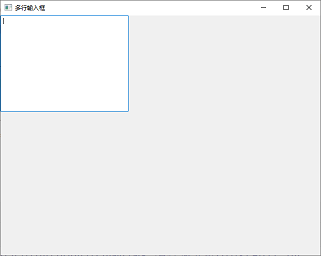

多行输入框的特点

**QTextEdit的方法**

| **方法**                  | **说明**                       |
| ------------------------- | ------------------------------ |
| setPlainText()            | 设置多行文本框的文本内容       |
| toPlainText()             | 返回多行文本框的文本内容       |
| setHtml()（可以暂时忽略） | 设置多行文本框的内容为HTML文档 |
| toHtml()（可以暂时忽略）  | 返回多行文本框的HTML文档内容   |
| clear()                   | 清空多行文本框的内容           |

# 11.按钮QPushButton

在我们需要登录注册的时候，就需要用到一些按钮。

常见的按钮实现类包括:QPushButton（普通按钮）、QRadioButton（单选按钮）和QCheckBox（复选按钮）

QPushButton是最普通的按钮控件,可以响应一些用户的事件，点击或者双击。

一般我们是使用单击事件，比如点一下进行登录或者其他的操作。

我们来看一下具体的代码，创建一个登录按钮。

```python
# 导入PyQt框架
from PyQt5.QtWidgets import QApplication,QWidget,QPushButton
from PyQt5.QtGui import QIcon
# 导入系统库
import sys

# 1.创建Qt应用程序,参数是固定写法
app = QApplication(sys.argv)

# 2.创建窗口
window = QWidget()

# 修改标题
window.setWindowTitle('按钮')

# 创建按钮
btn = QPushButton()
# 提示文字
btn.setText('登录')
# 创建图标
icon = QIcon('qq.png')
btn.setIcon(icon)

# 展示按钮控件
btn.setParent(window)

# 3.展示窗口
window.show()
# 4.等待窗口关闭(阻塞)
sys.exit(app.exec())
```

运行程序:

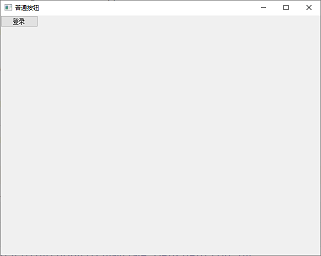

登录按钮做好了，但是我们点击是没有用的，没有事件相应，那如果使按钮响应呢？

如果我们想处理PyQt里的一些相应事件，就要用到一些信号和槽

# 12.信号和槽

**信号和槽**机制是 QT 的核心机制。它是一种高级接口，应用于对象之间的通

- 信号和槽是用来在对象间传递数据的方法：当一个特定事件发生的时候，signal会被emit出来，与其关联的槽函数被立刻执行
- Qt中对象已经包含了许多预定义的 signal（基本组件都有各自特有的预定义的信号）,Qt的对象中也已经包含了许多预定义的槽函数

比如很多年前，很多人都喜欢用收音机，广播就是一段频率发布广播，信号就是广播电视台发布的信号，槽函数就相当于我们买了一个收音机调好了频道，只要我们调好了频道，就可以接受到信息。

**信号和槽绑定**

通过调用 QObject 对象的 connect 函数来将对象的信号与另外一个对象的槽函数相关联，当发射者发射信号时，接收者的槽函数将被调用

需求:

```
点击按钮,输出hello
```

代码:

```python
# 导入PyQt框架
from PyQt5.QtWidgets import QApplication,QWidget,QPushButton
from PyQt5.QtGui import QIcon
# 导入系统库
import sys

# 槽函数
def func():
    # 获取信号的发送者
    send = window.sender()
    text = send.text()
    if text=='登录':
        print('开始登录')

# 1.创建Qt应用程序,参数是固定写法
app = QApplication(sys.argv)

# 2.创建窗口
window = QWidget()

# 修改标题
window.setWindowTitle('按钮')

# 创建按钮
btn = QPushButton()
# 提示文字
btn.setText('登录')

"""--------------------------- 信号和槽连接 ---------------------------"""
# 注意:1.信号不需要()  2.槽函数也不需要()
# 信号和槽函数的参数要一一对应,如果参数有= 槽函数可以不用定义这个参数
btn.clicked.connect(func)

# 展示按钮控件
btn.setParent(window)

# 3.展示窗口
window.show()
# 4.等待窗口关闭(阻塞)
sys.exit(app.exec())
```

运行程序:

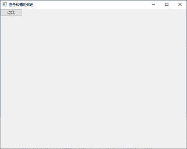

**获取信号发送者**

可以通过sender()找到信号的发送者

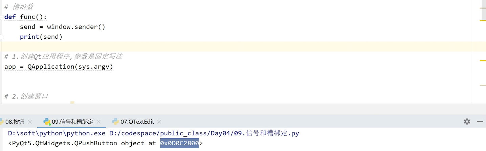


**使用PyQ系统的槽函数**

需求:

```
点击按钮,关闭窗口
```

代码：

```python
# 导入PyQt框架
from PyQt5.QtWidgets import QApplication,QWidget,QPushButton
from PyQt5.QtGui import QIcon
# 导入系统库
import sys
# 槽函数
def func():
    # 关闭窗口
    QApplication.quit()

# 1.创建Qt应用程序,参数是固定写法
app = QApplication(sys.argv)

# 2.创建窗口
window = QWidget()

# 修改标题
window.setWindowTitle('使用系统的槽函数')
# 创建按钮
btn = QPushButton('关闭窗口')
# 展示按钮
btn.setParent(window)
# 绑定信号和槽
# btn.clicked.connect(func)
# 绑定系统的槽函数quit
btn.clicked.connect(QApplication.quit)

# 3.展示窗口
window.show()
# 4.等待窗口关闭(阻塞)
sys.exit(app.exec())
```

运行程序:

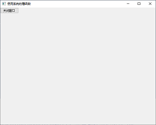

# 13.布局

对于真实的项目来说，会展示很多个文本，图片，或者按钮等等，这么多空间我们要按照一定的顺序进行摆放，那就需要通过布局来实现。

所谓布局,指的就是多个控件在窗口中的展示方式。

布局方式大致分为:

- 水平布局
- 竖直布局
- 网格布局
- 表单布局

水平布局和竖直布局是我们后面的开发中最常用的布局方式。

水平布局和竖直布局又属于框布局**QBoxLayout**

水平布局**QHBoxLayout**和竖直布局**QVBoxLayout**都称为框布局

## 水平布局QHBoxLayout

水平布局中,是按照从左往右的顺序添加控件的

只要使用了水平布局，只要往窗口里添加控件，就自动会水平排开

需求：实现以下布局


```python
# 导入PyQt框架
from PyQt5.QtWidgets import QApplication,QWidget,QHBoxLayout,QPushButton
from PyQt5.QtGui import QIcon
# 导入系统库
import sys

# 1.创建Qt应用程序,参数是固定写法
app = QApplication(sys.argv)

# 2.创建窗口
window = QWidget()

# 修改标题
window.setWindowTitle('水平布局')

# 创建布局
layout = QHBoxLayout()
# 窗口添加布局
window.setLayout(layout)

# 创建控件
btn1 = QPushButton('1')
btn2 = QPushButton('2')
btn3 = QPushButton('3')
btn4 = QPushButton('4')
btn5 = QPushButton('5')
# 控件添加到布局中
layout.addWidget(btn1)
layout.addWidget(btn2)
layout.addWidget(btn3)
layout.addWidget(btn4)
layout.addWidget(btn5)

# 3.展示窗口
window.show()
# 4.等待窗口关闭(阻塞)
sys.exit(app.exec())
```

运行程序:


## 竖直布局QVBoxLayout

竖直布局采用QVBoxLayout,是采用从上往下的方式添加控件的

需求：实现以下布局

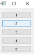

```python
# 导入PyQt框架
from PyQt5.QtWidgets import QApplication,QWidget,QVBoxLayout,QPushButton
from PyQt5.QtGui import QIcon
# 导入系统库
import sys

# 1.创建Qt应用程序,参数是固定写法
app = QApplication(sys.argv)

# 2.创建窗口
window = QWidget()

# 修改标题
window.setWindowTitle('竖直布局')

# 创建布局
layout = QVBoxLayout()
# 设置布局
window.setLayout(layout)

# 创建按钮控件
btn1 = QPushButton('1')
btn2 = QPushButton('2')
btn3 = QPushButton('3')
btn4 = QPushButton('4')
btn5 = QPushButton('5')

# 添加控件到布局中
layout.addWidget(btn1)
layout.addWidget(btn2)
layout.addWidget(btn3)
layout.addWidget(btn4)
layout.addWidget(btn5)

# 3.展示窗口
window.show()
# 4.等待窗口关闭(阻塞)
sys.exit(app.exec())
```

运行程序:


## 表单布局

这种布局一般在登录注册的时候比较常见，这个大家都非常熟悉的。

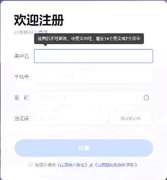

表单布局的特点就是它的每一行都有一个标题和一个控件。

表单布局是label-field式的表单布局,顾名思义,就是实现表单方式的布局

所以它跟之前的水平和垂直布局不一样，前面都是用addWidgets添加控件

表单布局的控件添加方式为**addRow(label,widget)**

需求：

实现以下布局

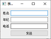

```python
# 导入PyQt框架
from PyQt5.QtWidgets import QApplication,QWidget,QFormLayout,QLineEdit,QPushButton
from PyQt5.QtGui import QIcon
# 导入系统库
import sys

def regist():
    # 获取用户输入的姓名 年纪  手机号
    name = nameEdit.text()
    age = ageEdit.text()
    phone = phoneEdit.text()
    # 打印输入的内容
    print('姓名:%s,年纪:%s,手机号:%s'%(name,age,phone))

# 1.创建Qt应用程序,参数是固定写法
app = QApplication(sys.argv)

# 2.创建窗口
window = QWidget()

# 修改标题
window.setWindowTitle('表单布局')

# 创建表单布局
layout = QFormLayout()
# 添加布局
window.setLayout(layout)

# 控件
nameEdit = QLineEdit()
ageEdit = QLineEdit()
phoneEdit = QLineEdit()
btn = QPushButton('注册')

# 添加每一行控件
layout.addRow('姓名',nameEdit)
layout.addRow('年纪',ageEdit)
layout.addRow('电话',phoneEdit)
layout.addRow('',btn)

# 绑定信号和槽函数
btn.clicked.connect(regist)


# 3.展示窗口
window.show()
# 4.等待窗口关闭(阻塞)
sys.exit(app.exec())
```

运行程序:


在表单内输入相应的信息，可以在后台打印出来

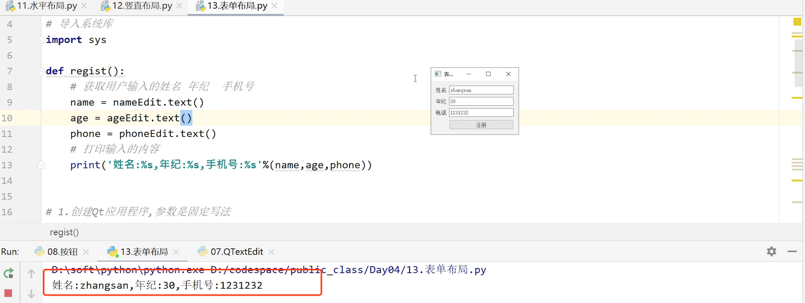

## 布局嵌套

在真是的开发中，一般不只有一个布局，一个布局是不满足我们的开发要求的，比如在这个窗口中，他的组成就比较的复杂，很多部分也不只有一个控件，分布也没有规律，情况是比较复杂的，就有水平布局，也有垂直布局，所以这就是布局的嵌套。

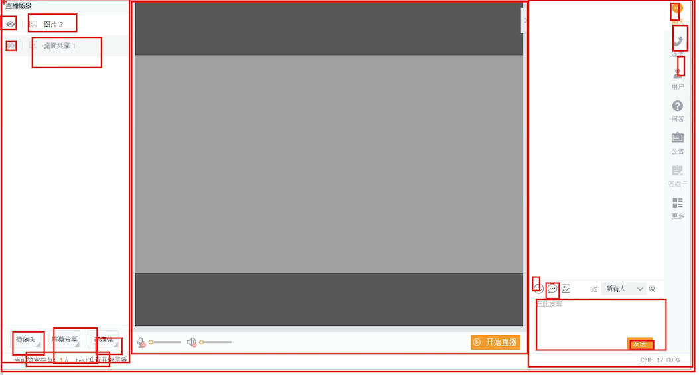

通过布局嵌套可以实现更加复杂的布局，并且使用的频率很高，

需求：

实现以下布局：

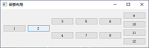

分析：

```
1、整体是一个完整的布局，从左往右水平布局
2.又分成5个布局
3.5个布局分别是：水平、竖直、竖直、竖直、竖直
```

```python
# 导入PyQt框架
from PyQt5.QtWidgets import QApplication,QWidget,QHBoxLayout,QVBoxLayout,QPushButton
from PyQt5.QtGui import QIcon
# 导入系统库
import sys

# 1.创建Qt应用程序,参数是固定写法
app = QApplication(sys.argv)

# 2.创建窗口
window = QWidget()

# 修改标题
window.setWindowTitle('布局嵌套')

# 创建整体布局
wholeLayout = QHBoxLayout()
# 添加整体布局
window.setLayout(wholeLayout)

# 第一部分
layout1 = QHBoxLayout()
btn1 = QPushButton('1')
btn2 = QPushButton('2')
layout1.addWidget(btn1)
layout1.addWidget(btn2)

# 第二部分
layout2 = QVBoxLayout()
btn3 = QPushButton('3')
btn4 = QPushButton('4')
layout2.addWidget(btn3)
layout2.addWidget(btn4)

# 第三部分
layout3 = QVBoxLayout()
btn5 = QPushButton('5')
btn7 = QPushButton('7')
layout3.addWidget(btn5)
layout3.addWidget(btn7)

# 第四部分
layout4 = QVBoxLayout()
btn6 = QPushButton('6')
btn8 = QPushButton('8')
layout4.addWidget(btn6)
layout4.addWidget(btn8)

# 第五部分
layout5 = QVBoxLayout()
btn9 = QPushButton('9')
btn10 = QPushButton('10')
btn11 = QPushButton('11')
btn12 = QPushButton('12')
layout5.addWidget(btn9)
layout5.addWidget(btn10)
layout5.addWidget(btn11)
layout5.addWidget(btn12)

# 把五部分放到整体的布局中
wholeLayout.addLayout(layout1)
wholeLayout.addLayout(layout2)
wholeLayout.addLayout(layout3)
wholeLayout.addLayout(layout4)
wholeLayout.addLayout(layout5)

# 3.展示窗口
window.show()
# 4.等待窗口关闭(阻塞)
sys.exit(app.exec())
```

运行程序:


# 14.对话框控件

对话框是为了更好地实现人与程序的交互
对话框主要是完成特定场景下的功能,比如删除确认等

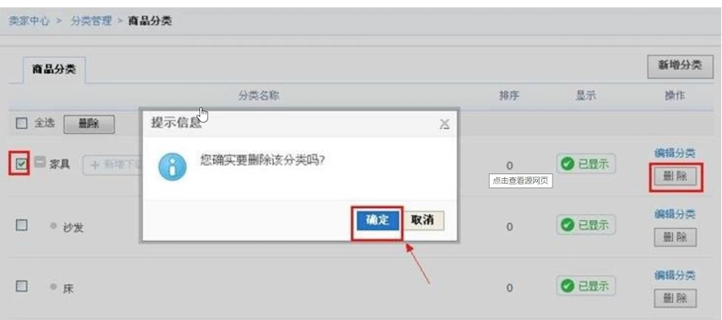

- QDialog的子类有:QMessageBox、QFileDialog、QFontDialog.QInputDialog等

## QMessageBox

QMessageBox是普通的对话框

需求：

```
点击按钮,弹出对话框,提示是否要删除用户
```

分析：

```
1.设置一个按钮
2.只有一个按钮，不需要布局
3.处理点击事件
4.QMessageBox.Ok|QMessageBox.Cancel（确认或者取消），QMessageBox.Cancel(默认选项)
```

代码：

```python
# 导入PyQt框架
from PyQt5.QtWidgets import QApplication,QWidget,QPushButton,QMessageBox
from PyQt5.QtGui import QIcon
# 导入系统库
import sys

def func():
    # 显示对话框
    result = QMessageBox.information(window,'警告','你确定要删除这个好友吗?',QMessageBox.Ok|QMessageBox.Cancel,QMessageBox.Cancel)
    if result==QMessageBox.Ok:
        print('确认删除')
    elif result==QMessageBox.Cancel:
        print('取消删除')

# 1.创建Qt应用程序,参数是固定写法
app = QApplication(sys.argv)

# 2.创建窗口
window = QWidget()

# 修改标题
window.setWindowTitle('对话框')

# 创建按钮
btn = QPushButton('显示对话框')
# 添加到窗口中
btn.setParent(window)
# 绑定信号和槽
btn.clicked.connect(func)

# 3.展示窗口
window.show()
# 4.等待窗口关闭(阻塞)
sys.exit(app.exec())
```

运行程序:

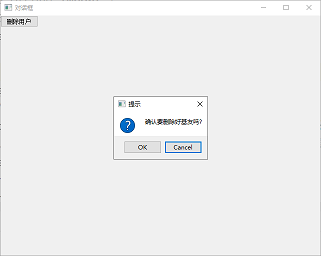

## QIputDialog

**QInputDialog**控件是一个标准对话框,由一个文本框和两个按钮(OK按钮和Cancel按钮)组成，主要是弹出一个输入框，输入一些东西
比如创建游戏角色,弹出的对话框，让你输入角色的名称，输入角色就创建成功

需求：
实现以下功能

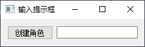

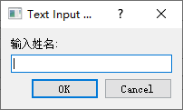

分析：

```
1.创建一个水平布局
2.弹出对话框
```

代码：

```python
# 导入PyQt框架
from PyQt5.QtWidgets import QApplication,QWidget,QHBoxLayout,QPushButton,QLineEdit,QInputDialog
from PyQt5.QtGui import QIcon
# 导入系统库
import sys

def func():
    # 显示输入对话框
    str,result = QInputDialog.getText(window,'提示','请输入角色名')
    if result:
        edit.setText(str)

# 1.创建Qt应用程序,参数是固定写法
app = QApplication(sys.argv)

# 2.创建窗口
window = QWidget()

# 修改标题
window.setWindowTitle('输入对话框')

# 创建布局
layout = QHBoxLayout()
# 添加布局
window.setLayout(layout)
# 控件
btn = QPushButton('创建角色')
edit = QLineEdit()
# 添加控件到布局中
layout.addWidget(btn)
layout.addWidget(edit)
# 绑定信号和槽函数
btn.clicked.connect(func)

# 3.展示窗口
window.show()
# 4.等待窗口关闭(阻塞)
sys.exit(app.exec())
```

运行程序,点击创建角色:


# 15.单选框

单选框和复选框也用的很多，比如我们在填写资料的时候选择的性别或者爱好、

我们先来看一下单选框

**QRadioButton**是单选按钮

它提供了一组可供选择的按钮和文本标签,用户可以**选择其中一个选项**比如性别只能选一个

需求：

实现以下功能

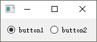

分析：

```
1.两个控件，需要 一个水平布局
2.单选框控件
3.单选框选中的信号是:toggled
```

代码：

```python
# 导入PyQt框架
from PyQt5.QtWidgets import QApplication,QWidget,QHBoxLayout,QRadioButton
from PyQt5.QtGui import QIcon
# 导入系统库
import sys
def func(ck):
    '''
    :param ck:当前是否选中
    :return:
    '''
    print(ck)

# 1.创建Qt应用程序,参数是固定写法
app = QApplication(sys.argv)

# 2.创建窗口
window = QWidget()

# 修改标题
window.setWindowTitle('单选框')

# 创建布局
layout = QHBoxLayout()
# 添加布局
window.setLayout(layout)

# 单选框控件
rb1 = QRadioButton('按钮1')
rb2 = QRadioButton('按钮2')
# 添加到布局中
layout.addWidget(rb1)
layout.addWidget(rb2)
# 默认选中第二个
rb2.setChecked(True)

# 绑定信号和槽
rb1.toggled.connect(func)

# 3.展示窗口
window.show()
# 4.等待窗口关闭(阻塞)
sys.exit(app.exec())
```

运行程序:


# 16.复选框

**QCheckBox**提供了一组带文本标签的复选框,用户可以**选择多个选项**

需求：

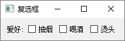

分析：

```
1.水平布局
2.控件分为2部分，爱好是一个文字控件，其他的是复选框控件
```


```python
# 导入PyQt框架
from PyQt5.QtWidgets import QApplication,QWidget,QHBoxLayout,QLabel,QCheckBox
from PyQt5.QtGui import QIcon
# 导入系统库
import sys

def func(ck):
    '''
    :param ck:是否选中
    :return:
    '''
    print(ck)

# 1.创建Qt应用程序,参数是固定写法
app = QApplication(sys.argv)

# 2.创建窗口
window = QWidget()

# 修改标题
window.setWindowTitle('复选框')

# 创建布局
layout = QHBoxLayout()
# 添加布局
window.setLayout(layout)

# 控件
label = QLabel('爱好')
ck1 = QCheckBox('抽烟')
ck2 = QCheckBox('喝酒')
ck3 = QCheckBox('烫头')

# 添加到布局中
layout.addWidget(label)
layout.addWidget(ck1)
layout.addWidget(ck2)
layout.addWidget(ck3)

# 设置默认选中
ck1.setChecked(True)

# 绑定信号和槽
ck1.toggled.connect(func)

# 3.展示窗口
window.show()
# 4.等待窗口关闭(阻塞)
sys.exit(app.exec())
```

运行程序:


# 17.综合练习：注册

## 注册页面的实现

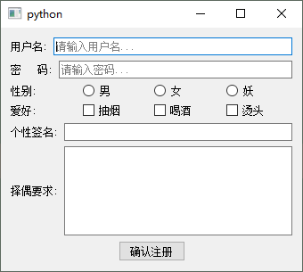

分析：

```
1.分析布局。整体竖直布局，
上半部分（从用户名到个性签名）是表单布局，
下半部分是水平布局
2.控件使用：单行文本，多行文本，对话框，单选框，复选框，按钮
```

代码：

```python
# 导入PyQt框架
from PyQt5.QtWidgets import QApplication,QWidget,QHBoxLayout,QFormLayout,QLabel,QVBoxLayout,QLineEdit,QRadioButton,QCheckBox,QTextEdit,QPushButton
from PyQt5.QtCore import Qt
from PyQt5.QtGui import QIcon
# 导入系统库
import sys

# 1.创建Qt应用程序,参数是固定写法
app = QApplication(sys.argv)

# 2.创建窗口
window = QWidget()

# 修改标题
window.setWindowTitle('注册界面')
# 整体布局
wholeLayout = QVBoxLayout()
# 添加布局
window.setLayout(wholeLayout)

# 第一部分 表单布局
formLayout = QFormLayout()
nameEdit = QLineEdit()
nameEdit.setPlaceholderText('请输入用户名')
pwdEdit = QLineEdit()
pwdEdit.setPlaceholderText('请输入密码')

sexLayout = QHBoxLayout()
rb1 = QRadioButton('男')
rb2 = QRadioButton('女')
rb3 = QRadioButton('妖')
sexLayout.addWidget(rb1)
sexLayout.addWidget(rb2)
sexLayout.addWidget(rb3)

# 默认选中
rb1.setChecked(True)

hobiLayout = QHBoxLayout()
ck1 = QCheckBox('抽烟')
ck2 = QCheckBox('喝酒')
ck3 = QCheckBox('烫头')
hobiLayout.addWidget(ck1)
hobiLayout.addWidget(ck2)
hobiLayout.addWidget(ck3)

# 签名
sigEdit = QLineEdit()

formLayout.addRow('用户名:',nameEdit)
formLayout.addRow('密  码:',pwdEdit)
formLayout.addRow('性  别:',sexLayout)
formLayout.addRow('爱  好:',hobiLayout)
formLayout.addRow('个性签名:',sigEdit)


# 第二部分 水平布局
hLayout = QHBoxLayout()
label = QLabel('择偶要求:')
labelEdit = QTextEdit()
hLayout.addWidget(label)
hLayout.addWidget(labelEdit)
# 第三部分 确认注册按钮
btn = QPushButton('确认注册')
btn.setFixedSize(100,30)
# 放入到整体布局中
wholeLayout.addLayout(formLayout)
wholeLayout.addLayout(hLayout)
wholeLayout.addWidget(btn,alignment=Qt.AlignHCenter)

# 3.展示窗口
window.show()
# 4.等待窗口关闭(阻塞)
sys.exit(app.exec())
```

运行结果：


## 注册功能的实现

输入相信的信息后，点击注册，信息保存在后台。

代码：

```python
# 导入PyQt框架
from PyQt5.QtWidgets import QApplication,QWidget,QHBoxLayout,QFormLayout,QLabel,QVBoxLayout,QLineEdit,QRadioButton,QCheckBox,QTextEdit,QPushButton
from PyQt5.QtCore import Qt
from PyQt5.QtGui import QIcon
# 导入系统库
import sys

def func():
    # 获取姓名
    name = nameEdit.text()
    # 获取密码
    pwd = pwdEdit.text()

    # 性别
    sex = None
    if rb1.isChecked():
        sex = '男'
    elif rb2.isChecked():
        sex = '女'
    elif rb3.isChecked():
        sex = '妖'

    # 爱好
    hobis = []
    if ck1.isChecked():
        hobis.append(ck1.text())
    if ck2.isChecked():
        hobis.append(ck2.text())
    if ck3.isChecked():
        hobis.append(ck3.text())

    # 个性签名
    sig = sigEdit.text()

    # 择偶要求(多行输入框获取输入文字toPlainText)
    label = labelEdit.toPlainText()

    # 输出
    print('姓名:{},密码:{},性别:{},爱好:{},个性签名:{},择偶要求:{}'.format(name,pwd,sex,hobis,sig,label))


# 1.创建Qt应用程序,参数是固定写法
app = QApplication(sys.argv)

# 2.创建窗口
window = QWidget()

# 修改标题
window.setWindowTitle('注册界面')
# 整体布局
wholeLayout = QVBoxLayout()
# 添加布局
window.setLayout(wholeLayout)

# 第一部分 表单布局
formLayout = QFormLayout()
nameEdit = QLineEdit()
nameEdit.setPlaceholderText('请输入用户名')
pwdEdit = QLineEdit()
pwdEdit.setPlaceholderText('请输入密码')

sexLayout = QHBoxLayout()
rb1 = QRadioButton('男')
rb2 = QRadioButton('女')
rb3 = QRadioButton('妖')
sexLayout.addWidget(rb1)
sexLayout.addWidget(rb2)
sexLayout.addWidget(rb3)

# 默认选中
rb1.setChecked(True)

hobiLayout = QHBoxLayout()
ck1 = QCheckBox('抽烟')
ck2 = QCheckBox('喝酒')
ck3 = QCheckBox('烫头')
hobiLayout.addWidget(ck1)
hobiLayout.addWidget(ck2)
hobiLayout.addWidget(ck3)

# 签名
sigEdit = QLineEdit()

formLayout.addRow('用户名:',nameEdit)
formLayout.addRow('密  码:',pwdEdit)
formLayout.addRow('性  别:',sexLayout)
formLayout.addRow('爱  好:',hobiLayout)
formLayout.addRow('个性签名:',sigEdit)


# 第二部分 水平布局
hLayout = QHBoxLayout()
label = QLabel('择偶要求:')
labelEdit = QTextEdit()
hLayout.addWidget(label)
hLayout.addWidget(labelEdit)
# 第三部分 确认注册按钮
btn = QPushButton('确认注册')
btn.setFixedSize(100,30)
# 放入到整体布局中
wholeLayout.addLayout(formLayout)
wholeLayout.addLayout(hLayout)
wholeLayout.addWidget(btn,alignment=Qt.AlignHCenter)#水平方向居中

# 注册新号和槽函数绑定
btn.clicked.connect(func)

# 3.展示窗口
window.show()
# 4.等待窗口关闭(阻塞)
sys.exit(app.exec())
```

运行结果：

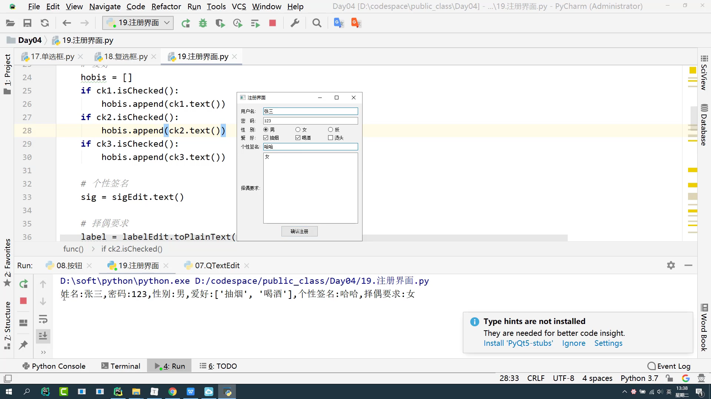


