学机器人技术,  请访问  http://robot.czxy.com/ 

大家好，又开始新的一天的课程了。

今天的主要内容有这些：

首先是学完剩下的高级变量类型

* set

* 字符串

* 字典

  然后就学习高级变量类型，就要学习一些高级变量的语法，比如内置函数啊，运算符，还有切片和推导式

* 切片

* 推导式

# 1.set

前面我们已经学过了列表和元组

列表可以进行增删改查的一些修改，元组则不可以修改。

set集合和元组有些类似。但是也有区别。

* ***set**被称为集合,是无序的，

比如之前的列表，元素放好之后，顺序是不会变的，但是集合，每次输出的都元素顺序偶读不一样

* 并且集合中的元素是唯一的
* 集合通过{  }定义

## 集合的创建

* 集合是无序的

```python
s = {'张曼玉','林青霞','高圆圆'}
print(s)
```

结果:

```
{'林青霞','张曼玉','高圆圆'}
```

而且每次打印出来的结果都不一样，大家可以试一试。

* 集合元素唯一

```python
s = {'张曼玉','林青霞','高圆圆','林青霞'}
print(s)
```

结果:

```
 {'高圆圆','张曼玉','林青霞'}
```

在列表和元组中，可以存在相同的元素。

* 定义空集合

  ```python
  # 错误的定义
  s = {}
  # 正确的空集合定义
  s = set()
  print(type(s))
  ```

##  集合的操作

### **遍历集合中元素**

通过for循环遍历集合中的元素

```python
s = {'张曼玉','林青霞','高圆圆'}
for ele in s:
    print(ele)
```


集合不能通过索引获取集合元素

### 集合中添加元素

1. 通过**add**方法添加元素

   可以直接添加元素

```python
 s = {'张曼玉','林青霞','高圆圆'}
 add增加
 s.add('范冰冰')
 print(s)
```

结果：

```
{'张曼玉','范冰冰','林青霞','高圆圆'}
```

也可以直接添加一个列表到集合里去，但是列表的元素会被拆分

```python
 l = ['范冰冰','李冰冰']
# update增加 把容器中所有的元素拆分出来 添加到集合中
 s.update(l)
 s.add(l)
 print(s)
```


### 集合删除元素

1. remove删除   

   如果有, 直接删除 ;如果没有, 程序报错

例如，删除”凤姐“

```python
s = {'张曼玉','林青霞','凤姐','高圆圆'}
#remove   ab 删除元素不存在  就报错
s.remove('ab')
print(s)

```

2. discard删除     

   元素存在 ，直接删除； 如果元素不存在， 不做任何操作

```python
s = {'张曼玉','林青霞','凤姐','高圆圆'}
# discard删除 删除元素不存在 不做任何操作
s.remove('ab')
print(s)
```

3.pop删除

**随机**删除集合中的元素 ,并且会返回删除的结果。

```python
# pop删除 随机删除 并且返回删除的元素
s = {'张曼玉','林青霞','凤姐','高圆圆'}
ele = s.pop()
print(ele)
print(s)
```

## set的作用

set集合一般用于对列表或者元组进行去重操作，因为集合的元素是唯一的。

例如有一个列表保存的是班级的姓名信息，但是姓名就会有一些重名的，比如两个张三，两个李四，现在我们需要统计的是没有重复的有多少个，这个就需要用集合做去重。

我们只需要做一些类型的转换即可。

```python
l = ['张曼玉','林青霞','高圆圆','林青霞']
# 对列表去重,将列表转换成set集合
s = set(l)
print(s)
print(type(s))

# 将set集合转换成列表
l = list(s)
print(l)

# 列表转换成元组
t = tuple(l)
print(t)

# 集合转换成元组
t = tuple(s)
print(t)
```


# 2.字符串

字符串类型其实我们在第一天的时候已经学过，我们要定一个人的姓名，邮箱或者电话等，都是字符串类型，也是我们用的最多的变量类型之一。所以我们今天要再着重的学习一下字符串的类型。先来看一下字符串的特点


##  字符串定义

Python中可以使用一对**双引号**""或者一对**单引号**''定义字符串

```python
# 单引号
 name = '张三'
# 双引号
# name = "张三"
# print(name)
```

如果引号里面还要引号，可以使用转义字符

或者直接外部用双引号，内部用单引号

或者直接外部用单引号，内部用双引号

```python
# 单引号
name = '张三说\'你好\''
# # 双引号
name = "张三\"你好\""
# 直接套用
name = "张三说:'你好'"
name = '张三说:"你好"'
```

## 字符串遍历

```python
str = 'hello'
for ele in str:
   print(ele)
```

这个非常简单，我们就不讲了

## 获取字符串中元素

和列表一样,字符串也是通过**索引**获取元素

```python
str = 'hello'
# 获取第三个元素
ele = str[2]
print(ele)
# 不能修改
str[2] = 'h'
```

## 字符串的判断

| **方法**       | **说明**                                                  |
| -------------- | --------------------------------------------------------- |
| isalpha()      | 如果 string 至少有一个字符并且所有字符都是字母则返回 True |
| isdecimal()    | 如果 string 只包含数字则返回 True                         |
| startwith(str) | 检查字符串是否是以 str 开头，是则返回 True                |
| endswith(str)  | 检查字符串是否是以 str 结束，是则返回 True                |

1. **isalpha()**

如果 string 至少有一个字符并且所有字符都是字母则返回 True

代码:

```python
str = 'hello '
result = str.isalpha()
print(result)
```

结果：

```
true
```

如果代码：

```python
str = ' '
result = str.isalpha()
print(result)
```

结果：

```
false
```

2. **isdecimal()**

如果 string 只包含数字则返回 True

```
# str = '123'
# result = str.isdecimal()
# print(result)
```

结果：

```
true
```

否则都是false

3. **startwith(str)**

检查字符串是否是以 str 开头，是则返回 True

需求：

判断是否姓张

```python
str = '张三'
# 是否姓张
if str[0]=='张':
     print('姓张')
else:
    print('不姓张')
```

4. **endswith(str)**

 检查字符串是否是以 str 结束，是则返回 True

```python
str = '张三李四王五张六'
result = str.endswith('六',0,5)
print(result)
```

这就是字符串的一些判断。

## 字符串的查找与替换

| **方法**                                         | **说明**                                                     |
| ------------------------------------------------ | ------------------------------------------------------------ |
| find(str, start=0, end=len(string))              | 检测 str 是否包含在 string 中，如果 start 和 end 指定范围，则检查是否包含在指定范围内，如果是返回开始的索引值，否则返回 -1 |
| rfind(str, start=0, end=len(string))             | 类似于 find()，不过是从右边开始查找                          |
| replace(old_str, new_str, num=string.count(old)) | 返回一个新字符串，把 string 中的 old_str 替换成 new_str，如果 num 指定，则替换不超过 num 次 |

1. **find(str, start=0, end=len(string))**

   查找元素并且返回元素的索引值

需求：

```
查找字符串是否包含o 这个元素
```

代码：

```python
 str = 'hello'
# 查找字符串是否包含o元素
# 查找元素  返回元素的索引值 如果不存在,返回-1
 index = str.find('o')
 if index!=-1:#直接用-1来判断
     print('存在')
 else:
     print('不存在')
```

如果有两个o呢？

它查找到第一个就会停下来。我们也可以指定查找范围

2. **rfind(str, start=0, end=len(string))**

   类似于 find()，不过是从右边开始查找

```python
 str = 'hellohello'
 # 从右边查找  返回第一个找到的元素索引,如果不存在 返回-1
 index = str.rfind('o',0,5)
 print(index)
```

3. **replace(old_str, new_str, num=string.count(old))**

```python
str = 'hellohellohello'
# 全部替换  替换完返回新的替换结果
newStr = str.replace('e','f')
# 可以替换一串字符
newStr = str.replace('ell','f')
# 也可以指定替换次数，后面加一个数字代表替换次数
newStr = str.replace('ell','f'，2)
```

## 字符串的拆分和连接

| **方法**           | **说明**                                                     |
| ------------------ | ------------------------------------------------------------ |
| split(str="", num) | 返回列表，以 str 为分隔符拆分 string，如果 num 有指定值，则仅分隔 num + 1 个子字符串，str 默认包含 '\r', '\t', '\n' 和空格 |
| string1 + string2  | 拼接两个字符串                                               |

1. **split(str="", num)**

按照指定的规则，拆分为几段

```python
#被hello隔开
  str = '张三hello李四hello王五hello赵六'
# 通过split拆分字符串 找到张三 李四 王五
# split拆分  返回列表类型 默认全部拆分 可以指定拆分个数
# 只拆分两次
 result = str.split('hello',2)
 print(result)
```

结果 ：

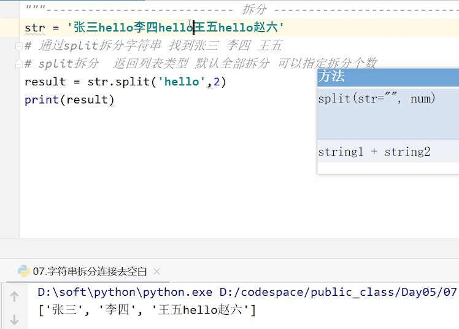

2. **string1 + string2**

```python
 str1 = 'hello'
 str2 = 'world'
 newStr = str1+str2
 print(newStr)
```

## 字符串去除空白字符

| **方法** | **说明**                                                     |
| -------- | ------------------------------------------------------------ |
| strip()  | 返回新字符串，截掉 string 左右两边的空白字符 (可以指定截掉的字符) |

比如我们要在登录网站的时候输入用户名或者密码，第一步就是去空白操作，然后才能进行判断。

需求：

对'  hel  lo   '进行去空白操作。

```python
str = '  hel  lo   '
# 去空白 只能去掉首尾空白
# 记住打印的是新的结果
result = str.strip()
print(result)
```


## 练习：用户名和密码判断

```
需求:
1.用户名和密码格式校验程序
2.要求从键盘输入用户名和密码，校验格式是否符合规则，如果不符合，打印出不符合的原因，并提示重新输入
3.用户名长度6-20，用户名必须以字母开头
4.密码长度至少6位，不能为纯数字，不能有空格
```

分析:

```
1.输入用户名 (while True循环)
2.用户名长度6-20
3.用户名必须以字母开头

4.输入密码(while True)
5.密码必须至少有6位
6.密码不能为纯数字
7.密码不能有空格
8.登录成功
```

代码:

```python
while True:
    # 1.输入用户名 (while True循环)
    name = input('请输入用户名')
    # 2.用户名长度6-20
    if len(name)<6 or len(name)>20:
        print('用户名长度必须在6到20位,请重新输入')
        continue
    # 3.用户名必须以字母开头
    if not name[0].isalpha():
        print('用户名必须以字母开头,请重新输入')
        continue

    # 两个条件都满足
    print('用户名满足条件')
    # 跳出循环
    break

while True:
    # 4.输入密码(while True)
    pwd = input('请输入密码')
    # 5.密码必须至少有6位
    if len(pwd)<6:
        print('密码必须至少有6位,请重新输入')
        continue
    # 6.密码不能为纯数字
    if pwd.isdecimal():
        print('密码不能为纯数字,请重新输入')
        continue
    # 7.密码不能有空格  adb fadsf
    if ' ' in pwd:
        print('密码不能有空格,请重新输入')
        continue

    # 密码满足条件
    print('密码合法')
    # 跳出循环
    break

# 开始登录
print('用户名和密码合法,开始登录')

```

isalpha:用来判断字符串中所有元素都是字母就返回True

isdecimal:字符串中都是数字返回True

# 3.字典

我们生活中要查询一些字词，需要用到字典。我们来看一下字典是如何使用的？

比如英汉字典，一个英文对照一个汉语，所以字典的元素就跟列表就不一样，之前学的每一个元素就包含一个东西，字典是包含两个部分，通过前面可以找到后面。

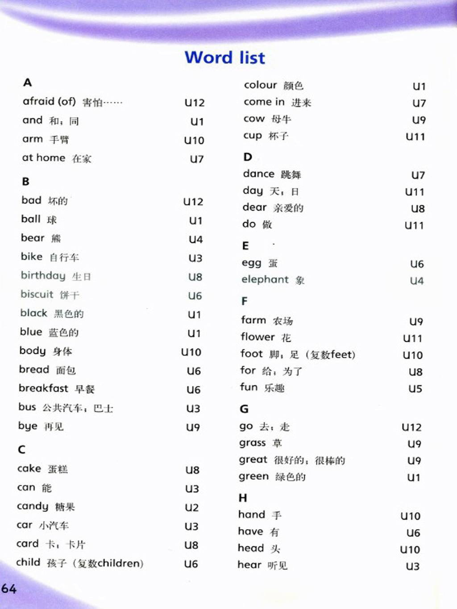

dictionary（字典） 是 除列表以外 Python 之中 最灵活 的数据类型

- 字典同样可以用来存储**多个数据**
- 字典使用**键值对**存储数据

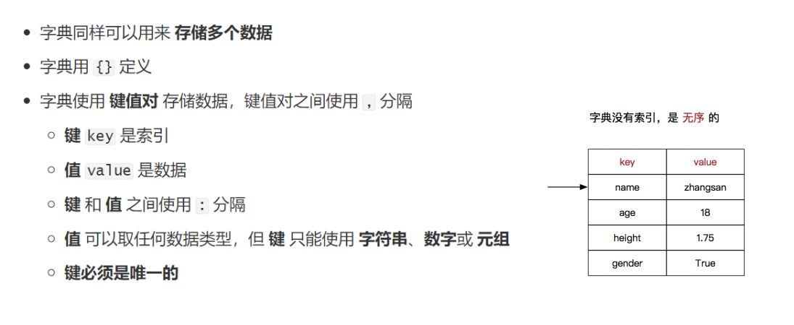

## 字典的定义

- 字典用`{}`定义
- 键值对之间使用`,`分隔
- **键**和**值**之间使用`:`分隔

```python
d = {'England':'英国','China':'中国','America':'美国'}
```

## 字典的特点

字典中的**键**相当于索引,必须是**唯一的**

```python
# 字典key必须要唯一
 d = {'England':'英国','China':'中国','America':'美国','England':'英格兰'}
 print(d)
```

运行:

```python
{'England':'英国','China':'中国','America':'美国'}
```

**key必须是字符串 数字 元组类型**

```python
d = {'England':'英国','China':'中国','America':'美国',10:10,(1,2,3):10}
```

## 字典的应用场景

使用多个键值对,存储描述一个物体的相关信息---描述更复杂的数据信息

例如：

```
需求:
1. 使用字典来存储一个人的信息（姓名、年龄、学号、QQ、微信、住址等），这些信息来自键盘的输入
2. 存储多个人

```

代码：

```python
persons = []

while True:
    name = input('请输入姓名')
    age = input('请输入年纪')
    studentId = input('请输入学号')
    qq = input('请输入QQ')
    wechart = input('请输入微信')
    address = input('请输入住址')

    # 存储人
    person = {'name':name,'age':age,'studentId':studentId,'qq':qq,'wechart':wechart,'address':address}
    # 添加到列表中
    persons.append(person)
    print(persons)
```

结果：

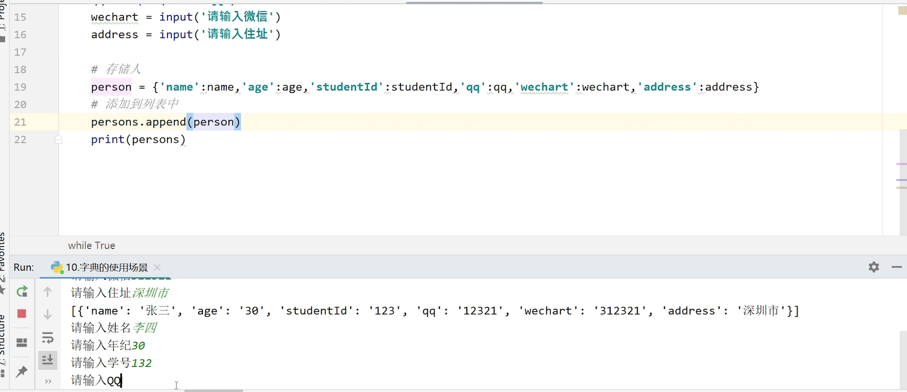

可以存储多个人的信息，列表里有两个字典。高级变量之间可以相互嵌套。

我们之前保存的都是静态的信息，但是人的话还有很多动态的属性，比如会跑会跳之类的。动态的东西用一个单独的数据类型就描述不出来了，所以我们后面要用到对象的方式来进行描述。

## 字典的操作

### 字典增删改查

### 字典增加元素

需求：添加'法国'

1. d[] = '  '直接添加

```python
 d = {'England':'英国','China':'中国','America':'美国'}
# 添加法国
 d['England'] = '法国'
 print(d)
```

2. 也可以通过`setdefault`方法添加

```python
d.setdefault('法国','France')
```

区别：键不存在时，方法一，会覆盖原来的数据。方法二，不会修改原来的数据。

如果我们不希望影响原始数据的安全，可以选用方法二。

### 字典删除元素

需求：删除美国

1.  **del**

```python
 d = {'England':'英国','China':'中国','America':'美国'}
# del删除美国
 del d['America']
 print(d)
```

2.也可以通过`pop`删除

```python
# pop删除 返回的是删除元素的value
 ele = d.pop('America')
 print(ele)
 print(d)
```

3. 清空字典clear()

```python
# 清空容器中的数据  还可以继续使用
d.clear()
```

### 字典修改元素

 把一个键的值修改成另外一个值

需求：把英国改成英格兰

1. d['原键 ']='修改值'

```python
d = {'England':'英国','China':'中国','America':'美国'}
# 英国修改成英格兰
d['England']='英格兰'
print(d)
```

2. update

```python
# 键存在 修改  键不存在,添加元素
d.update(England='英格兰')
print(d)
```


### 字典查询与遍历

| **分类** | **方法**                 | **说明**                                                  |
| -------- | ------------------------ | --------------------------------------------------------- |
| 增加     | 字典[键]=值              | 键不存在，会添加键值对；键存在，会修改键值对的值          |
|          | 字典.setDefault(键,数据) | 键值对不存在，添加键值对；存在则不做处理                  |
| 删除     | del 字典[键]             | 删除指定的键值对                                          |
|          | 字典.pop(键)             | 删除指定键值对,返回被删除的值                             |
|          | 字典.clear()             | 清空字典                                                  |
| 修改     | 字典[键]=数据            | 键不存在，会添加键值对；键存在，会修改键值对的值          |
|          | 字典.update(key=value)   | 取出字典2的键值对，键值对不存在，添加键值对；存在则修改值 |

#### 查询字典

```python
# d = {'England':'英国','China':'中国','America':'美国'}
# 根据键查询值 键不存在就报错
 value = d['France']
 print(value)

# 根据键查询值 键不存在不会报错 返回None
 value = d.get('France')
 print(value)

# 获取所有的键
 keys = d.keys()
 print(keys)

# 获取所有的值
 values = d.values()
 print(values)

# 获取所有的条目
 items = d.items()
 print(items)
```

#### 遍历字典

1. 默认打印所有的键

```python
d = {'England':'英国','China':'中国','America':'美国'}
# 默认打印所有的键
 for ele  in d:
     print(ele)
```

结果:

```
England 
China  
America 
```

2. 遍历字典中所有的键

```python
d = {'England':'英国','China':'中国','America':'美国'}
for key in d.keys():
    print(key)
```

结果:

```
England
China
America
```

3. 遍历字典中所有的值

```python
d = {'England':'英国','China':'中国','America':'美国'}

for value in d.values():
    print(value)
```

结果:

```
英国
中国
美国
```

4. 遍历字典中所有的键值对

```python
d ={'England':'英国','China':'中国','America':'美国'}
for key,value in d.items():
    print(key,value)
```

结果:

```
England 英国
China   中国
America 美国
```

##  练习题

```
需求:
判断如下列表中是否存在name为'阿土'的元素

```

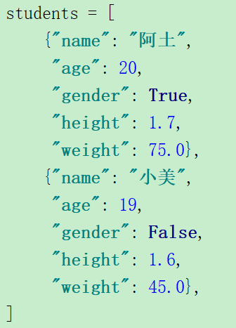

分析:

```
1.遍历列表
2.查看元素中name属性是否为阿土
3.是:存在  不是:等到循环结束之后都不是才说明不存在
```

代码:

```python
students = [
    {"name": "阿土",
     "age": 20,
     "gender": True,
     "height": 1.7,
     "weight": 75.0},
    {"name": "小美",
     "age": 19,
     "gender": False,
     "height": 1.6,
     "weight": 45.0},
]

# 1.遍历列表
for student in students:
    # 2.查看元素中name属性是否为阿土
    if student['name']=='张三':
        print('存在阿土这个人')
        # 跳出循环
        break
else:
    print('不存在阿土这个人')
```

# 4.高级变量综合练习：分配球游戏

分配球的游戏跟之前分配办公室有形似之处，也有一些新的特点。

```
需求:
有10个球分别3红、3蓝、4白，现需要将这10个球放入这3个盒子，要求每个盒子至少有一个白球，请用程序实现
```

分析:

```
1.定义容器保存10个球 (定义列表)
2.定义三个盒子，定义列表，列表里的元素也是列表  使用列表嵌套
3.把每一个盒子中放入一个白球
4.剩下的球再随机分配
```

代码:

```python
# 导入一个随机库
import random
# 1.定义三个容器保存三种球
whiteBalls = ['白','白','白','白']
redBalls = ['红','红','红']
blueBalls = ['蓝','蓝','蓝']

# 2.定义三个盒子 嵌套列表
boxes = [[],[],[]]
# 3.白球分配到三个盒子中
for box in boxes:
    # 找到白球
    # 添加白球
    box.append(whiteBalls.pop(whiteBalls.index('白')))

# 4.三个容器合并,再进行分配
l = whiteBalls+redBalls+redBalls

whiteBalls.clear()
redBalls.clear()
blueBalls.clear()

for ball in l:
    # 拿到盒子的索引
    index = random.randint(0,2)
    # 随机获取box
    box = boxes[index]
    # 添加球到盒子中
    box.append(ball)
```

结果：每次运行的结果都不一样，但是保证每个盒子里有一个白球

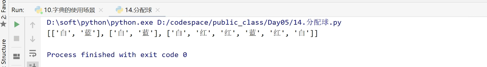

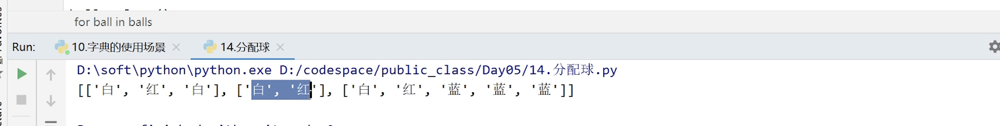


# 5.高级变量类型的公共语法

对于前面学的列表，字典，集合等高级变量，它们也有共同的特点，比如说，他们都是容器，所以它们也有公共的语法。我们一起来看一下

## 内置函数

高级变量类型有一些公共的内置,如下

| **函数**  | **描述**             | **备注**      |
| --------- | -------------------- | ------------- |
| len(item) | 计算容器中元素个数   |               |
| del item  | 删除变量             |               |
| max(item) | 返回容器中元素最大值 | 字典只比较key |
| min(item) | 返回容器中元素最小值 | 字典只比较key |

1.**len**

需求：计算hello的长度

```python
str = 'hello'
print(len(str))
```

结果:

```
5
```

或者计算字典的长度

```python
d = {10:40,20:50,30:60}
print(len(d))
```

结果

```
3
```

2. **del**

   元组是不能删除的。

```python
l = [1,2,3]
del l[0]
print(l)
```

结果:

```
[2,3]
```

3. **max**求最大值

   由于集合是键值对，它比较的是key值

```python
l = [10,20,30]
print(min(l))
print(max(d))
```

结果：

```
30
```

## 运算符

| **运算符**   | **描述**                 | **支持的数据类型**             |
| ------------ | ------------------------ | ------------------------------ |
| +            | 合并                     | 字符串、列表、元组             |
| *            | 重复                     | 字符串、列表、元组             |
| in           | 是否存在(字典中判断键)   | 字符串、列表、元组、集合、字典 |
| not in       | 是否不存在(字典中判断键) | 字符串、列表、元组、集合、字典 |
| > >= == < <= | 比较                     | 字符串、列表、元组             |

1. **in和not in**

需求：

```
‘h'是否在容器中
```

代码：

```python
str = 'hello'
# h是否在str中
result = 'h' in str
print(result)
result = 'h' not in str
print(result)
```

结果:

```
True
False
```

2. **+** 合并 

   只有字符串  ，列表和元组可以合并

**字符串**

```python
# 字符串
str1 = 'hello'
str2 = 'world'
str = str1+str2
```

结果：

```
'helloworld'
```

**列表**

```python
l1 = [1,2,3]
l2 = [4,5,6]
l = l1+l2
```

结果：

```
[1,2,3，4,5,6]
```

**元组**

```python
t1 = (1,2,3)
t2 = (4,5,6)
t = t1+t2
```

结果：

```
(1,2,3，4,5,6)
```


2. *****  重复

   只有字符串，列表和元组可以

```python
# 字符串
str = 'hello'
print(str*3)

# 列表
l = [1,2,3]
print(l*3)

#元组
t = (1,2,3)
print(l*3)
```

结果:

```
hellohellohello
[1, 2, 3, 1, 2, 3, 1, 2, 3]
[1, 2, 3, 1, 2, 3, 1, 2, 3]
```

## 切片

取一个字符串 list或tuple的部分元素是非常常见的操作

l = ['Michael', 'Sarah', 'Tracy', 'Bob', 'Jack']
取前三个元素怎么做?就是从容器中或者一部分数据，就需要用到切片

- 切片 译自英文单词slice,指的是一部分
- 切片 根据 **步长**从原序列中取出**一部分元素**组成新序列
- 切片适用于 **字符串**  **列表**  **元组**

### 切片的格式

进行切片的操作，格式很重要，一定要记清楚。

**字符串**\[开始索引**:**结束索引**:**步长\](包含开始,不包含结束)

```
需求:
str = '中华人民共和国欢迎您'
获取前三个文字
```

分析：

```
1. 开始索引0，结束索引，因为不包含，所以是3
2.步长为1，可以省略，：也可以省略
3.开始索引为0 也可以省略
```

代码:

```python
str = '中华人民共和国欢迎您'
# 获取前三个文字 
newStr = str[0:3:1]
```

> 步长默认为1,可以省略

```python
newStr = str[0:3:]
```

> 开始索引为0,可以省略

```python
newStr = str[0:3]
```

> 到末尾结束,可以省略结束索引

```python
newStr = str[:3]
```

以上几种写法出来的结果都是一样的

结果：

```
中华人
```

再来看看其他的切片方式

结束的索引在最后

如：取后7位

```python
# 结束索引是最后,可以省略最后的索引
newStr = str[3:]
```

### 切片的注意事项

1. 指定的区间是属于 左闭右开型  ,包含开始索引,不包含结束索引
2. 步长默认为1,可以省略
3. 从头开始,开始索引数字可以省略,冒号不能省略
4. 到末尾结束,可以直接在开始索引后加上:

### 索引的正序和倒序

索引分为正序和倒序，

正序:从左向右,0开始

倒序:从右向左,-1开始

元素都可以用两种方法表示索引

如下图：

字母p的索引，既可以是0，也可以是-1


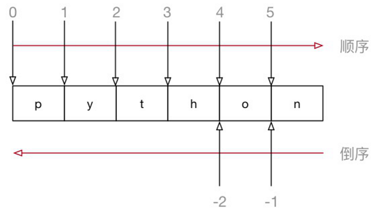

```
需求:
str = "中华人名共和国欢迎您"
把字符串中从第一个到倒数第二个(不包含)打印出来
```

代码:

```python
str = "中华人名共和国欢迎您"
# 把字符串中从第一个到倒数第二个(不包含)打印出来
# 开始位置 正序  结束位置:倒序
newStr = str[:-1]
print(newStr)
```

### 步长为负数

步长也可以为负数,代表逆序切片

```
需求:
str = "中华人名共和国欢迎您"
把从角标为2到7(包含)倒序打印出来
```

代码:

```python
str = "中华人名共和国欢迎您"
# 把从角标为2到7(包含)倒序打印出来
# 欢国和共名人
# 逆序打印 除了步长为负数  索引也要按照逆序定义
newStr = str[7:1:-1]
print(newStr)
```

结果:

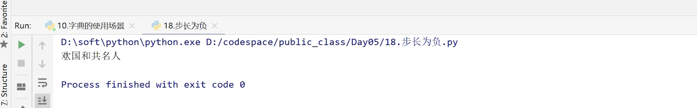

## 高级变量综合练习

```
需求:
完成字符串的逆序以及统计
设计一个程序，要求只能输入长度低于31的字符串，否则提示用户重新输入
打印如下内容:
您输入的字符串: ...
长度: ...
逆序后为: ...
字符统计结果: ...(afsfdsf)  a:1  f:3 s:2 d:1
zhangsanlisi
```

分析:

```
1.输入字符串(while True)
2.判断长度如果大于等于31,重新输入
3.输出字符串
4.长度:(len)
5.逆序  abc  cba
6.统计  afsfdsf  a:1 f:3 s:2 d:1
    gaslfldsafsdf   g:1 a:2
```

代码:

```python
while True:
    # 1.输入字符串(while True)
    str = input('请输入长度低于31位的字符串')
    # 2.判断长度如果大于等于31,重新输入
    if len(str)>=31:
        print('字符串的长度不能大于31位')
        continue

    # 满足条件,跳出循环
    break

# 3.输出字符串
print('您输入的字符串:%s'%str)
# 4.长度:(len)
print('长度:%d'%len(str))
# 5.逆序  abc  cba
# abc
newStr = str[::-1]
print('逆序后为:%s'%newStr)
# 6.统计  afsfdsf  a:1 f:3 s:2 d:1
# 定义字典保存结果
d = {}
for ele in str:
    if ele not in d:
        d[ele] = 1
    else:
        d[ele]+=1
print('字符统计结果:{}'.format(d))
```

结果：

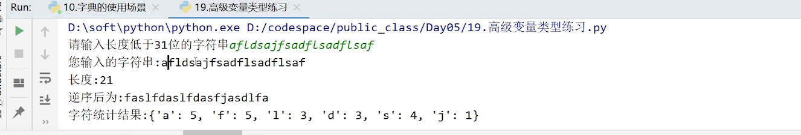

## 推导式

推导式是高级变量类型最后一个公共语法

推导式,指的是轻量级循环创建数据的方式

我们先学习一下列表推导式：

列表推导式的格式:

**[计算公式 for循环 if判断]**

推导式的作用，比如，我们需要定义列表保存从1到10000的数据,怎么做?

```python
普通写法：
l = []
for ele in range(10001):
    l.append(ele)
print(l)
```

```python
使用列表推导式
l = [ele for ele in range(10001)]
print(l)

```

需求2：

```
创建包含1到10000中所有偶数的列表
```

代码：

```python
# 加入if语句
l = [ele for ele in range(10001) if ele%2==0]
print(l)
```

**元组推导式**

需求3

```
创建嵌套列表(列表每个元素是两个元素的元组)
```

代码：

```
l = [(1,2),(3,4)]
l = [(ele,2*ele) for ele in range(10001)]
print(l)
```

#### 列表推导式练习

需求

```
请写出一段 Python 代码实现分组一个 list 里面的元素
比如 [1,2,3,...100]变成 [[1,2,3],[4,5,6]....[100]]
```

**分析**

```
1.定义列表[1,2,3...100]
2.[[1,2,3],[4,5,6]....[100]]
```

**代码**

```python
# 1 2 3 4 5 6 7 8 9 10 11 12
# 1.定义列表[1,2,3...100]
l = [ele for ele in range(1,101)]
# 2.[[1,2,3],[4,5,6]....[100]]
# newL = [[ele,ele+1,ele+2] for ele in range(100)]
# print(newL)
newL = [l[ele:ele+3] for ele in range(len(l)) if ele%3==0]
print(newL)
```

#### 其他推导式

还有其他的两种

集合推导式

字典推导式

其实就是符号的变化

**集合推导式**

集合推导式的格式:**{计算公式 for循环 if判断}**

```python
s = {ele for ele in range(1,101)}
```

**字典推导式**格式： **{key:value for循环 if判断}**

需求

```
定义{"1":1,"2":4,'3':9,..,'10':100}这样的字典
```

代码：

```python
# 定义一个变量ele ，value是key的平方
d = {str(ele):ele**2 for ele in range(1,11)}
 print(d)
```

因为key和value是有联系的，所以只需要定义一个变量

来看看两个变量的情况？

需求

```
需求:
l1 = [10,20,30,40,50]
l2 = [100,200,300,400,500]
定义{10:100,20:200,30:300,..,50:500}这样的字典
```

代码：

```python
l1 = [10,20,30,40,50]
l2 = [100,200,300,400,500]
# d = {key:value for key in l1 for value in l2}
# 同时遍历 zip是打包
d = {key:value for key,value in zip(l1,l2)}
print(d)
```

结果：

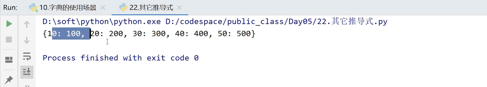

推导式的内容就是这些在开发的过程中使用的最多的是列表推导式，大家可以在开发的过程中多总结。

# 6.课后练习

```
需求1:
设计一个程序，实现str.split()方法的替换：
首先输入一个任意长度的字符串
其次输入一个字符，用以分割该字符串，并且分割后的字符串保存到一个列表中
不允许使用str.split()方法
最后打印出该字符串被分割成多少部分、以及这个列表
去掉分割出来的空字符串
如"1234r5678r90r"用r分割，则为["1234","5678","90"] 

```

```
需求2:
输入年月日如:20180325
输入在当前年的哪一天(第84天)
```

