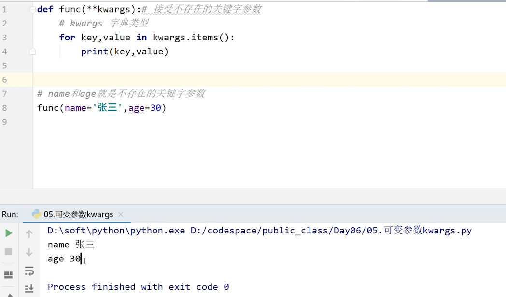
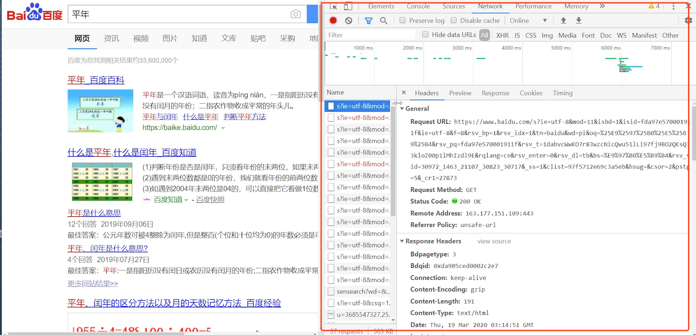
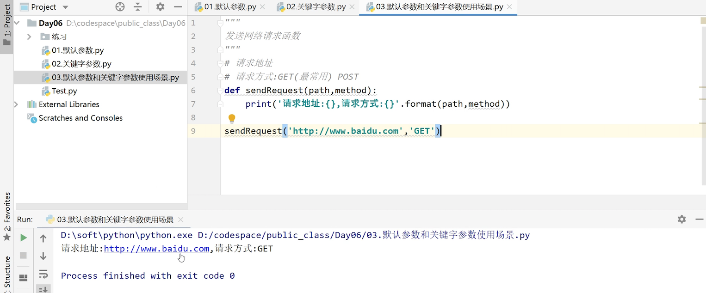
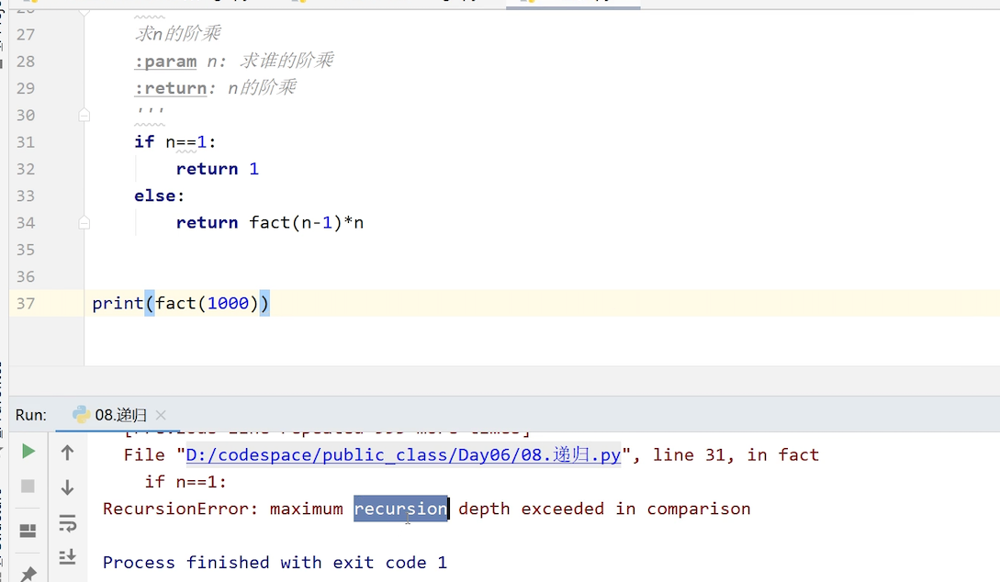
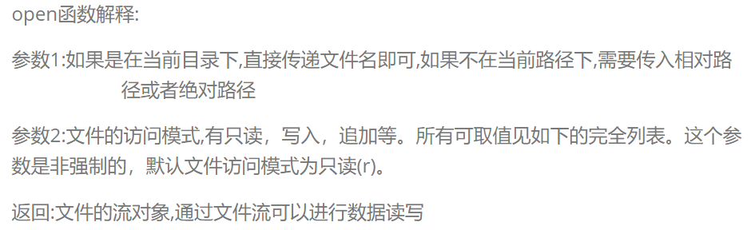
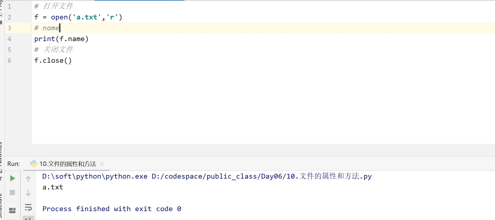
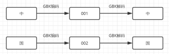
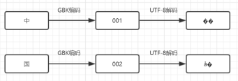
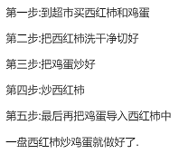

学机器人技术,  请访问  http://robot.czxy.com/ 

这是昨天练习的代码，大家都有练习吗？

```
需求1:
设计一个程序，实现str.split()方法的替换：
首先输入一个任意长度的字符串
其次输入一个字符，用以分割该字符串，并且分割后的字符串保存到一个列表中
不允许使用str.split()方法
最后打印出该字符串被分割成多少部分、以及这个列表
去掉分割出来的空字符串
如"1234r5678r90r"用r分割，则为["1234","5678","90"] 
```

```
分析:
1.定义容器保存结果(列表)
2.定义查找的字符串
```

```python
str = input('请输入字符串')
splitStr = input('请输入分隔字符串')
# 1.定义容器保存结果(列表)
result = []
# 2.定义查找的字符串
rightStr = str[:]
while True:
    # 查找r的角标
    index = rightStr.find(splitStr)
    # 判断
    if index!=-1:
        # 获取左侧字符串
        leftStr = rightStr[:index]
        # 添加到结果容器中
        result.append(leftStr)
        # 右侧字符串重新复制
        rightStr = rightStr[index+len(splitStr):]

    else:
        # 最后一部分没有查找到
        if rightStr:
            result.append(rightStr)
        # 跳出循环
        break

# 打印结果
print(result)

```

```
需求2:
输入年月日如:20180325
输入在当前年的哪一天(第84天)
```

```
分析:
1.输入日期
2.分出年月日
3.判断平年还是闰年
4.每一个月对应的天数定义出来
5.把月之前的天数加起来 再加上当前月天数
```

```python
# 1.输入日期
date = input('请输入正确的日期')
# 2.分出年月日
year = int(date[:4])
month = int(date[4:6])
day = int(date[6:])

# print(year)
# print(month)
# print(day)
# 4.每一个月对应的天数定义出来
monthDays = [0,31,28,31,30,31,30,31,31,30,31,30,31]
# 3.判断平年还是闰年
if (year%4==0 and year%100!=0) or (year%400==0):
    monthDays[2] = 29

# 记录天数
days = 0
# 5.把月之前的天数加起来 再加上当前月天数
for month in range(1,month):
    days+= monthDays[month]

# 6加上当前月天数
days+=day

print('天数:%d'%days)
```

```
需求3:
判断用户输入的日期是否为有效日期

用户可以输入"20170327"等三种格式的日期
判断是否是有效日期，如"20170229"不是有效日期，"20171345"不是有效日期
```

```
分析:
1.长度8位
2.必须是纯数字
3.年月日分隔出来
4.年只要不是负数都是满足
5.月只要在1到12之间都可以
6.日必须在1到当前月最大的天数之间
```

```python
def isLegel(date):
    # 1.长度8位
    if len(date) != 8:
        print('不合法,长度不为8')
        return
    # 2.必须是纯数字
    if not date.isdecimal():
        print('不合法,不是纯数字')
        return

    # 3.年月日分隔出来
    year = int(date[:4])
    month = int(date[4:6])
    day = int(date[6:])
    # 4.年只要不是负数都是满足
    if year<0:
        print('不合法,年不能为负数')
        return
    # 5.月只要在1到12之间都可以
    if month<1 or month>12:
        print('不合法,月必须在1到12之间')
        return
    # 6.日必须在1到当前月最大的天数之间
    monthDays = [0,31,28,31,30,31,30,31,31,30,31,30,31]
    # 闰年
    if (year % 4 == 0 and year % 100 != 0) or (year % 400 == 0):
        monthDays[2] = 29
    if day<1 or day>monthDays[month]:
        print('不合法,日期必须在1到%d之间'%monthDays[month])
        return

    # 日期合法
    print('日期合法')

date = input('请输入日期')
# 调用这个函数
isLegel(date)

```

来看一下今天的学习内容

* 默认参数和关键字参数
* 可变参数
* 递归
* 文件I/O
* 面向对象

# 1.默认参数和关键字参数

## 默认参数

- 形参设定默认值 称为 **默认参数**
- 调用函数时，如果没有传入默认参数对应的实参，则实参使用默认值
- 默认参数在调用的时候可以不传递,也可以传递

例如

```python
"""
形参设定默认值 称为 默认参数 用来接收实参传递的数据
"""
 def sayHello(name):# 形参 
     '''
#     给女神打招呼
#     :param name:女神姓名
#     :return:
#     '''
     print('hello %s'%name)
 
# 调用函数 传一个林青霞，输出的就是林青霞，如果穿的是张曼玉，则输出张曼玉
 sayHello('林青霞')
```

情况2

```python
def sayHello(name='林青霞'):# 形参
    '''
    给女神打招呼
    :param name:女神姓名
    :return:
    '''
    print('hello %s'%name)

# 调用函数，传张曼玉，输出的还是张曼玉
 sayHello('张曼玉')# 实参
# 如果不传 则输出林青霞
 sayHello()
```

注意:默认参数一定要在参数的最后，否则会报错。

```python
def sayHello(a,name='林青霞'):# 形参
    '''
    给女神打招呼
    :param name:女神姓名
    :return:
    '''
    print('hello %s'%name)

sayHello('张曼玉')
```

## 关键字参数

- 调用函数时，实参可以指定对应的形参，称为 **关键字参数**

- 使用关键字参数调用可以改变传递参数的顺序

  例如

```python
def func(name,age,phone):
    '''
    接收用户的姓名 年纪以及电话并输出
    :param name: 姓名
    :param age: 年纪
    :param phone: 电话
    :return:
    '''
    print('姓名:{},年纪:{},电话:{}'.format(name,age,phone))

# 调用函数，将参数一一对应
func('张三',30，'123123')
# 如果参数很多，就容易混乱，我们就需要用到一下的方法
# 关键字参数  可以直接指定传递给哪一个形参数据
func(name='张三',age=30,phone='123132')
# 关键字参数调用可以不按照形参顺序传递数据
func(phone='1231',name='张三',age = 30)
```


# 2.可变参数

可变参数，用于接收任意数量的相同类型的参数

可变参数有什么作用呢？

我们来看一下这三个需求

```
思考:
1.定义函数,求两个数的和
2.定义函数,求三个数的和
3.定义函数求任意个数的和
```

代码

```python
# 1.定义函数,求两个数的和
 def sum(a,b):
     return a+b
 print(sum(10, 20))   
# 2.定义函数,求三个数的和
 def sum(a,b,c):
     return a+b+c
 print(sum(10, 20,30))

```

定义函数求任意个数的和呢？

这个时候我们就需要用到可变参数

## 可变参数args

可变参数的前边需要添加*，用于提示python解释器该参数为可变参数
可变参数的本质是 将传递的参数包装成了元组

可变参数也要放在最后

```python
def sum(*args):# 参数前加上*代表可变参数 可以接受任意数量的数据
		print('调用了函数')
# 调用函数，可以穿任意个数的数据
sum(10,20,30,40)
```

求和

```python
def sum(*args):# 参数前加上*代表可变参数 可以接受任意数量的数据
    # 可变参数args把所有的参数保存在了元组中
    # args是什么类型的数据呢?
    # print(args)
    # 求和
    sum = 0
    for ele in args:
        sum += ele
    return sum

result = sum(10,20,30,40,50,60)
print(result)
```


## 可变参数kwargs

可变参数还有一种形式 可以接收不存在的关键字参数
定义参数时需要在变量名前添加两个*
这种可变参数会将 不存在的关键字参数包装成字典

1. 可以接收不存在的关键字参数

```python
def func(**kwargs):# kwargs 接收不存在的关键字参数
    pass

# 调用不存在的关键字参数函数
func(name = '张三',age = 30)
```

2. 不存在的关键字参数包装成**字典**

```python
def func(**kwargs):# 接受不存在的关键字参数
    # kwargs 字典类型
    for key,value in kwargs.items():
        print(key,value)

# name和age就是不存在的关键字参数
func(name='张三',age=30)
```

结果:



# 3.默认参数和关键字参数使用场景

学习任何知识，我们知道了是什么是不够的，关键是要掌握它有什么用？尤其是编程，一定要理解它的作用，以及对我们的开发有什么帮助。这样才算是真正的掌握它。

对于默认参数和关键字参数的来说，它在开发过程中的作用非常大。我们一起来看一下。

我们来看一个简单的案例：

当我们用百度搜索一个东西的时候，点击搜索，电脑就会向百度的服务器发送一个网络请求，服务器接受到数据之后，再返回数据，浏览器再解析数据，将内容展示到窗口上。

点击F12，可以看到具体的网络请求



网络请求包括哪些部分呢？一个是请求的地址，一个请求的方式，最常用的是get。

我们现在就要来写一下请求的地址和方式。

代码：

```python

# 请求地址
# 请求方式:GET(最常用) POST
def sendRequest(path,method='GET'):
    print('请求地址:{},请求方式:{}'.format(path,method))

 sendRequest('http://www.baidu.com','GET')

```

结果：



如果有30 网络请求  28 GET 2 POST

```python

# 请求地址
# 请求方式:GET(最常用) POST

def sendRequest(path,method='GET'):
    print('请求地址:{},请求方式:{}'.format(path,method))

# GET请求
sendRequest('http://www.baidu.com'，)
# POST
sendRequest("http://www.baidu.com/login",'POST')
```

默认参数可以达到其他语言java方法的重载实现的效果

再来回忆一下前面的内容。

* 可变参数args是将参数包装成元组tuple
* 可变参数kwargs是将参数包装成字典

那我们来思考一下，能否把一个元组直接传递给args，直接把一个字典直接传递给kwargs呢？一起来看一下。

# 4.传递元组给可变参数args

在实参的前面加上*的作用是将元组中的元素解包成一个一个的元素传递给函数.
对于元组 列表以及集合都可以使用

```python
def func(*args):
    print(args)#(10,20,30)

t = (10,20,30)
t1 = (40,50,60)
# 直接传递元组,元组整体当成一个参数传递给args,两个元组，就写两个参数
# 传递元组可以通过*解包元组
result = sum(*t,*t1)
print(result)
```

# 5.传递字典给可变参数kwargs

在实参的前面加上**的作用是将元组中的元素解包成一个一个的不存在的关键字参数传递给函数.
注意:如果字典前面加上表示的是将字典的key值解包出来

```python
def func(**kwargs):
    for key,value in kwargs.items():
        print(key,value)

# func(name='张三',age='30')
d = {'name':'张三','age':30}
# 传递字典给kwargs需要通过**拆分
func(**d)

```

# 6.递归函数

递归函数定义：如果 一个函数在内部调用其本身，这个函数就是 递归函数

递归函数好处:把一个大型复杂的问题层层转化为一个与原问题相似的规模较小的问题来求解，只需少量的程序就可描述出解题过程所需要的多次重复计算，更加符合人类的需求

我们先来看看生活中递归的场景:

```
从前有座山，山里有个庙，庙里有个老和尚，给小和尚讲故事。故事讲的是：
从前有座山，山里有个庙，庙里有个老和尚，给小和尚讲故事。故事讲的是：
从前有座山，山里有个庙，庙里有个老和尚，给小和尚讲故事。故事讲的是：
从前有座山，山里有个庙，庙里有个老和尚，给小和尚讲故事…
```

故事里面又是这个故事，就是递归，就是在函数内部调用了它本身。

在实际开发中，让我们的解题思路变得非常的简单

递归最经典的案例是求n的阶乘

```
需求:
使用递归求n的阶乘
```

分析：

```
什么是阶乘？
5的阶乘1*2*3*4 * 5
5的阶乘  4的阶乘乘以5
10的阶乘  1*2*3*4*5*..*9 * 10
10的阶乘  9的阶乘*10
n的阶乘: 1*2*..*(n-1) * n
    n-1的阶乘*n
```

代码：

```python
def fact(n):
    '''
    求n的阶乘
    :param n: 求谁的阶乘
    :return: n的阶乘
    '''
    if n==1:
        return 1
    else:
        return fact(n-1)*n

print(fact(1000))
```

阶乘写起来非常简单, 效率低,占用内存嵌套层级比较多, 会造成内存溢出 ，程序报错。如果写1000，就会这样。



如果层级比较高的话，就建议大家不要使用递归了。python最高就只能到996层，内存就不够了。但是有些其他的语言层级比较深，就可以使用了。

# 7.文件I/O

- IO是两个单词的缩写,分别是Input和Output,输入和输出
- IO包含控制台IO以及文件IO

控制台IO就是程序控制台出入和输出，我们前面讲的input语句和print语句就是控制台IO，我们通过input可以输入，通过print可以输出。

文件IO就是文件的操作

**文件I/O的基本流程**

- 打开文件
- 文件读写
- 关闭文件

在python，使用**open**函数，可以打开一个已经存在的文件，或者创建一个新文件

**文件打开格式**

```
f = open(文件名，访问模式)
```



常用的访问模式对应的功能如下:

| **访问模式** | **说明**                                                     |
| ------------ | ------------------------------------------------------------ |
| r            | 以只读方式打开文件。文件的指针将会放在文件的开头。这是默认模式 |
| w            | 打开一个文件只用于写入。如果该文件已存在则将其覆盖。如果该文件不存在，创建新文件 |
| r+           | 打开一个文件用于读写。文件指针将会放在文件的开头             |
| w+           | 打开一个文件用于读写。如果该文件已存在则将其覆盖。如果该文件不存在，创建新文件 |

文件访问模式简略，大家可以根据自己的需要选择不同的模式，这个也不用背下来，用多了就会了。

| **功能** | **r** | **r+** | **w** | **w+**    |
| -------- | ----- | ------ | ----- | --------- |
| 读       | +     | +      |       | +         |
| 写       |       | +      | +     | +         |
| 创建     |       |        | +     | +         |
| 覆盖     |       |        | +     | +关闭文件 |

**关闭文件格式**

可以使用f.close()方法关闭文件

```python
f.close()
```

下面就来具体的操作一下。

## 文件打开

```python
# 默认r模式  文件不存在就报错
 f = open('a.txt')
```

```python
# w模式 文件不存在,会创建  文件存在,会覆盖，也就是清空重写，所以比较危险
 f = open('b.txt','w')
```

```python
# r+模式 可以读写 不会覆盖 不会创建
 f = open('b.txt','r+')
```

```python
# w+ 可以读写 会覆盖 会创建 带w相关的模式比价危险，会清空
 f = open('b.txt','w+')
```

**file对象的方法和属性**

| **方法或属性** | **说明**           |
| -------------- | ------------------ |
| name           | 返回文件的名称     |
| mode           | 返回文件的访问模式 |
| closed         | 文件是否已经关闭   |
| readable()     | 文件是否可读       |
| writable()     | 文件是否可写       |
| encoding       | 文件编码           |

**name**返回文件名

```python

# 打开文件
f = open('a.txt','w')
# name 文件名
print(f.name)

# 关闭
f.closed
```

结果：




## 文件读写

**文件写入**

使用**write()**可以完成向文件写入数据

格式为:
**1. write(str)**

```python
 # 打开文件 必须是w模式 因为要有写的功能
 f = open('c.txt','w')

 # 写入数据
 f.write('hello world1')

 # 关闭文件
 f.close()
```

**2. writelines**

writelines可以将容器中数据写入到文件中

```python
# 打开文件
f = open('d.txt','w')

l = ['bill','tom','jack']
# 写入数据
f.writelines(l)

# 关闭文件
f.close()
```

相比其他的语言来说，python的文件写入功能非常简单，就只有这两种


**文件读取**

1. **read**

   格式为:data =f. read(num)

```python
# 打开文件 读取数据要使用r模式
f = open('a.txt','r')

# 读取整个文件
# 参数n 读取数据个数 默认-1,读取整个文件
 result = f.read(15)
 print(result)
```

2. **readline**

   格式为：data = f.readline(num)

```python
# 默认读取一行
# limit 读取一行中字符个数  默认-1  代表读取整行
 result = f.readline(15)
 print(result)
```

3. **readlines**

   格式：result = f.readlines()

readlines指的是读取整个文件,返回每一行数据的列表

```python
result = f.readlines()
print(result)
```

## 练习1：制作文件备份

```
需求:
输入文件的名字，然后程序自动完成对文件进行备份
```
分析:

```
1.输入文件名,默认文件存在
2.新文件名 a[备份].txt
3.打开新文件和输入的文件
4.读取输入的文件
5.写入到新的文件中
```

代码实现:

```python
# 1.输入文件名,默认文件存在
fileName = input('请输入需要备份的文件')
# 2.新文件名 a[备份].txt  a[].txt  a.b.txt
# 查找最后一个.索引
index = fileName.rfind('.')
copyName = fileName[:index]+'[备份]'+fileName[index:]
# 先打印一下备份的名称试一试
print(copyName)
# 3.打开新文件和输入的文件
# 原来的文件
originalF = open(fileName)
# 备份的文件
newF = open(copyName,'w')

"""--------------------------- 小文件备份 ---------------------------"""
# # 4.读取输入的文件
str = originalF.read()
# # 5.写入到新的文件中
newF.write(str)

#  为了防止内存溢出，需要用另外的方法读写大文件，进行备份
"""--------------------------- 大文件备份 ---------------------------"""
# 读取一行 ,写入一行 直到读取内容为空结束
line = originalF.read(1024)
# line = originalF.readline()
while line:# 判断是否为空
    # 写入到新文件中
    newF.write(line)
    # 读取下一行
    # line = originalF.readline()
    line = originalF.read(1024)

# 关闭文件
originalF.close()
newF.close()
```

## 练习2：统计代码

```
需求:
输入一个文件名,统计文件中代码行数、注释行数、空行数
并输出代码以及注释
```

分析:

```
1.输入文件名
2.打开文件(r模式)
3.按照行读取
4.注释:以#开头
5.空行  没有数据
6.既不是注释也不是空行 说明是代码
```

代码:

```python
# 1.输入文件名
fileName = input('请输入需要统计的代码文件名')
# 2.打开文件(r模式)
f = open(fileName,encoding='utf-8')
# 定义变量保存注释的行数 空行数  代码行数
commandCount = 0
emptyCount = 0
codeCount = 0
# 定义列表保存注释和代码
commandL = []
codeL = []
# 3.按照行读取
line = f.readline()
while line:# 判断line是否为空
    # 处理统计
    if line.startswith('#'):
        # 4.注释:以#开头
        commandCount+=1
        commandL.append(line)
    elif not line.strip():
        # 5.空行  没有数据
        emptyCount+=1
    else:
        # 6.既不是注释也不是空行 说明是代码
        codeCount+=1
        codeL.append(line)

    # 读取下一行
    line = f.readline()

# 输出统计结果
print('注释行数:{},空行数:{},代码行数:{}'.format(commandCount,emptyCount,codeCount))
print('注释:{}'.format(commandL))
print('代码:{}'.format(codeL))
```

## 相对路径和绝对路径

再来回顾一下，对于前面的文件IO来说，打开文件方式:
**f = open(文件名，访问模式)**

这里的第一个参数，并不是文件名，而是文件的路径

对于文件名,如果是在当前目录下,可以直接写文件名
如果是在其他目录下,就需要填写带有文件名的文件路径

文件路径分为两种:**相对路径和绝对路径**

比如我们现在要找一个D盘的文件，要怎么写呢？

先来看一下使用绝对路径

1. 绝对路径

绝对路径指的是在电脑硬盘上真正保存的路径
绝对路径在不同的操作系统上写法是不一样的

```python
# 打开文件 其中一个\是转义作用
 f = open('D:\\dir\\t.txt') # 文件在其它文件夹下 找不到
#
 f = open('D:\\codespace\\public_class\\Day06\\a.txt')
 str = f.read()
 print(str)
# # 关闭文件
 f.close()
```

绝对路径的缺点，当文件的位置发生变化时，文件路径就要重新修改，否则无法正常读取，文件路径错误，所以我们一般不使用

再来看一下相对路径

2. 相对路径

   相对路径就是相对于当前目录的路径
   相对路径用  **.**  代表当前目录,

   ​               使用  **..**  代表上一级目录
   如果是当前路径可以省略**./**

```python
# 打开  以下是相对路径的不同的写法
f = open('./a.txt')# 相对路径写法
f = open('a.txt')# 相对路径写法
f = open('./b/h.txt')# 相对路径写法

f = open('../b/z.txt')
f = open('../../a/a.txt')
str = f.read()
print(str)
# 关闭
f.close()
```

使用相对路径，就算文件拷贝，也不会影响读取，因为相对位置是不变的

## 编码和解码

最后，在来看一个跟文件IO相关的知识，编码和解码。

当我们在打开文件时出现问好或者看不懂的东西，就说明我们的文件出现了乱码

那为什么回出现乱码呢？

我们首先会明白数据存储的读取的原理

* 计算机只能读取和识别二进制的数据,任何数据无论是中文还是英文进行存储的时候都需要转换成二进制的数据进行存储,

这个转换的规则就是编码方式，常用的编码方式是字符集编码的方式,比如常用的GBK和UTF-8等

原理就是建立中文或者英文与数字的一一对应关系，比如下图：



那为什么会出现乱码呢？

那是因为我们在进行编码和解码的时候对应的方式不一样，导致计算机混乱，就出现了乱码。



```python
# 打开文件 默认gbk编码 指定一个特定的编码方式
f = open('z.txt','w',encoding='utf-8')
f = open('z.txt','w')

print(f.encoding)
# 写入数据
f.write('中国')

# 关闭文件
f.close()
```

**中文出现乱码的原因**

查看写入文件的编码方式为gbk
打开文件的方式是utf-8

**解决的乱码的方式**

1.修改打开文件的编码方式
2.修改写入文件的编码方式

只要讲两端统一就行。

# 8.面向对象

面向对象很多同学之前应该听过，Java是面向对象的语言，而C语言是面向过程的语言。

那什么是面向对象，什么又是面向过程，有什么区别和联系呢？

**面向对象**和**面向过程**都是一种编程思想,就是解决问题的思路

- 面向对象:OOP(Object Oriented Programming)

  常见的面向对象语言包括:java c++ go python koltin

- 面向过程:POP(Process Oriented Programming)

  面向过程语言代表是c语言

我们看同一个问题,面向过程和面向对象是怎么解决的?

中午想吃西红柿炒鸡蛋怎么办呢?

**面向过程思想**



面向过程解决问题必须要知道完成这个功能每一步的操作，只要有一个步骤出错或者步骤反了，那程序就出问题了。

- 面向过程思想,强调的是**过程(动作)**
- 而完成这个功能我们充当的角色是**执行者**的角色

所以面向过程解决问题就比较麻烦，我们必须要了解每一个过程才行。

**面向对象思想**

同样是中午想吃西红柿炒鸡蛋,

* 直接到饿了么上下个单,老板就把西红柿炒鸡蛋做好送过来了

* 餐馆老板具备做西红柿炒鸡蛋的功能,直接调用他的功能即可,不需要知道具体的流程

所以

* 面向对象思想:不再关注具体的过程

- 功能里面充当的角色是**指挥者**的角色

**面向过程和面向对象的总结**

面向对象,强调的是**对象(实体)**

面向对象是一种思想,更加符合人的思维习惯

面向对象使复杂的问题简单化了

面向对象的出现,让曾经在过程中的**执行者**,编程了对象中的**指挥者**

其实面向对象的编程思想的例子非常的多，

比如说我们的城市到处都有高楼大厦，建好一栋楼的话会有甲方和乙方，

甲方就是投资方，比如说万达投资一个楼房，万达不需要自己盖，而是请会盖房子的人过来盖就可以了，盖房子的就是乙方。

乙方中的项目经理就是面向对象中的调用者。但是项目经理他也不会房子，他就需要调用民工来盖房子。

所以在不同的场景下，指挥者，调用者，实施者的身份是可以转换的

## 类和对象

### 类和对象的概念

类和对象是面向对象非常重要的概念

- 类是描述了一种**类型**(相当于图纸)
- 对象是这个类型的具体实现(相当于图纸具体实现)

比如农村的房子都差不多，就是因为它们是同一个类

```
思考:
狗和旺财,哪个是类,哪个是对象?
```

> 狗是一个类型,属于类
>
> 旺财是狗的实现,属于对象

### 定义类和创建对象

类其实就是一种数据类型,描述特定的事物
系统帮我们定义好了很多类型:数值型、字符串、列表、元组、集合以及字典

为什么要定义类？

我们来看一下，生活中我们会用到人民币，有固定的面额，有些人就问会什么没有30元的90元的面额呢？因为这些面值就可以组合出各种数值的金额。所以没有必要有那么多不同面值的基础币值。


所以，我们不需要将人或者狗这些东西都定义出来。

需要定义人的姓名可以用字符串类型，年纪int类型等等，都可以用基本的数据类型定义出来。

只要我们把这些基本的数据类型确定完之后,任何复杂的事物都可以通过组合基本数据类型来描述

类就是用基本的数据类型描述复杂的事物

**类的定义**

> 类的定义格式:

```python
class 类名:
    pass
```

**创建对象**

```
对象名 = 类名()
```

需求

```
1.定义Person类和创建person对象
2.定义多个类和定义多个对象
3.一个类创建多个对象
```

代码：

```python
# 定义Peron类
class Peron:
    pass

# 定义狗Dog类
class Dog:
    pass


# 创建多个对象
p1 = Peron()
p2 = Peron()
p3 = Peron()

dog1 = Dog()
dog2 = Dog()
dog3 = Dog()
```

### 类的组成


类都需要有类名,也应该具备一些静态属性和动态的行为

* 类的关键字:class
  类的名称:类名
  类的属性:一组数据
  类的方法:允许进行操作的方法(行为)

人需要怎么设计呢：

* 类名：Person

* 属性:姓名(name) 、年纪(age)    

* 方法:跑(run)、说话(say)

  

#### 成员方法的定义

动态行为主要是通过成员方法的方式进行定义
方法定义在类里面
方法:类中的函数

成员方法的定义格式为:

**def 函数名(self)**

```
需求:
1.给Person类定义sayHello方法
2.给Person类定义run方法
```

代码：


```python
# 定义sayHello方法
def sayHello():
    print('你好')
    
# 定义一个Person类
class Person:
    # 方法必须要有self参数
    def sayHello(self):
        print('你好')
    # 定义run方法
    def run(self):
        print('开始跑步')

    # 方法之间相互调用，定义的cacl中再调用sayHello方法run方法
    def cacl(self):
        # 调用sayHello方法
        self.sayHello()
        # 调用run
        self.run()

# 创建对象
p = Person()
# 调用方法 self参数不需要传递
p.sayHello()
# 调用run方法
p.run()
# 调用run方法
p.cacl()
```

> 注意:
>
> 成员方法有都有参数self,调用的时候不需要传递self

#### 成员属性定义

成员属性的定义需要在\_\_init\_\_方法下定义

格式:

**def \_\_init\_\_(self):**

​     **self.属性 = 属性值**

```python
需求:
定义Person类,定义成员属性name和age
```

代码：

```python
class Person:
    def __init__(self):
        # 定义成员属性
        self.name = '张三'
        self.age = 30

# 创建对象
p = Person()
# 访问属性
print(p.name)
print(p.age)
```

属性和方法多需要通过对象来调用，直接调用是不行的。

