学机器人技术,  请访问  http://robot.czxy.com/ 

先来看一下几天学习的主要内容

* 特殊方法和参数
* 私有化
* 面向对象-封装
* 面向对象-继承
* 面向对象-多态
* 鸭子模型
* 枚举

# 1.self参数

成员方法中self表示调用该方法的对象
对象调用⽅法时，python解释器会把这个对象作为第⼀个参数传递给⽅法，所以开发者只需要在定义⽅法时 “预留” 第⼀个参数为 self即可
通过self也可以获取对象实例的属性

类中方法参数self:

1.调用该方法的对象

2.self不需要我们传递,python解释器会自动将调用该方法的对象传递给self

3.self后面如果还有参数，就需要写相应的数据传过去

```python
print('程序开始')
# 定义类Person
class Person:
    def __init__(self):
        self.name = '张三'
        self.age = 30

    def sayHello(self):
        print('你好')
        print(self.name)#内部调用

# 创建对象
p = Person()
# print(p.name)
# 调用方法
p.sayHello()
# print('程序结束')
#
# p1 = Person()
# p1.sayHello()
```


# 2._\_init\_\_方法

这个方法我们之前也用过，当我们定一些属性的时候，我们就需要用到_\_init\_\_方法

那它有什么作用呢，有什么特点呢？

特点如下：

1. __init__是类的内置方法 每一个类都有这些方法
2. 只要以__开头,以__结尾的方法都是内置方法
3. __init__方法会在创建对象的时候自动执行
4. 每创建一个对象都会执行__init__方法
5. __init__主要的作用是进行对象的初始化

* _\_init\_\_()__是一个**内置的方法**

* 当**对象创建的时**候就会自动执行\_\_init\_\_()方法

```python
class Person:
    def __init__(self):
    print('执行了init方法')
```

定义成员属性

```python
 class Person:
      def __init__(self):
         # 初始化属性 每个类都具备这些属性  
         self.name = '张三'
         self.age = 30

# 创建对象  
 p1 = Person()
 print(p1.name)
 p2 = Person()
 print(p2.name)
```

因为每个人的属性都是不一样的，所以后面的名称要是可以变化的，我们就需要学习另外一个方法。要对方法传递参数

**__init__()方法传参**

__init__()方法可以传参,一般用来进行成员属性的初始化

```python
class Person:
    #zai self后面加上参数
    def __init__(self,name,age):
        # 初始化属性
        self.name = name
        self.age = age


# 创建对象的要穿相应的数据到定义的参数上，否则报错
p1 = Person('张三',30)
print(p1.name)
p2 = Person('李四',40)
print(p2.name)
```


# 3.\_\_str\_\_方法

\_\_str\_\_也是类的内置方法，也是自动执行的

用于将对象转化为**适于人阅读的形式**

先看一个需求

```
1.定义Person类,具有成员属性name和age
2.创建p1和p2对象
3.打印p1对象和p2对象
```

代码：

```python
# 1.定义Person类,具有成员属性name和age
class Person:
    def __init__(self,name,age):
        self.name = name
        self.age = age

# 2.创建p1和p2对象
p1 = Person('张三',30)
p2 = Person('李四',40)

# 3.打印p1对象和p2对象
print(p1)
print(p2)
```

创建了两个对象,输出两个对象

结果如下：并没有达到我们想要的效果

下面的含义表示的是有一个person对象在这个地址上，两个地址不同，说明对象不同

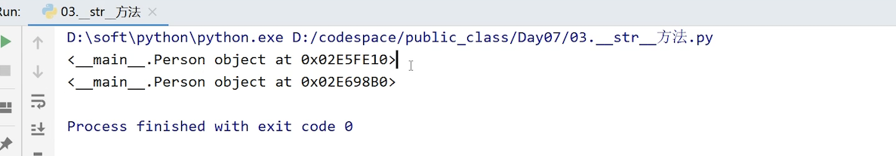

从结果中我们并不能区分出到底哪个是属于`p1`,哪个是属于`p2`

我们需要的是能够区分两个人的不同结果，他们有不同的特征

可以通过**\_\_str\_\_**提取对象的主要特征用于区分不同的对象

还是以上的问题，要加上\_\_str\_\_方法

```python
# 1.定义Person类,具有成员属性name和age
class Person:
    def __init__(self,name,age):
        self.name = name
        self.age = age

    def __str__(self):
        '''
        提取对象的特征,用于输出对象
        :return:
        '''
        return '姓名:{},年纪:{}'.format(self.name,self.age)

# 2.创建p1和p2对象
p1 = Person('张三',30)
p2 = Person('李四',40)

# 3.打印p1对象和p2对象
print(p1)
print(p2)
```

输出结果:

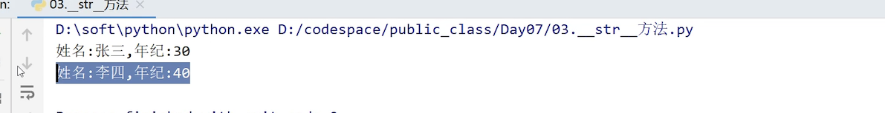

我们从结果中很容易就区分出两个对象的不同

# 4.练习：手机案例

```
需求:
	手机电量默认是100
	打游戏每次消耗电量10
	听歌每次消耗电量5
	打电话每次消耗电量4
	接电话每次消耗电量3
	充电可以为手机补充电量
```

分析:

```
1.定义类:MobilePhone
2.定义成员属性:battery
3.定义方法:playGame
4.定义方法:listenMusic
5.定义方法:call
6.定义方法:receiveCall
7.定义方法:charge
```

代码：

```python
# 1.定义类:MobilePhone
class MobilePhone:
    def __init__(self):
        # 2.定义成员属性:battery
        self.battery = 100

    # 3.定义方法:playGame
    def playGame(self):
        # 每次消耗电量10
        if self.battery >= 10:
            self.battery -= 10
        else:
            print('电量不足,需要充电')

    # 4.定义方法:listenMusic
    def listenMusic(self):
        # 每次消耗电量5
        if self.battery >= 5:
            self.battery -= 5
        else:
            print('电量不足,需要充电')

    # 5.定义方法:call
    def call(self):
        # 每次消耗电量4
        if self.battery >= 4:
            self.battery -= 4
        else:
            print('电量不足,需要充电')

    # 6.定义方法:receiveCall
    def receiveCall(self):
        # 每次消耗电量3
        if self.battery >= 3:
            self.battery -= 3
        else:
            print('电量不足,需要充电')

    # 7.定义方法:charge
    def charge(self, battery):
        '''
        充电
        :param battery:每次充电的电量 (不同的功率充电器是不同的)
        :return:
        '''
        self.battery += battery
        # 判断
        if self.battery > 100:
            self.battery = 100

    def __str__(self):
        return '电量:{}'.format(self.battery)

# 创建对象
phone = MobilePhone()
# 打游戏
phone.playGame()
print(phone)
# 听歌
phone.listenMusic()
print(phone)
# 打电话
phone.call()
print(phone)
# 接电话
phone.receiveCall()
print(phone)
# 充电
phone.charge(10)
print(phone)

```

根据不同的电量消耗情况：就会输出不同的结果

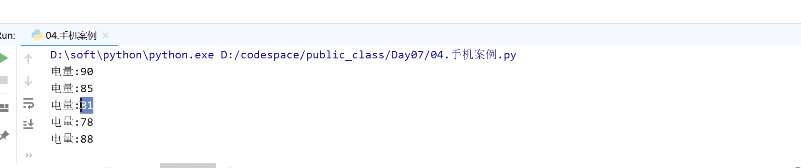

# 5.练习搬家具案例

**搬家具规则**

```
1.家具分不同的类型，并占用不同的面积
2.输出家具信息时，显示家具的类型和家具占用的面积
3.房子有自己的地址和占用的面积
4.房子可以添加家具，如果房子的剩余面积可以容纳家具，则提示家具添加成功；否则提示添加失败
5.输出房子信息时，可以显示房子的地址、占地面积、剩余面积
6.查看房子中所有的家具
```

**类的设计**

> 可以提取两个类:家具类和房子类
>
> 每个类具备的属性和方法如下:

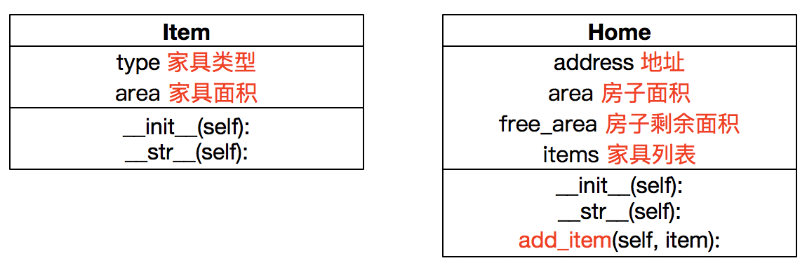

**家具类**

```
1.使用 Item 类可以创建 家具对象
2.家具有两个属性：
	家具类型 type：字符串
	家具面积 area：整数
3.实现__str__方法
4.显示家具的 type 和 area 属性
```

**房子类**

```
1.使用 Home 类可以创建 房子对象
2.房子有四个属性：
	地址 address：字符串
	房子面积 area：整数
	房子剩余面积 free_area：整数，默认为房子的面积
	家具列表 items：列表
3.实现__str__方法
	显示房子的 address 、area、free_area 属性
4.实现add_item方法，提供item参数来添加家具
	如果 可以容纳家具：
		家具 加入 item属性
		剩余面积 减少
	如果 不能容纳家具： 提示家具添加失败
```

**主程序逻辑**

```
1.创建 家具对象, 输出 家具信息
2.创建 房子对象, 输出 房子信息
3.房子添加家具, 输出 房子信息
```

**代码实现**

```python
# 定义房子类
class Home:
    def __init__(self,address,area):
        # 地址
        self.address = address
        # 房子面积
        self.area = area
        # 剩余面积
        self.free_area = self.area
        # 家具列表
        self.items = []

    def __str__(self):
        return '房子地址:{},房子面积:{},房子的剩余面积:{}'.format(self.address,self.area,self.free_area)

   # 添加家具
    def add_item(self,item):
        '''
        添加家具
        :param item: Item类型的家具对象
        :return:
        '''
        # 是否可以容纳家具
        if self.free_area>=item.area:
            # 可以容纳
            # 添加到家具列表中
            self.items.append(item)
            # 减少剩余面积
            self.free_area -= item.area
            print('添加成功')
        else:
            # 不能容纳
            print('添加家具失败')

"""--------------------------- 业务流程 ---------------------------"""
# 1.创建 家具对象, 输出 家具信息
item = Item('桌子',10)
print(item)
# 2.创建 房子对象, 输出 房子信息
home = Home('深圳湾一号',140)
print(home)
# 3.房子添加家具, 输出 房子信息
home.add_item(item)
home.add_item(item)
print(home)
```

结果：

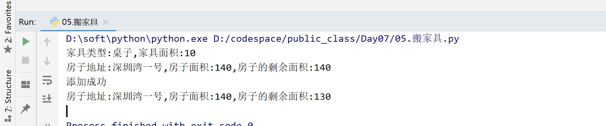

# 6.私有化

类里面的属性外可以被访问的叫做公有。

将**属性**或者**方法**设置为不能在外部访问,就是私有化

私有化包括:**属性私有化**、**方法私有化**

## 属性私有化

先来看一下为什么要使用属性的私有化呢？

```
需求：
写一个圆形类,传递圆的直径,定义方法求圆的周长
```

代码：

```python
# 定义圆
class Circle:

    def __init__(self):
       
        self.PI = 3.1415926
   
  #定义方法
    def perimeter(self,radius):
        '''
        根据半径求圆的周长
        :param radius: 圆的半径
        :return:
        '''
        return 2*self.PI*radius

# 创建圆
c = Circle()
# 访问PI属性
print(c.PI)
# 修改PI
# c.PI = 40
# 求周长
result = c.perimeter(20)
print(result)
```

这样写，pi可以访问和修改，所以就比较危险，因为会影响最后的结果，所以有时候，我们希望pi是不可修改的。但是在python中变量都是可以变的。所以我们就只能讲pi私有化。

**私有化特点**:私有化的属性可以在类内部访问，在外部不能访问

**私有化作用**:保证类中数据安全

**私有化格式:**self.__属性名 = 属性值**

将代码修改如下：

```python
class Circle:
    def __init__(self):
        # PI属性 希望不能再外面修改  不能再外部访问
        # 私有化:在外部不能访问
        # python的属性私有化:只需要在属性名前加上__
        # 私有化的属性可以在类内部访问
        self.__PI = 3.1415926


    def perimeter(self,radius):
        '''
        根据半径求圆的周长
        :param radius: 圆的半径
        :return:
        '''
        return 2*self.__PI*radius

# 创建圆
c = Circle()
# 访问PI属性 不能实现，在外部不能使用
# print(c.__PI)
# print(c.PI)
# 修改PI
# c.PI = 40
# 求周长
result = c.perimeter(20)
print(result)
```

再来看下属性私有化的其他问题：

让私有化的属性在一定的范围内可以修改，通过get的方式来访问

```python
class Peron:
    def __init__(self,age):
        # 年纪 私有  在外部就不能再随意修改了
        self.__age = age

    def getAge(self):
        return self.__age

    def setAge(self,age):
        if age>150 or age<0:
            return
        self.__age = age

p = Peron(30)
# # 访问age属性
# print(p.age)
# # 修改age属性
# p.age = 60
# print(p.age)

# 并不是修改内部的__age属性 定义了新的属性__age
# p.__age = 300
# print(p.__age)
# print(p.getAge())

p.setAge(60)
print(p.getAge())
```


## 方法私有化

方法的私有化方式和属性私有化方式一样

私有化的方法,不能通过对象调用,只能在类内部调用

方法私有化的主要作用是进行对象的封装

所以我们就简单的说一下，大家看一下示例代码

```python
class Person:
    def __sayHello(self):
        print('你好')

p = Person()
p.__sayHello()
```

# 7.面向对象三大特征

面向对象三大特征是:**封装、继承和多态**

任何时候，面向对象都离不开这三大特征

## 封装

封装在我们生活中是无处不在的，比如说五六年的手机，手机后盖可以打开，打开手机壳就可以看到里面各种各样的部件，电路板，内存卡等等，手机壳就是对手机对了一个封装。


再比如说来看我们的电脑后面，会有一个音箱的插孔等等，这也是封装。

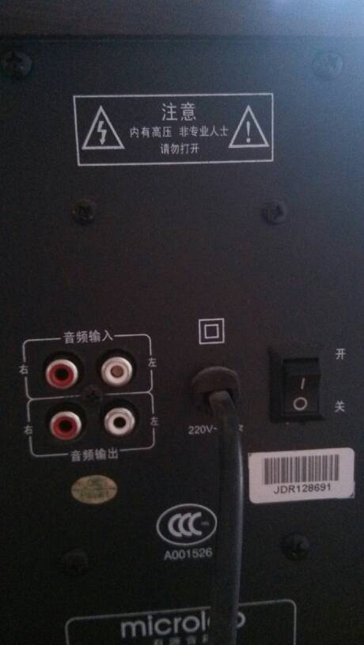


封装就是隐藏内部实现的细节,只保留功能接口

手机壳把手机的内部构造隐藏掉，具体里面是怎么工作的，我们不知道。

那我们来看一下代码怎么封装？

洗衣机洗衣服，大家都知道。对于洗衣机来说，其实是有很多社会分工的。

对于洗衣机生产厂商来说，他就需要了解洗衣机的工作原理

```
洗衣机生产商(程序员A)

* 电机的工作原理
* 排水的工作原理
* 马达的工作原理
* 电压转换方式
* 保险
```

对于消费者来说，她只要会使用洗衣机就行，至于洗衣机里面是如何工作的，不需要了解。

```
消费者(程序员B)

* 买个洗衣机
* 设置模式,开始洗
```

那我们来看一下，程序员A和程序员B分别是怎么工作的。

```
需求
洗衣机洗衣服
```

分析

```
1.定义洗衣机类
2.洗衣机的属性：品牌 容量 
3.洗衣机的功能：开门 关门 开始洗衣服 
4.消费者 打开洗衣机  放入衣服 关闭洗衣机门 设置洗衣模式 开始洗衣服
```

代码

```python
# 生产厂商
class WashMachine:
    def __init__(self,brand,capacity):
        # 品牌
        self.brand = brand
        # 容量
        self.capacity = capacity
        # 是否关闭洗衣机门
        self.hasCloseDoor = False
        # 模式属性  0:默认模式 1:外套模式 2:内衣模式
        self.__mode = 0
        # 马达转速
        self.motorSpeed = 0

    def openDoor(self):
        print('打开洗衣机门...')
        # 洗衣机门没有关闭
        self.hasCloseDoor = False

    def closeDoor(self):
        print('关闭洗衣机门')
        # 洗衣机门已经关闭
        self.hasCloseDoor = True

    def setMode(self,mode):
        '''
        调节模式
        :param mode:
        :return:
        '''
        if mode==0 or mode==1 or mode==2:
            self.__mode = mode
        # 修改对应的马达转速
        if self.__mode==1:
            self.__setMotorSpeed(2000)
        elif self.__mode==2:
            self.__setMotorSpeed(1000)

    def __setMotorSpeed(self,speed):
        '''
        设置马达转速
        :param speed:
        :return:
        '''
        self.motorSpeed = speed

    def start(self):
        # 只有洗衣机门关闭的时候才能洗衣服
        if not self.hasCloseDoor:
            print('请先关闭洗衣机门...')
            return
        print('开始放水...')
        print('水放满了...')
        if self.__mode==1:
            print('模式是外套模式')
            print('马达转速:{}'.format(self.motorSpeed))
            print('开始洗衣服...')
        elif self.__mode ==2:
            print('模式是内衣模式')
            print('马达转速:{}'.format(self.motorSpeed))
            print('开始洗衣服...')
        elif self.__mode ==0:
            print('请选择模式')

# 消费者
machine = WashMachine('海尔',10)
# 打开洗衣机门
machine.openDoor()
# 放入衣服
print('放入衣服')
# 关闭洗衣机门
machine.closeDoor()

# 设置洗衣模式
machine.setMode(2)
# 调节马达转速
# machine.__setMotorSpeed(100000)
# 开始洗衣服
machine.start()
```

一定要注意，要设置只有关闭了洗衣机门才能开始洗衣服，否则很危险。

还要将马达的转速的方法私有化，

在外部不希望别人访问的我们就可以将它们私有化，把细节隐藏在内部，这就是面相对象的封装。

封装的范围:

1.封装属性
2.封装成方法/函数
3.封装成类
4.封装模块和包

## 继承

继承指的是一个对象直接使用另一个对象的属性或方法

继承有哪些作用呢？我们先来回顾一下之前所学的知识。

比如要实现以下需求

```
需求:
1.定义人类,具有name和age属性,具有sayHello方法
2.定义学生类,具有name和age属性,具有study方法和打招呼sayHello方法
3.定义老师类,具有name和age属性,具有teach方法和打招呼sayHello方法
```

代码：

```python
# 1.定义人类,具有name和age属性,具有sayHello方法
class Person:
    def __init__(self,name,age):
        # 姓名
        self.name = name
        # 年纪
        self.age = age
#   def sayHello(self):
        print('你好')
# 2.定义学生类,具有name和age属性,具有study方法和打招呼sayHello方法
class Student:
    def __init__(self,name,age):
        self.name = name
        self.age = age
        
    def sayHello(self):
        print('你好')
   def study(self):
        print('学习')
# 3.定义老师类,具有name和age属性,具有teach方法和打招呼sayHello方法
class Teacher:
    def __init__(self, name, age):
        # 姓名
        # 年纪
        self.age = age
    def sayHello(self):
        print('你好')
        
    def teach(self):
        print('教书')
```

我们发现学生老师都要同样的属性，比如name和age等等，那么我们会可以使用继承。

**继承的格式:**
**class 子类名(父类名):**
 ...

使用继承的方式实现以上需求：

分析：

```
主需要创建Person这个个父类
其他都是子类
```

代码

```python
# 1.定义人类,具有name和age属性,具有sayHello方法
class Person:
    def __init__(self,name,age):
        # 姓名
        self.name = name
        # 年纪
        self.age = age

    def sayHello(self):
        print('你好')

# 2.定义学生类,具有name和age属性,具有study方法和打招呼sayHello方法
class Student(Person):
    def study(self):
        print('学习')

# 3.定义老师类,具有name和age属性,具有teach方法和打招呼sayHello方法
class Teacher(Person):
    def teach(self):
        print('教书')

# 创建Student对象
stu = Student('小明',18)
# 继承 可以使用父类定义的属性和方法
# name
print(stu.name)
print(stu.age)

# 方法
stu.sayHello()

teacher = Teacher('马老师',50)
# 属性
print(teacher.name)
print(teacher.age)

# 方法
teacher.sayHello()
teacher.teach()
```

`Student`类继承自`Person类`可以使用Person类中定义的属性`name`和`age`以及方法`sayHello`

**继承的好处：**

* 提高了代码的复用性
* 让类与类之间发生了关系,为多态提供了前提

**继承误区：**

* 不要为了代码复用而继承

**继承关系结构图**

如果继承关系比较长，就可以通过下面的方法查找继承关系。

* 可以通过类名.__mro__查看继承结构图,也就是继承链
  所有对象都是继承自object

```python
class Father:
    pass

class Son(Father):
    pass

# 查看Son对应的继承关系
print(Son.__mro__)
print(Father.__mro__)
```

**重写父类中的方法**

有时,父类中方法的实现不满足子类的需求,子类继承父类之后可以修改父类中的方法实现

```
需求:
1.定义父类,具有sayHello方法
2.子类继承父类,修改sayHello方法
```

代码：

```python
# 1.定义父类,具有sayHello方法
class Father:
    def sayHello(self):
        print('同志好')

# 2.子类继承父类,修改sayHello方法
class Son(Father):
    # 重写了父类中的方法
    def sayHello(self):
        print('美女好')

# 创建Son对象
son = Son()
son.sayHello()
```

**init和属性继承问题**

继承之后,就默认继承了父类中公有的属性,子类中也可以增加属性

```

需求:
1.定义人类,具有name和age属性
2.定义学生类,具有name和age属性,还具备student_id属性

```

代码：

```python
# 1.定义人类,具有name和age属性
class Person:
    def __init__(self,name,age):
        self.name = name
        self.age = age

# 2.定义学生类,具有name和age属性,还具备student_id属性
class Student(Person):
    def __init__(self,name,age,student_id):
        # 调用父类的init方法
        super(Student, self).__init__(name,age)
        # 增加属性
        self.student_id = student_id

# 创建学生对象
stu = Student('张三',30,123123)
print(stu.name)
print(stu.age)
print(stu.student_id)
```

子类不能使用父类中的私有属性和方法

```python
# 1.定义人类,具有name和age属性
class Person:
    def __init__(self,name,age):
        self.name = name
        self.__age = age
    def __sayHello(self):
        print('hello')
# 2.定义学生类,具有name和age属性,还具备student_id属性
class Student(Person):
    pass

# 创建学生对象
stu = Student('张三',30)
# 私有的属性不能用
# print(stu.__age)
# stu.__sayHello()
```

### 多继承

有多个父类的继承关系就称为多继承

多继承在生活中的例子也比较多，比如下图：

骡子就是驴和马交配而来的。所以，骡子就可以继承驴和马的特点。这就是多继承的好处

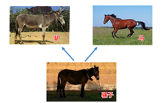

**多继承格式:**
class 子类(父类1,父类2...)
	...


#### 多继承方法

子类可以调用多个父类中的方法

```
需求:
定义Mother类,Mother具有cook方法
定义Father类,Father具有makeMoney方法
```

代码：

```python
# 定义Mother类,Mother具有cook方法
class Mother:
    def cook(self):
        print('做饭')

# 定义Father类,Father具有makeMoney方法
class Father:
    def makeMoney(self):
        print('赚钱')

# 定义Son类
class Son(Mother,Father):
    pass

# 创建Son类
son = Son()
son.cook()
son.makeMoney()
```

运行结果：

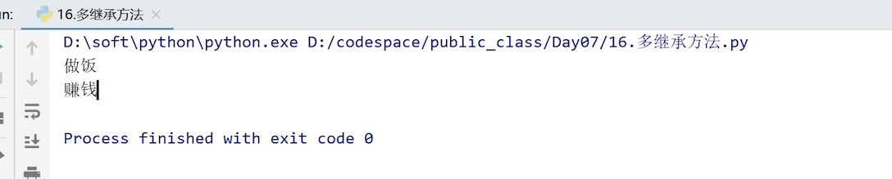

#### 多继承属性

 子类只能使用第一个父类的属性

```
需求:
Mother类还具有money属性
Father类还具备wage工资属性
```

代码：

```python
# Mother类还具有money属性
class Mother:
    def __init__(self):
        self.money = 100

# Father类还具备wage工资属性
class Father:
    pass
    # def __init__(self):
    #     self.wage = 50


# 定义Son
class Son(Father,Mother):
    pass

# 创建Son对象
son = Son()
# print(son.wage) 报错 只能继承父类的第一个属性
print(son.money)

```

#### 多继承方法和属性总结

1. 多继承可以直接使用多个父类中的方法
2. 多继承中,子类没有成员属性,如果多个父类都有成员属性,只能使用前一个父类的成员属性
3. 多继承中,子类没有成员属性,如果只有一个父类有成员属性,不论继承的顺序,都能使用这个成员属性


## 多态

多态指的是一类事物有多种形态，比如一个类有多个子类

多态的概念依赖于继承

我们来看看生活中多态的例子

世界上的所有人中都是继承了人的特性，人又分为很多种，比如黄种人，白种人，黑种人，他们的行为也不同，比如中国人用筷子吃饭，西方人用刀叉，非洲人用手，所以说，对于不同的子类来说，他们的行为属性各不相同，这就是多态。

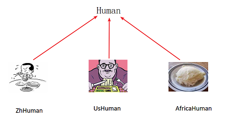

```python
# 定义Human
class Human:
    def eat(self):
        print('人类吃饭')

# ZhHuman
class ZhHuman(Human):
    def eat(self):
        print('中国人使用筷子吃饭')

# UsHuman
class UsHuman(Human):
    def eat(self):
        print('美国人使用刀叉吃饭')

# AfricaHuman
class AfricaHuman(Human):
    def eat(self):
        print('非洲人使用手抓饭')


# 函数
def tranlate(human):
    '''
    需要传递具备吃饭功能的Human对象
    :param human:
    :return:
    '''
    human.eat()

# 创建Human
human = Human()
# ZhHuman
zhHuman = ZhHuman()
# UsHuman
usHuman = UsHuman()
# AfricaHuman
africaHuman = AfricaHuman()
#
# 传递human
tranlate(human)
# 传递 zhHuman
tranlate(zhHuman)
#
# 传递 usHuman
tranlate(usHuman)

```

结果：

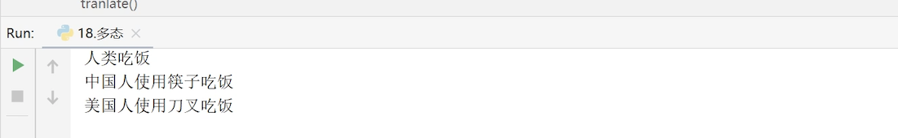

**多态的作用**

* 不同的 子类对象调用 相同的 父类方法，产生 不同的 执行结果，可以增加代码的外部
* 调用灵活度
* 多态以 继承 和 重写 父类方法 为前提
* 多态是调用方法的技巧，不会影响到类的内部设计

**鸭子模型**

```python
# 定义Human
class Human:
    def eat(self):
        print('人类吃饭')

# ZhHuman
class ZhHuman(Human):
    def eat(self):
        print('中国人使用筷子吃饭')

# UsHuman
class UsHuman(Human):
    def eat(self):
        print('美国人使用刀叉吃饭')

# AfricaHuman
class AfricaHuman(Human):
    def eat(self):
        print('非洲人使用手抓饭')


# 函数
def tranlate(human):
    '''
    需要传递具备吃饭功能的Human对象
    :param human:
    :return:
    '''
    human.eat()

class Dog:
    def eat(self):
        print('狗吃骨头')

# 创建Dog对象
dog = Dog()
tranlate(dog)
```

程序可以正常运行，因为狗也具备吃饭的功能。

# 8.枚举

枚举就是一一列举

**枚举的例子**

```
一周有七天:
Sun 
Mon
Tue 
Wed 
Thu
Fri
Sat
```

**枚举的定义**

第一种:
from enum import Enum
Week= Enum('Week', ('Sun', 'Tue', 'Wed', 'Thu', 'Fri', 'Sat')

```python
# 导入枚举的包
from enum import Enum

Week= Enum('Week', ('Sun','Mon', 'Tue', 'Wed', 'Thu', 'Fri', 'Sat'))
print(Week.Sun)
print(Week.Sat)
```

第二种:
from enum import Enum, unique
class Weekday(Enum):
    Sun = 0 
    Mon = 1
    Tue = 2
    Wed = 3
    Thu = 4
    Fri = 5
    Sat = 6

```python
from enum import Enum
# 枚举的每一个值都是唯一的 不是重复的 
class Weekday(Enum):
    Sun = 0
    Mon = 1
    Tue = 2
    Wed = 3
    Thu = 4
    Fri = 5
    Sat = 6

# print(Weekday.Sun)
# print(Weekday.Mon)
# print(Weekday.Tue)


# 枚举的作用 
def translate(weekDay):
    '''
    根据传递的周日期确定是休息还是上班
    :param weekDay:
    :return:
    '''
    if weekDay==Weekday.Sun or weekDay==Weekday.Sat:
        print('休息')
    else:
        print('上班')

translate(Weekday.Mon)
```


# 9. 面向对象实战-反恐精英

反恐精英是我们的一个综合练习，希望通过这个练习达到以下目的

* 强化对面向对象封装特性的理解
* 理解 一个对象的属性 可以是 另外一个类创建的对象

下面我们就先来分析以下这个案例

1. 反恐精英是非常经典的游戏,游戏中分为两个角色:警察和土匪

2. 警察和土匪都可以拿枪打击对方

我们要用面向对象实现反恐精英流程

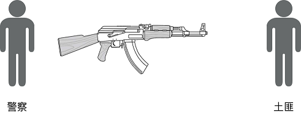

**需求说明**

```
1.游戏枪支有不同的型号,并拥有不同的伤害
2.枪支可以添加一定数量的子弹
3.枪支可以设计敌人,设计敌人时,如果子弹数量为0,则提示玩家;如果有子弹,会减少子弹,如果击中敌人,会让敌人受伤
4.输出枪支信息时,可以显示枪支的型号、伤害、子弹数量
5.游戏玩家分为警察和土匪两种角色,玩家拥有自己的枪支和血量,可以攻击敌人
6.玩家攻击敌人时,如果没有枪,则提示玩家;如果有枪,则检查枪支是否有子弹,有子弹则使用枪支射击敌人,没有子弹则自动给枪支添加子弹
7.玩家被击中会受伤,减少血量为枪支的伤害,提示玩家受伤并显示当前血量;如果血量<=0,则提示玩家死亡
8.输出玩家信息时,可以显示玩家角色、状态、血量、所持有枪支的信息
```

**类图**

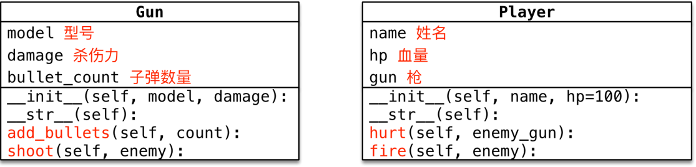


**枪支类**

1. 使用`Gun`类可以创建**枪支对象**
2. 枪有三个属性:
   1. **型号**:model
   2. **杀伤力:**damage
   3. **子弹数量:**bullet_count,枪出事没有子弹
3. 实现`__str__`方法,显示枪的model、damage和area属性
4. 调用`add_bullets`方法可以增加**子弹数量**
5. 调用`shoot`方法可以给参数**敌人对象**造成伤害
   1. 如果**没有子弹**,则**提示玩家**并返回
   2. 如果**有子弹**,则:
      1. **子弹数量**减少
      2. 调用**敌人对象**的`hurt`方法,**给敌人造成伤害**


**玩家类**

1. 使用`Player`类可以创建**警察对象**和**土匪对象**
2. 玩家有三个属性:
   1. **姓名:**name
   2. **血量:**hp
   3. **枪:**gun 使用`Gun`类创建的对象,**初始没有枪**
3. 实现`__str__`方法,显示玩家的name、hp和gun属性
4. 调用`hurt`方法可以让**当前玩家**受到`enemy_gun`的伤害,具体流程如下:
   1. **玩家血量**减去**枪对象**的`damage`伤害度
   2. 判断修改后的**玩家血量**
      1. 如果血量<0,提示**玩家挂了**
      2. 否则,提示**玩家受伤**以及**当前血量**
5. 调用`fire`方法可以向`enemy`开火,具体流程如下:
   1. 判断自己**是否有武器**,如果没有直接返回
   2. 检查自己的枪是**否有子弹**,如果没有,**自动装填子弹**
   3. 让自己的枪调用`shoot`方法,并传递要射击的敌人对象

**主程序流程**

1. 创建**枪对象**并测试**装填和发射子弹**
2. 创建**警察对象policeman**和**匪徒对象badman**
3. 将枪支交给警察,警察向匪徒开火
4. 利用**循环**消灭匪徒

**代码实现**

```python
"""--------------------------- 枪支类 ---------------------------"""
class Gun:
    def __init__(self, model, damage):
        # 型号
        self.model = model
        # 杀伤力
        self.damage = damage
        # 子弹数量
        self.bullet_count = 0

    def __str__(self):
        return '型号:{},杀伤力:{},子弹数量:{}'.format(self.model, self.damage, self.bullet_count)

    def add_bullets(self, count):
        '''
        添加子弹
        :param count: 子弹数量
        :return:
        '''
        self.bullet_count += count

    def shoot(self, enemy):
        '''
        射击敌人
        :param enemy:敌人 Player对象
        :return:
        '''
        # 判断子弹数量是否为0
        if self.bullet_count <= 0:
            print('请填充子弹')
            return
        # 有子弹
        # 减少子弹
        self.bullet_count -= 1
        # 击中敌人,让敌人受伤
        enemy.hurt(self)


"""--------------------------- 玩家类 ---------------------------"""

class Player:
    def __init__(self, role, name):
        # 角色
        self.role = role
        # 姓名
        self.name = name
        # 血量
        self.hp = 100
        # 枪支
        self.gun = None

    def __str__(self):
        return '角色:{},姓名:{},血量:{},枪支:{}'.format(self.role, self.name, self.hp, self.gun)

    def fire(self, enemy):
        '''
        向地方射击
        :param enemy:Player对象
        :return:
        '''
        # 没有枪
        if not self.gun:
            print('没有枪')
            return
        # 有枪
        # 是否有子弹
        if self.gun.bullet_count <= 0:
            # 添加子弹
            self.gun.add_bullets(5)
            print('自动添加子弹')
            return
        # 有子弹
        self.gun.shoot(enemy)

    def hurt(self, enemy_gun):
        '''
        玩家受到枪支的伤害
        :param enemy_gun: Gun对象
        :return:
        '''
        # 减少血量为枪支的伤害
        self.hp -= enemy_gun.damage
        if self.hp <= 0:
            print('玩家死亡')
        else:
            print('玩家受伤,血量:{}'.format(self.hp))

"""--------------------------- 流程 ---------------------------"""
# 创建枪支对象
gun = Gun('ak47',10)
# 创建土匪
badMan = Player('土匪','张三')
# 警察
policeman = Player('警察','李四')
# 装子弹
# gun.add_bullets(5)
# print(gun)
# gun.shoot(badMan)

# 将枪支交给警察
policeman.gun = gun
# 警察向匪徒开火
while badMan.hp>0:
    policeman.fire(badMan)

```

结果：

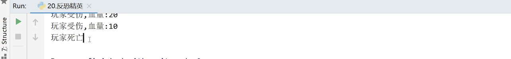

遇到复杂的项目就一定要先分析流程，然后再按照流程写代码，这样才不容易出错。

